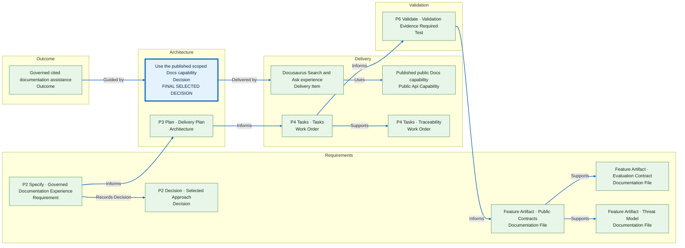

# Delivery Lineage: 342-governed-documentation-experience

> Customer-safe graph. EAI dependencies stop at published PublicAPI capabilities.

Generated from `delivery-lineage.json`. Open **Gofer: Show Delivery Lineage** for the interactive viewer.
