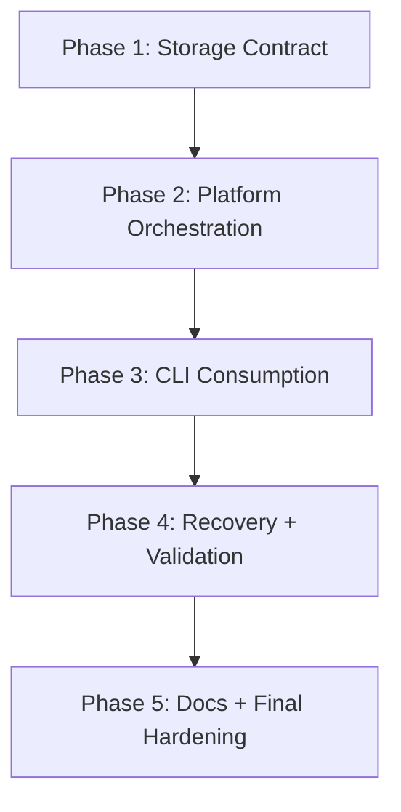

# Tasks: Tenant Authorized Apps Persistence

Date: 2026-05-11

## Overview

- Total phases: 5
- Primary goal: make `eai-cli`-triggered tenant and Entra operations leave the
  tenant CMS and cloud secret state authoritative before local env patching
- Parallel opportunities: tests and documentation can run in parallel after the
  platform contract is in place

## Dependencies

## Phase 1: Storage Contract

Goal: define the authoritative tenant CMS storage and response model before CLI
behavior changes.

- [ ] T001 Define `app-registrations` tenant-data type in [index.ts](/Users/eai-douglasross/Code/eai/tech-docs/mod-platform/Configurator/src/collections/TenantData/index.ts)
- [ ] T002 Allow `app-registrations` through the custom tenant-data API in [route.ts](/Users/eai-douglasross/Code/eai/tech-docs/mod-platform/Configurator/src/app/api/custom-tenant-data/[tenantId]/[dataType]/route.ts)
- [ ] T003 Document the new tenant-data type and its non-secret payload contract in [TenantData.md](/Users/eai-douglasross/Code/eai/tech-docs/mod-platform/Configurator/documentation/TenantData.md)
- [ ] T004 Define PublicAPI response sections for tenant authorization, tenant metadata sync, and cloud secret persistence in [provision.py](/Users/eai-douglasross/Code/eai/tech-docs/mod-platform/PublicAPI/src/app/routers/v3/provision.py)

Verification:

- storage contract names `authorizedApps[]`, `tenant-data/app-registrations`,
  and cloud secret storage separately

## Phase 2: Platform Orchestration

Goal: make the platform write authoritative state in the required order.

- [ ] T005 Add a PublicAPI helper to upsert tenant app-registration metadata via Configurator from [provision.py](/Users/eai-douglasross/Code/eai/tech-docs/mod-platform/PublicAPI/src/app/routers/v3/provision.py)
- [ ] T006 Change PublicAPI provisioning flow to fail if `authorizedApps[]` sync fails in [provision.py](/Users/eai-douglasross/Code/eai/tech-docs/mod-platform/PublicAPI/src/app/routers/v3/provision.py)
- [ ] T007 Change PublicAPI provisioning flow to fail if tenant-data app metadata upsert fails in [provision.py](/Users/eai-douglasross/Code/eai/tech-docs/mod-platform/PublicAPI/src/app/routers/v3/provision.py)
- [ ] T008 Add or reuse a cloud-config writer service in AdminAPI or PublicAPI so `ENTRA_CLIENT_SECRET` and related keys are persisted for the vertical label
- [ ] T009 Return `appObjectId` and any additional metadata needed for tenant-data persistence from [ciam.py](/Users/eai-douglasross/Code/eai/tech-docs/mod-platform/AdminAPI/src/api/routes/ciam.py) and [entra_service.py](/Users/eai-douglasross/Code/eai/tech-docs/mod-platform/AdminAPI/src/services/entra_service.py)
- [ ] T010 Seed or prepare empty tenant app-registration metadata during tenant creation paths in [route.ts](/Users/eai-douglasross/Code/eai/tech-docs/mod-platform/Configurator/src/app/api/tenant-management/route.ts) or the corresponding tenant lifecycle service

Verification:

- success response only returns after runtime allowlist, tenant metadata, and
  cloud secret writes all succeed

## Phase 3: CLI Consumption

Goal: make `eai-cli` consume and report the new authoritative platform contract.

- [ ] T011 Extend the provisioning response type and parsing logic in [api.ts](/Users/eai-douglasross/Code/eai/tech-docs/mod-tools/eai-cli/src/lib/api.ts)
- [ ] T012 Update `eai provision entra` output and failure handling in [provision.ts](/Users/eai-douglasross/Code/eai/tech-docs/mod-tools/eai-cli/src/commands/provision.ts)
- [ ] T013 Update inline provisioning inside `eai init` to consume the same contract in [init.ts](/Users/eai-douglasross/Code/eai/tech-docs/mod-tools/eai-cli/src/commands/init.ts)
- [ ] T014 Make CLI messaging treat `.env.local` as a mirror of platform-owned state, not the source of truth, in [provision.ts](/Users/eai-douglasross/Code/eai/tech-docs/mod-tools/eai-cli/src/commands/provision.ts) and [env.ts](/Users/eai-douglasross/Code/eai/tech-docs/mod-tools/eai-cli/src/commands/env.ts)

Verification:

- CLI clearly reports runtime allowlist sync, tenant metadata sync, and cloud
  secret persistence status

## Phase 4: Recovery And Validation

Goal: turn `--force` into a working recovery path and add regression coverage.

- [ ] T015 Implement `eai provision entra --force` as rotate-secret orchestration instead of a no-op idempotent retry in [provision.ts](/Users/eai-douglasross/Code/eai/tech-docs/mod-tools/eai-cli/src/commands/provision.ts) and [api.ts](/Users/eai-douglasross/Code/eai/tech-docs/mod-tools/eai-cli/src/lib/api.ts)
- [ ] T016 Add AdminAPI route coverage for secret rotation payload needs in [test_ciam.py](/Users/eai-douglasross/Code/eai/tech-docs/mod-platform/AdminAPI/tests/test_ciam.py)
- [ ] T017 Add PublicAPI unit coverage for strict tenant authorization, tenant-data sync, and cloud-secret persistence gates in [test_provision.py](/Users/eai-douglasross/Code/eai/tech-docs/mod-platform/PublicAPI/src/tests/unit/test_provision.py)
- [ ] T018 Add `eai-cli` integration coverage for create, existing repair, forced rotation, and local secret hydration in [provision.test.ts](/Users/eai-douglasross/Code/eai/tech-docs/mod-tools/eai-cli/tests/integration/provision.test.ts)

Verification:

- example user journey succeeds without Azure Portal intervention when tenant
  admin permissions and platform secret storage are available

## Phase 5: Docs And Final Hardening

Goal: align docs and final validation with the new platform-owned process.

- [ ] T019 Update `eai-cli` help/docs to describe the platform-owned CMS + cloud-secret flow
- [ ] T020 Update runbook/docs that currently imply Azure Portal is required for existing-app recovery
- [ ] T021 Run targeted validation across `eai-cli`, PublicAPI, AdminAPI, and Configurator test suites

Verification:

- docs match implemented behavior
- no command claims success before authoritative platform state is complete

## Parallel Execution Guide

- T003 and T004 can run in parallel after T001 and T002 define the storage
  contract.
- T016, T017, and T018 can run in parallel after T015 stabilizes the response
  and recovery semantics.
- T019 and T020 can run in parallel after the platform/CLI behavior is final.

## Implementation Strategy

- MVP first: authoritative platform writes and strict failure gates
- Recovery second: secret rotation and cloud rehydration
- Polish last: messaging, docs, and broader validation
