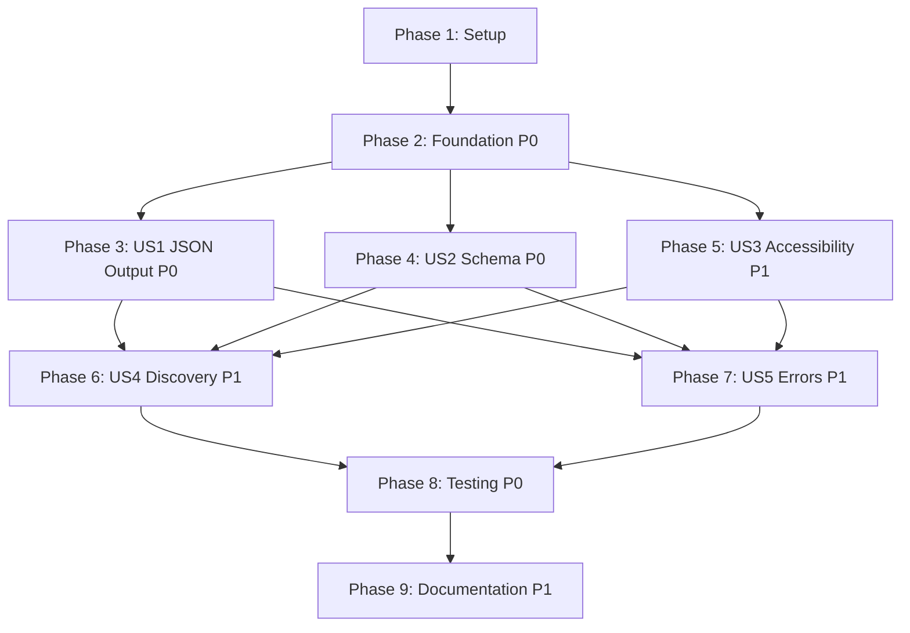

# Tasks: CLI Help System Enhancement

## Overview

- **Total Tasks**: 144
- **Parallel Opportunities**: 85 tasks marked [P]
- **User Stories**: 5 (US1-US5)
- **Phases**: 9 (Foundation + Error Codes + 5 User Stories + Testing + Documentation)

## Dependencies

## Phase 1: Foundation & Output Layer (P0)

**Goal**: Implement core output utilities and TTY detection (FR002, FR007, FR009)

**User Stories**: Foundation for US1, US2, US3

### Output Utility Implementation

- [X] T001 [P] Implement `success(msg: string)` in src/lib/output.ts
- [X] T002 [P] Implement `warn(msg: string)` in src/lib/output.ts
- [X] T003 [P] Implement `info(msg: string)` in src/lib/output.ts
- [X] T004 [P] Implement `heading(text: string)` in src/lib/output.ts
- [X] T005 [P] Implement `dim(text: string)` in src/lib/output.ts
- [X] T006 [P] Implement `table(rows: Array<[string, string]>)` in src/lib/output.ts
- [X] T007 Implement `json(data: unknown)` with pretty-printing in src/lib/output.ts
- [X] T008 [P] Implement `blank()` in src/lib/output.ts (already exists, verify)

### TTY and Color Detection

- [X] T009 Add TTY detection logic checking `process.stdout.isTTY` in src/lib/output.ts
- [X] T010 [P] Add `NO_COLOR` environment variable support in src/lib/output.ts
- [X] T011 [P] Add `FORCE_COLOR` environment variable support in src/lib/output.ts
- [X] T012 Add global `--no-color` flag to src/index.ts
- [X] T013 [P] Add global `--color` flag (force colors) to src/index.ts

### Simple/Accessible Mode

- [X] T014 Add global `--simple` flag to src/index.ts
- [X] T015 Modify `success()` to output "SUCCESS:" when `--simple` is set in src/lib/output.ts
- [X] T016 [P] Modify `error()` to output "ERROR:" when `--simple` is set in src/lib/output.ts
- [X] T017 [P] Modify `warn()` to output "WARNING:" when `--simple` is set in src/lib/output.ts
- [X] T018 [P] Modify `info()` to output "INFO:" when `--simple` is set in src/lib/output.ts

### Format Output Helper

- [X] T019 Create `formatOutput(data: unknown, format: 'text' | 'json' | 'yaml')` helper in src/lib/output.ts

**Verification**:
- [X] All output utility functions work correctly
- [X] TTY detection disables colors when piped
- [X] `NO_COLOR=1 eai types seed` shows no colors
- [X] `eai types seed --simple` shows text-only output
- [X] Unit tests for all output functions

---

## Phase 2: Error Code System (P0)

**Goal**: Implement structured error codes and formatted error output (FR004, US5)

**User Story**: US5 - Structured Error Handling

### Error Code Infrastructure

- [X] T020 Create src/lib/error-codes.ts with ErrorCode enum (E001-E399)
- [X] T021 Define ErrorDefinition interface in src/lib/error-codes.ts
- [X] T022 Create error catalog with E001-E099 (Project errors) in src/lib/error-codes.ts
- [X] T023 [P] Add E100-E199 (Auth errors) to error catalog in src/lib/error-codes.ts
- [X] T024 [P] Add E200-E299 (Platform errors) to error catalog in src/lib/error-codes.ts
- [X] T025 [P] Add E300-E399 (Validation errors) to error catalog in src/lib/error-codes.ts

### Error Formatting Functions

- [X] T026 Implement `formatError(code: ErrorCode, context?: Record<string, string>): string` in src/lib/error-codes.ts
- [X] T027 Implement `formatErrorJSON(code: ErrorCode, context?: Record<string, string>): object` in src/lib/error-codes.ts
- [X] T028 Implement `exitWithError(code: ErrorCode, context?: object, format?: string)` in src/lib/error-codes.ts

### Error Migration

- [X] T029 Catalog all existing error messages in src/commands/types.ts
- [X] T030 [P] Catalog all existing error messages in src/commands/resources.ts
- [X] T031 [P] Catalog all existing error messages in src/commands/tenant.ts
- [X] T032 [P] Catalog all existing error messages in src/commands/deploy.ts
- [X] T033 [P] Catalog all existing error messages in src/commands/env.ts
- [X] T034 [P] Catalog all existing error messages in src/commands/user.ts
- [X] T035 Replace error messages with error codes in src/commands/types.ts
- [X] T036 [P] Replace error messages with error codes in src/commands/resources.ts
- [X] T037 [P] Replace error messages with error codes in src/commands/tenant.ts
- [X] T038 [P] Replace error messages with error codes in src/commands/deploy.ts
- [X] T039 [P] Replace error messages with error codes in src/commands/env.ts
- [X] T040 [P] Replace error messages with error codes in src/commands/user.ts
- [X] T041 [P] Replace error messages with error codes in src/commands/chat.ts
- [X] T042 [P] Replace error messages with error codes in src/commands/docs.ts
- [X] T043 [P] Replace error messages with error codes in src/commands/verify.ts

**Verification**:
- [X] All error codes are unique and documented
- [X] Text errors show "Error code: EXXX" at the end
- [X] JSON errors include structured error object
- [X] Exit codes consistent (0=success, 1=error)

---

## Phase 3: US1 - JSON Output Implementation (P0)

**Goal**: Complete all empty JSON output blocks (FR001, FR003, US1)

**User Story**: US1 - Automated Testing and CI/CD Integration

**Story**: As a DevOps engineer, I want to get structured, machine-readable output from CLI commands so that I can parse results in automated scripts and CI/CD pipelines.

**Independent Test Criteria**:
- All commands with `--format json` produce valid, parseable JSON
- No ANSI codes or spinners in JSON output
- Schema is consistent across invocations

### Types Commands JSON Output

- [X] T044 [US1] Implement `types seed --format json` output in src/commands/types.ts:164-165
- [X] T045 [P] [US1] Implement `types diff --format json` output in src/commands/types.ts
- [X] T046 [P] [US1] Implement `types pull --format json` output in src/commands/types.ts

### Resources Commands JSON Output

- [X] T047 [P] [US1] Implement `resources list --format json` output in src/commands/resources.ts:70-71
- [X] T048 [P] [US1] Implement `resources get --format json` output in src/commands/resources.ts:111-113
- [X] T049 [P] [US1] Implement `resources query --format json` output in src/commands/resources.ts
- [X] T050 [P] [US1] Implement `resources schema --format json` output in src/commands/resources.ts:276

### Deploy Commands JSON Output

- [X] T051 [P] [US1] Implement `deploy trigger --format json` output in src/commands/deploy.ts:119-120
- [X] T052 [P] [US1] Implement `deploy status --format json` output in src/commands/deploy.ts:171-180

### Tenant Commands JSON Output

- [X] T053 [P] [US1] Implement `tenant list --format json` output in src/commands/tenant.ts:44-45
- [X] T054 [P] [US1] Implement `tenant create --format json` output in src/commands/tenant.ts
- [X] T055 [P] [US1] Implement `tenant info --format json` output in src/commands/tenant.ts:129-130

### Env Commands JSON Output

- [X] T056 [P] [US1] Implement `env list --format json` output in src/commands/env.ts

### Format Flag Implementation (FR003)

- [X] T057 [US1] Add `--format <format>` option to all `types` commands in src/commands/types.ts
- [X] T058 [P] [US1] Add `--format <format>` option to all `resources` commands in src/commands/resources.ts
- [X] T059 [P] [US1] Add `--format <format>` option to all `deploy` commands in src/commands/deploy.ts
- [X] T060 [P] [US1] Add `--format <format>` option to all `tenant` commands in src/commands/tenant.ts
- [X] T061 [P] [US1] Add `--format <format>` option to all `env` commands in src/commands/env.ts
- [X] T062 [US1] Implement format validation (accept text/json/yaml, reject invalid) in src/lib/output.ts
- [X] T063 [US1] Alias existing `--json` flags to `--format json` for backward compatibility in all commands

### JSON Mode Spinner Handling

- [X] T064 [US1] Disable `ora` spinners when `format === 'json'` in src/commands/types.ts
- [X] T065 [P] [US1] Disable `ora` spinners when `format === 'json'` in src/commands/resources.ts
- [X] T066 [P] [US1] Disable `ora` spinners when `format === 'json'` in src/commands/deploy.ts
- [X] T067 [P] [US1] Disable `ora` spinners when `format === 'json'` in src/commands/tenant.ts

**Verification**:
- [X] US1-AC1: All commands support `--format json` flag
- [X] US1-AC2: JSON output is valid, parseable JSON with consistent schema
- [X] US1-AC3: Errors in JSON mode include error codes and structured details
- [X] US1-AC4: JSON output excludes progress indicators and ANSI codes
- [X] US1-AC5: Exit codes reliably indicate success (0) vs failure (1)

---

## Phase 4: US2 - Schema Introspection (P0)

**Goal**: Implement `--describe` flag for runtime schema discovery (FR005, US2)

**User Story**: US2 - AI Agent Tool Integration

**Story**: As an AI coding agent, I want to discover command capabilities and schemas at runtime so that I can use the CLI effectively without pre-training.

**Independent Test Criteria**:
- `--describe` outputs valid JSON schema
- Schema includes parameter types, constraints, and defaults
- Commands are deterministic

### Schema Builder Infrastructure

- [X] T068 [US2] Create src/lib/schema-builder.ts with basic structure
- [X] T069 [US2] Implement `buildCommandSchema(command: Command): object` in src/lib/schema-builder.ts
- [X] T070 [P] [US2] Implement option type detection in src/lib/schema-builder.ts
- [X] T071 [P] [US2] Implement subcommand recursion in src/lib/schema-builder.ts
- [X] T072 [P] [US2] Add JSON Schema format output in src/lib/schema-builder.ts

### Global Describe Flag

- [X] T073 [US2] Add global `--describe` flag handler to src/index.ts
- [X] T074 [US2] Hook `--describe` to intercept command execution in src/index.ts
- [X] T075 [US2] Output schema instead of executing when `--describe` is present in src/index.ts

**Verification**:
- [X] US2-AC1: `--describe` flag outputs JSON schema for any command
- [X] US2-AC2: Schema includes parameter types, constraints, and defaults
- [X] US2-AC3: Help text is structured and machine-parseable
- [X] US2-AC4: Error messages include error codes for programmatic handling
- [X] US2-AC5: Commands are deterministic (same input → same output)

---

## Phase 5: US3 - Accessibility (P1)

**Goal**: Ensure CLI works with assistive technology (FR007, FR009, US3)

**User Story**: US3 - Accessible CLI for All Users

**Story**: As a developer using assistive technology, I want CLI output that works with screen readers so that I can use the tool independently.

**Independent Test Criteria**:
- `--simple` mode provides plain text without colors/symbols
- Output works in text-only mode
- Information not conveyed by color alone

### Accessibility Verification

- [X] T076 [US3] Verify all output utilities respect `--simple` flag in src/lib/output.ts
- [X] T077 [P] [US3] Verify TTY detection works correctly in piped scenarios
- [X] T078 [P] [US3] Test NO_COLOR environment variable support
- [X] T079 [P] [US3] Ensure all commands work without colors/symbols

**Verification**:
- [X] US3-AC1: `--simple` mode provides plain text without colors/symbols
- [X] US3-AC2: Help text uses structural elements (headings, lists)
- [X] US3-AC3: Information is not conveyed by color alone
- [X] US3-AC4: Output utilities check for TTY and color support
- [X] US3-AC5: All commands work in text-only mode

---

## Phase 6: US4 - Command Discovery (P1)

**Goal**: Add examples and enhance help text (FR006, FR008, US4)

**User Story**: US4 - Quick Command Discovery

**Story**: As a new CLI user, I want to quickly find the right command and learn how to use it so that I can accomplish my task without reading full documentation.

**Independent Test Criteria**:
- Every command shows 2-5 practical examples with `--examples`
- Help footer includes common workflow patterns
- Help text is scannable

### Examples Implementation

- [X] T080 [US4] Add examples to `types` commands using `.addHelpText('after', ...)` in src/commands/types.ts
- [X] T081 [P] [US4] Add examples to `resources` commands in src/commands/resources.ts
- [X] T082 [P] [US4] Add examples to `tenant` commands in src/commands/tenant.ts
- [X] T083 [P] [US4] Add examples to `deploy` commands in src/commands/deploy.ts
- [X] T084 [P] [US4] Add examples to `env` commands in src/commands/env.ts
- [X] T085 [P] [US4] Add examples to `user` commands in src/commands/user.ts
- [X] T086 [P] [US4] Add examples to `chat` commands in src/commands/chat.ts
- [X] T087 [P] [US4] Add examples to `docs` commands in src/commands/docs.ts
- [X] T088 [P] [US4] Add examples to `verify` commands in src/commands/verify.ts

### Help Footer Enhancement

- [X] T089 [US4] Create enhanced root help footer with "Getting Started" section in src/index.ts
- [X] T090 [P] [US4] Add "Development Workflow" section to help footer in src/index.ts
- [X] T091 [P] [US4] Add "Deployment" section to help footer in src/index.ts
- [X] T092 [P] [US4] Add pointers to `--examples` and `--describe` in help footer in src/index.ts

**Verification**:
- [X] US4-AC1: `--help` shows brief, scannable information
- [X] US4-AC2: `--examples` flag shows 2-5 practical usage examples
- [X] US4-AC3: Help footer includes common workflow patterns
- [X] US4-AC4: Error messages suggest related commands

---

## Phase 7: US5 - Error Enhancement (P1)

**Goal**: Enhance error messages with suggestions (FR004, US5)

**User Story**: US5 - Structured Error Handling

**Story**: As a developer debugging CLI failures, I want clear, actionable error messages with context so that I can quickly understand and fix the problem.

**Independent Test Criteria**:
- All errors include structured error codes
- Error messages state problem and provide solution
- Errors show failing input when relevant

### Error Enhancement

- [X] T093 [US5] Verify all error codes include suggestions in src/lib/error-codes.ts
- [X] T094 [P] [US5] Add context interpolation to error messages in src/lib/error-codes.ts
- [X] T095 [P] [US5] Add related command suggestions to errors in src/lib/error-codes.ts

**Verification**:
- [X] US5-AC1: All errors include structured error codes (E001-E399)
- [X] US5-AC2: Error messages state the problem and provide a solution
- [X] US5-AC3: Errors show the failing input when relevant
- [X] US5-AC4: Error codes are categorized (Project, Auth, Platform, Validation)
- [X] US5-AC5: Errors link to docs/troubleshooting when appropriate

---

## Phase 8: Testing and Validation (P0)

**Goal**: Comprehensive testing of all new functionality

### Unit Tests

- [X] T096 Create tests/unit/output.test.ts with tests for all output functions
- [X] T097 [P] Test TTY detection logic in tests/unit/output.test.ts
- [X] T098 [P] Test color mode detection in tests/unit/output.test.ts
- [X] T099 [P] Test `--simple` mode in tests/unit/output.test.ts
- [X] T100 [P] Test table formatting and alignment in tests/unit/output.test.ts

- [X] T101 Create tests/unit/error-codes.test.ts with error formatting tests
- [X] T102 [P] Test error code uniqueness in tests/unit/error-codes.test.ts
- [X] T103 [P] Test error context interpolation in tests/unit/error-codes.test.ts
- [X] T104 [P] Test exit code consistency in tests/unit/error-codes.test.ts

- [X] T105 Create tests/unit/schema-builder.test.ts with schema generation tests
- [X] T106 [P] Test option type detection in tests/unit/schema-builder.test.ts
- [X] T107 [P] Test subcommand recursion in tests/unit/schema-builder.test.ts
- [X] T108 [P] Test JSON Schema validity in tests/unit/schema-builder.test.ts

### Integration Tests

- [X] T109 Create tests/integration/json-output.test.ts
- [X] T110 [P] Test `types seed --format json` in tests/integration/json-output.test.ts
- [X] T111 [P] Test `resources list --format json` in tests/integration/json-output.test.ts
- [X] T112 [P] Test `tenant list --format json` in tests/integration/json-output.test.ts
- [X] T113 [P] Verify JSON parseability in tests/integration/json-output.test.ts
- [X] T114 [P] Verify no ANSI codes in JSON output in tests/integration/json-output.test.ts

- [X] T115 Create tests/integration/format-flag.test.ts
- [X] T116 [P] Test `--format text` vs `--format json` in tests/integration/format-flag.test.ts
- [X] T117 [P] Test invalid format values in tests/integration/format-flag.test.ts
- [X] T118 [P] Test backward compatibility with `--json` in tests/integration/format-flag.test.ts

- [X] T119 Create tests/integration/describe-flag.test.ts
- [X] T120 [P] Test `eai --describe` output in tests/integration/describe-flag.test.ts
- [X] T121 [P] Test `eai types seed --describe` output in tests/integration/describe-flag.test.ts
- [X] T122 [P] Verify schema accuracy in tests/integration/describe-flag.test.ts

- [X] T123 Create tests/integration/examples.test.ts
- [X] T124 [P] Verify examples are shown with `--examples` in tests/integration/examples.test.ts
- [X] T125 [P] Verify examples are valid commands in tests/integration/examples.test.ts

### Performance Testing

- [X] T126 Measure help text generation time (baseline vs. enhanced)
- [X] T127 [P] Measure JSON formatting overhead
- [X] T128 [P] Measure schema introspection time
- [X] T129 [P] Verify no performance regression

**Verification**:
- [X] All unit tests pass
- [X] All integration tests pass
- [X] Test coverage ≥ 80% for new code
- [X] No performance regression
- [X] All user stories have test coverage

---

## Phase 9: Documentation and Polish (P1)

**Goal**: Update documentation and finalize implementation

### Documentation Updates

- [X] T130 Update CLI documentation for `--format` flag in docs/
- [X] T131 [P] Document `--describe` flag usage in docs/
- [X] T132 [P] Document `--examples` flag usage in docs/
- [X] T133 [P] Document `--simple` mode for accessibility in docs/
- [X] T134 Create error codes reference page at docs/reference/error-codes.md
- [X] T135 [P] Create machine-readable output guide at docs/guides/machine-readable-output.md
- [X] T136 [P] Create accessibility features guide at docs/guides/accessibility.md
- [X] T137 Update README.md with new features section

### Code Comments

- [X] T138 Add inline comments to output formatting logic in src/lib/output.ts
- [X] T139 [P] Add comments to error code catalog in src/lib/error-codes.ts
- [X] T140 [P] Add comments to schema builder algorithm in src/lib/schema-builder.ts

### Final Polish

- [X] T141 Review all error messages for clarity
- [X] T142 [P] Review all help text for consistency
- [X] T143 [P] Review all examples for accuracy
- [X] T144 [P] Fix any formatting inconsistencies

**Verification**:
- [X] Documentation is complete and accurate
- [X] All examples in docs are tested and work
- [X] Error codes are fully documented
- [X] Code comments are helpful

---

## Parallel Execution Guide

Tasks marked [P] can run concurrently if they:
- Modify different files
- Have no dependencies on incomplete tasks

### Example Parallel Groups:

**Phase 1 - Output Utilities** (can run in parallel):
- T001-T008 (different functions in same file - can be parallelized by function)
- T010, T011, T013 (independent flag support)
- T016-T018 (simple mode modifications)

**Phase 2 - Error Categories** (can run in parallel):
- T023-T025 (different error categories)
- T030-T034 (cataloging different command files)
- T036-T040 (replacing errors in different command files)

**Phase 3 - JSON Output** (can run in parallel):
- T042-T043 (types commands)
- T044-T047 (resources commands)
- T048-T049 (deploy commands)
- T050-T052 (tenant commands)
- T055-T057 (spinner disabling in different files)

**Phase 6 - Examples** (can run in parallel):
- T071-T078 (examples for different command files)
- T080-T082 (help footer sections)

**Phase 8 - Tests** (can run in parallel):
- T087-T090 (output tests)
- T092-T094 (error code tests)
- T096-T098 (schema builder tests)
- T100-T104 (JSON output integration tests)
- T106-T108 (format flag tests)
- T110-T112 (describe flag tests)
- T114-T115 (examples tests)
- T117-T119 (performance benchmarks)

**Phase 9 - Documentation** (can run in parallel):
- T121-T123 (different doc topics)
- T125-T126 (guides)
- T129-T130 (code comments in different files)
- T132-T134 (review tasks)

---

## Implementation Strategy

### MVP First (Phases 1-3)
Complete Setup, Foundation, and US1 (JSON Output) for a minimal deployable increment:
1. **Phase 1**: Foundation & Output Layer (T001-T019)
2. **Phase 2**: Error Code System (T020-T040)
3. **Phase 3**: US1 - JSON Output (T041-T057)

After MVP, each user story is an independent deployable increment:
- **Phase 4**: US2 - Schema Introspection
- **Phase 5**: US3 - Accessibility
- **Phase 6**: US4 - Command Discovery
- **Phase 7**: US5 - Error Enhancement

### Incremental Delivery
Each phase delivers value independently:
- After Phase 1: Consistent output formatting
- After Phase 2: Structured error handling
- After Phase 3: Machine-readable JSON output
- After Phase 4: AI agent schema discovery
- After Phase 5: Accessibility compliance
- After Phase 6: Improved discoverability
- After Phase 7: Enhanced error messages

### Testing Strategy
- Write unit tests as you implement (Phase 8 runs continuously)
- Integration tests after each user story phase
- Performance benchmarks before and after
- Manual accessibility testing for Phase 5

### Rollback Plan
- Each phase is independently rollback-able
- Use feature flags if needed for gradual rollout
- Maintain backward compatibility (`--json` alias)
- Version JSON schemas for breaking changes

---

## Protected Files

These files should be modified carefully and require extra review:
- `src/index.ts` - CLI entry point, global flags
- `src/lib/output.ts` - Core output utilities
- All command files - Existing functionality must not break

---

## Success Metrics

From spec.md success criteria:

| Metric | Target | Verification Method |
|--------|--------|---------------------|
| JSON output coverage | 100% | All structured output commands support `--format json` |
| Output utility coverage | 100% | All 9 utility functions implemented and tested |
| Error code coverage | 100% | All error paths have error codes (E001-E399) |
| Example coverage | 100% | All commands have ≥2 examples |
| Test coverage | ≥80% | Code coverage for new code |
| Performance impact | <5% | Benchmark baseline vs. enhanced |
| Backward compatibility | 100% | All existing scripts continue working |

---

## Estimated Timeline

Based on plan.md estimates:

| Phase | Tasks | Estimated Hours |
|-------|-------|-----------------|
| Phase 1: Foundation | T001-T019 | 4 hours |
| Phase 2: Error Codes | T020-T043 | 7 hours |
| Phase 3: US1 JSON Output | T044-T067 | 10 hours |
| Phase 4: US2 Schema | T068-T075 | 6 hours |
| Phase 5: US3 Accessibility | T076-T079 | 2 hours |
| Phase 6: US4 Discovery | T080-T092 | 8 hours |
| Phase 7: US5 Error Enhancement | T093-T095 | 2 hours |
| Phase 8: Testing | T096-T129 | 10 hours |
| Phase 9: Documentation | T130-T144 | 6 hours |
| **Total** | **144 tasks** | **55 hours** |

**Calendar Time**: 2-3 weeks (assuming 20-25 hours/week)

---

## Notes

- All tasks include specific file paths for clarity
- Parallel tasks marked with [P] for efficiency
- User story tasks marked with [USx] for traceability
- Each phase is independently testable and deployable
- Backward compatibility maintained throughout (--json alias)
- Testing is continuous but formalized in Phase 8
- Documentation is last to capture final implementation
