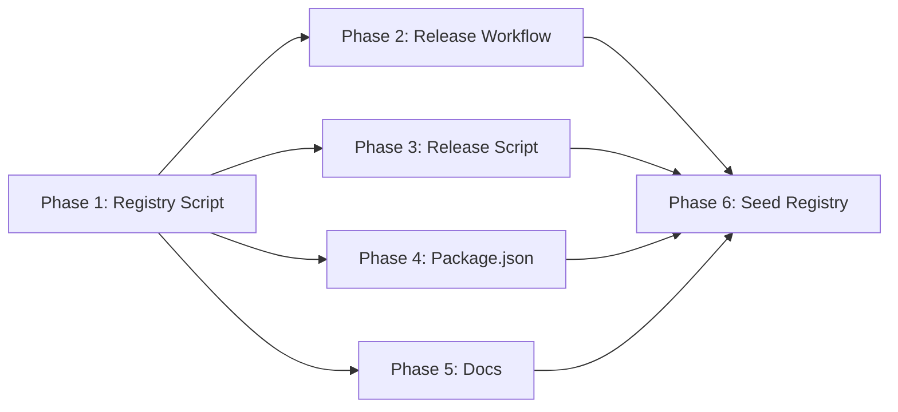

# Tasks: Static npm Registry on GitHub Pages

## Overview

- **Total Tasks**: 16
- **Parallel Opportunities**: 4 tasks marked [P]
- **User Stories**: 4 (US1-US4)
- **Phases**: 6

## Dependencies



## Phase 1: Registry Generation Script

**Goal**: Create the script that generates npm registry metadata and manages tarballs

- [x] T001 [US1] [US2] Create registry generation script at scripts/generate-registry.cjs

  The script must:
  1. Read `package.json` for name, version, description, bin, engines, dependencies
  2. Find the `npm pack` tarball in project root (glob `eai-tools-cli-*.tgz`)
  3. Compute SHA-1 hex hash (`shasum`) and SHA-512 SRI hash (`integrity`) of tarball using `node:crypto`
  4. Read existing packument from `docs/public/registry/@eai-tools/cli` if it exists (JSON parse)
  5. Append new version entry to `versions` object; update `dist-tags.latest`
  6. Set `dist.tarball` URL to `https://eai-tools.github.io/eai/registry/-/@eai-tools/cli-{version}.tgz`
  7. Write updated packument as extensionless file to `docs/public/registry/@eai-tools/cli`
  8. Create directory `docs/public/registry/-/@eai-tools/` if needed
  9. Copy tarball to `docs/public/registry/-/@eai-tools/cli-{version}.tgz`
  10. Log: version added, files written, hash values

  Use only Node.js built-ins: `node:crypto`, `node:fs`, `node:path`. CommonJS format.
  Follow pattern of existing `scripts/generate-llms-full.cjs`.

**Verification**:
- [x] V001 Script runs: `npm run build && npm pack && node scripts/generate-registry.cjs`
- [x] V002 Packument is valid JSON with `name`, `dist-tags`, `versions` fields
- [x] V003 Running twice with same version is idempotent (overwrites, not duplicates)
- [x] V003b Hashes match: `shasum <tarball>` output matches packument `shasum` field
- [x] V003c First-ever run works (no pre-existing packument file)

---

## Phase 2: Release Workflow Updates

**Goal**: Replace npm publish with registry generation and auto-commit

- [x] T002 [US2] Remove npm publish from .github/workflows/release.yml

  Remove these elements:
  - `registry-url: https://registry.npmjs.org` from `actions/setup-node@v4`
  - The "Publish to npm" step and its `NODE_AUTH_TOKEN` env var
  - Any `NPM_TOKEN` secret references

- [x] T003 [US2] Add registry generation steps to .github/workflows/release.yml

  After the existing `npm pack` step, add:
  1. Step "Generate registry metadata": `node scripts/generate-registry.cjs`
  2. Step "Commit registry to main": configure git bot user, `git add docs/public/registry/`, commit with message `chore: publish v{version} to registry`, push to `HEAD:main`

  Note: The tag push checks out a detached HEAD at the tag. The commit must push to `main` explicitly.

- [x] T004 [P] [US2] Update GitHub Release body in .github/workflows/release.yml

  Replace the installation section in the `softprops/action-gh-release@v2` body:
  - Remove Homebrew instructions (`brew tap`, `brew install`)
  - Add `.npmrc` configuration instruction
  - Show `npm install -g @eai-tools/cli` as primary method
  - Keep `npx @eai-tools/cli --help` as alternative

**Verification**:
- [x] V004 No `npm publish`, `NPM_TOKEN`, or `registry.npmjs.org` in release.yml
- [x] V005 No "brew" or "homebrew" in release.yml (case-insensitive)
- [x] V006 Workflow YAML is syntactically valid

---

## Phase 3: Release Script Updates

**Goal**: Update release.sh to remove Homebrew and align with registry flow

- [x] T005 [P] [US2] Update release.sh to remove Homebrew references and update install instructions

  Changes:
  1. In `gh release create` notes: replace `npm install -g github:eai-tools/eai#v$NEW_VERSION` with `.npmrc` setup + `npm install -g @eai-tools/cli`
  2. Remove any Homebrew references from the final "Install:" echo
  3. In the `git add` step, add `docs/public/registry/` alongside `package.json package-lock.json`
  4. After `npm pack` (add it if not present), add `node scripts/generate-registry.cjs`

**Verification**:
- [x] V007 No "brew" or "homebrew" in release.sh (case-insensitive)
- [x] V008 Install instructions reference `.npmrc` configuration

---

## Phase 4: Package.json Cleanup

**Goal**: Remove npm publish configuration

- [x] T006 [P] [US2] Remove publishConfig from package.json

  Delete the `publishConfig` section:
  ```json
  "publishConfig": {
    "access": "public"
  },
  ```

**Verification**:
- [x] V009 No `publishConfig` key in package.json
- [x] V010 `npm run build` still succeeds

---

## Phase 5: Documentation Updates

**Goal**: Rewrite installation docs for registry-based install, remove Homebrew

- [x] T007 [US3] Rewrite install tabs in docs/src/content/docs/getting-started/installation.mdx

  Replace the three existing tabs (npm from GitHub, Homebrew, From source) with:

  **Tab 1 — "npm (recommended)"**:
  ```
  Configure your npm to use the EAI registry:

  echo "@eai-tools:registry=https://eai-tools.github.io/eai/registry" >> ~/.npmrc

  Then install globally:

  npm install -g @eai-tools/cli

  To pin a specific version:

  npm install -g @eai-tools/cli@0.1.0
  ```

  **Tab 2 — "npm from GitHub"**:
  Keep existing content (install directly from GitHub repo). Label as alternative.

  **Tab 3 — "From source"**:
  Keep existing content unchanged.

- [x] T008 [US3] Update "Update" section in docs/src/content/docs/getting-started/installation.mdx

  Replace tabs:
  - **npm**: `npm install -g @eai-tools/cli@latest`
  - **npm from GitHub**: keep existing
  - **From source**: keep existing
  Remove Homebrew tab.

- [x] T009 [US3] Update "Uninstall" section in docs/src/content/docs/getting-started/installation.mdx

  Remove Homebrew tab. Keep npm uninstall tab.

**Verification**:
- [x] V011 No "brew", "Homebrew", or "tap" anywhere in installation.mdx
- [x] V012 Docs build succeeds: `cd docs && npm run build`
- [x] V013 Three install tabs exist: npm (recommended), npm from GitHub, From source

---

## Phase 6: Seed Initial Registry & Verify

**Goal**: Generate the initial registry for the current version and verify end-to-end

- [x] T010 [US1] Generate initial registry files by running the build + pack + generate pipeline

  ```bash
  npm run build
  npm pack
  node scripts/generate-registry.cjs
  ```

- [x] T011 [US1] Verify Astro build includes registry files

  ```bash
  cd docs && npm run build
  ```
  Check that `docs/dist/registry/@eai-tools/cli` and `docs/dist/registry/-/@eai-tools/cli-0.1.0.tgz` exist.

- [x] T012 Verify no Homebrew references remain in any modified files

  Grep for "brew", "homebrew", "tap" (case-insensitive) across:
  - `docs/src/content/docs/getting-started/installation.mdx`
  - `.github/workflows/release.yml`
  - `release.sh`

- [x] T013 Verify no npm publish references remain

  Grep for "npm publish", "NPM_TOKEN", "registry.npmjs.org" in:
  - `.github/workflows/release.yml`
  - `package.json`

- [x] T014 Verify build and lint still pass

  ```bash
  npm run build
  npm run lint
  ```

- [x] T015 Verify packument JSON is valid and contains correct fields

  Parse `docs/public/registry/@eai-tools/cli` as JSON and check:
  - `name` === `@eai-tools/cli`
  - `dist-tags.latest` === current version from package.json
  - `versions[version].dist.tarball` points to correct URL
  - `versions[version].dist.shasum` is 40-char hex
  - `versions[version].dist.integrity` starts with `sha512-`

- [x] T016 [US4] Verify packument supports semver resolution

  Validate the packument structure enables semver by checking:
  1. `dist-tags.latest` points to a valid version key in `versions`
  2. All version keys in `versions` are valid semver strings
  3. Each version entry contains `dependencies`, `engines`, `bin` fields
     (npm needs these for resolution)
  4. Multiple versions can coexist (manually add a second test version entry
     via the script to confirm append works, then remove it)

  Note: Full consumer-side `npm install` testing requires deployment to Pages
  and is covered by SC-001/SC-002 as manual post-deployment verification.

---

## Parallel Execution Guide

Tasks marked [P] can run concurrently:

- **Group A** (after Phase 1): T004, T005, T006 can run in parallel
  - T004 modifies release.yml (release body only)
  - T005 modifies release.sh
  - T006 modifies package.json
  - No file conflicts

## Implementation Strategy

1. **Phase 1 first**: The registry script is the foundation — everything depends on it
2. **Phases 2-5 in parallel where possible**: After the script works, workflow/docs changes are independent
3. **Phase 6 last**: Seed the registry and verify everything works together
4. **Single commit**: All changes can be committed together since they form one cohesive feature
