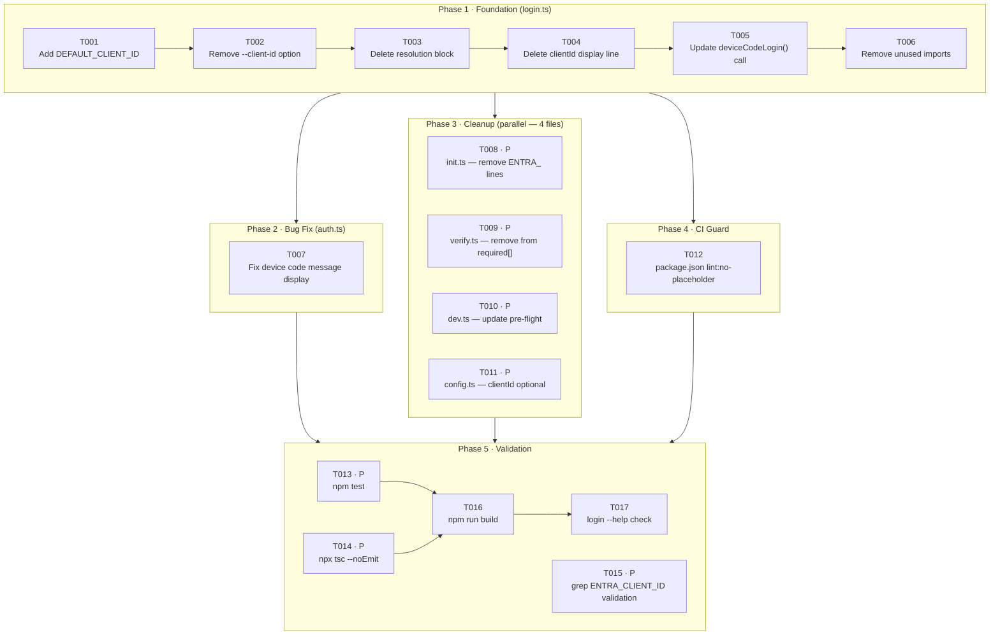

# Tasks: CLI First-Party Authentication

**Feature**: Embed the EAI CLI's own App Registration into `login.ts` so that
`eai login` works immediately after `npm install` with zero configuration.

**Total tasks**: 17 | **Parallel opportunities**: 7 | **Estimated net diff**: −19 lines across 6 files

---

## Overview

| Phase | Goal | Tasks | Parallel? |
|-------|------|-------|-----------|
| 1 — Foundation | Add constant, remove flag + resolution block, clean login.ts | T001–T006 | Sequential (same file) |
| 2 — Bug Fix | Add missing device code message display | T007 | Unblocked after Phase 1 |
| 3 — Cleanup | Remove ENTRA_CLIENT_ID from init, verify, dev, config | T008–T011 | All [P] — different files |
| 4 — CI Guard | Prevent placeholder shipping via npm script | T012 | Unblocked after Phase 1 |
| 5 — Validation | Tests, typecheck, grep, build, help output | T013–T017 | T013/T014/T015 [P] |

---

## Dependency Graph



---

## Phase 1: Foundation — `src/commands/login.ts`

**Goal**: Replace the 3-path clientId resolution (flag → `.env.local` → env var
→ `process.exit(1)`) with a single hardcoded constant. Remove the `--client-id`
Commander option. Keep `--tenant-name`, `--tenant-id`, `--scope` flags unchanged.

**Verification**: After this phase, `eai login --help` contains no `--client-id`
and `eai login` on a clean machine reaches the Entra device code endpoint.

- [X] T001 Add `const DEFAULT_CLIENT_ID = 'EAI_CLI_CLIENT_ID_PLACEHOLDER';` as a
      new line 15 (after `DEFAULT_SCOPE` on line 14), following the exact pattern
      of the three existing default constants, in `src/commands/login.ts`

- [X] T002 Delete line 20: `.option('--client-id <id>', 'App registration client
      ID')` from the Commander option chain in `src/commands/login.ts`

- [X] T003 Delete the entire 15-line clientId resolution block (currently lines
      23–37) in `src/commands/login.ts`:
      ```
      let clientId = options.clientId;
      if (!clientId) { ... findProjectRoot ... loadEnvFile ... }
      if (!clientId) { out.error(...); process.exit(1); }
      ```

- [X] T004 Delete the `out.info(\`Client: ${chalk.dim(clientId)}\`)` display line
      (currently line 41, shifts down after T003 deletions) — the hardcoded client
      ID is an implementation detail, not user-facing information —
      in `src/commands/login.ts`

- [X] T005 Update the `deviceCodeLogin()` call argument `clientId,` (currently
      line 47, renumbers after prior deletions) to `DEFAULT_CLIENT_ID,` — this is
      the only code addition after T001; all other changes are deletions —
      in `src/commands/login.ts`

- [X] T006 Remove the now-dead import on line 8:
      `import { findProjectRoot, loadEnvFile } from '../lib/config.js';`
      — `findProjectRoot` and `loadEnvFile` are no longer called anywhere in
      `login.ts` after T003 is applied — in `src/commands/login.ts`

**Phase 1 checkpoint**:
- [ ] `eai login --help` shows no `--client-id`, no `ENTRA_CLIENT_ID`
- [ ] `eai login --tenant-name foo --tenant-id bar --scope baz` still works
- [ ] File compiles: `npx tsc --noEmit`

---

## Phase 2: Bug Fix — `src/lib/auth.ts`

**Goal**: Display the device code message (URL + user code) so users know where
to authenticate. This corrects an existing bug where the comment stub
`// Display message to user` on line 162 was never replaced with actual output.

- [X] T007 Replace the stub comment `  // Display message to user` (line 162,
      between the `deviceCode` parse on line 160 and the `// Step 2: Poll for
      token` comment on line 164) with the actual display call:
      ```typescript
      console.log(`\n${deviceCode.message}\n`);
      ```
      The `message` field is already declared in the `DeviceCodeResponse`
      interface at `src/lib/auth.ts:34`. The `\n` wrappers produce a blank line
      before and after the Entra message (satisfying FR-04 and NFR-05).
      File: `src/lib/auth.ts`

**Phase 2 checkpoint**:
- [ ] Running `eai login` with a real Client ID shows the Entra verification URL
      and user code before polling begins
- [ ] The message is visually separated from the heading and subsequent output

---

## Phase 3: Cleanup — 4 files (all parallelizable)

**Goal**: Remove every remaining `ENTRA_CLIENT_ID` reference from the CLI
surface. All four tasks touch different files and have no shared state — they
can be executed in parallel or in any order.

- [X] T008 [P] Delete lines 267–268 from the `.env.local` template string inside
      `generateEnvLocalTemplate()` in `src/commands/init.ts`:
      ```
      ENTRA_CLIENT_ID=<your-app-client-id>
      ENTRA_CLIENT_SECRET=<your-app-client-secret>
      ```
      The adjacent lines `ENTRA_TENANT_NAME`, `ENTRA_TENANT_ID`, and
      `ENTRA_SCOPES` (lines 265, 266, 269) remain untouched.

- [X] T009 [P] Remove `'ENTRA_CLIENT_ID'` from the `required` array on line 170
      in `src/commands/verify.ts`:
      ```typescript
      // BEFORE
      const required = ['BASE_URL_PUBLIC_API', 'ENTRA_TENANT_ID', 'ENTRA_CLIENT_ID', 'AUTH_SECRET'];
      // AFTER
      const required = ['BASE_URL_PUBLIC_API', 'ENTRA_TENANT_ID', 'AUTH_SECRET'];
      ```
      The three remaining entries are unchanged.

- [X] T010 [P] Replace the `if (env.ENTRA_CLIENT_ID && env.ENTRA_TENANT_ID)`
      auth pre-flight block (lines 64–68) in `src/commands/dev.ts` with a
      tenant-only check:
      ```typescript
      // BEFORE (lines 64-68)
      if (env.ENTRA_CLIENT_ID && env.ENTRA_TENANT_ID) {
        out.success(`Auth configured for tenant ${chalk.dim(env.ENTRA_TENANT_ID)}`);
      } else {
        out.warn('Entra auth not configured. Login will not work.');
      }

      // AFTER
      if (env.ENTRA_TENANT_ID) {
        out.success(`Entra tenant configured: ${chalk.dim(env.ENTRA_TENANT_ID)}`);
      } else {
        out.warn('ENTRA_TENANT_ID not set. Server-side Entra auth may not work.');
      }
      ```
      The updated warning is accurate: the CLI itself works regardless
      (via first-party auth); the warning now pertains to the vertical's
      server-side config only.

- [X] T011 [P] Make two edits to `src/lib/config.ts`:
      1. Mark `clientId` optional in the `EAIProjectConfig.entra` interface
         at line 24:
         ```typescript
         // BEFORE (line 24)
         clientId: string;
         // AFTER
         clientId?: string;  // No longer required — CLI uses first-party App Registration
         ```
      2. Change the `resolveProjectConfig()` return at line 232 to use
         `undefined` instead of empty-string fallback:
         ```typescript
         // BEFORE (line 232)
         clientId: env.ENTRA_CLIENT_ID || '',
         // AFTER
         clientId: env.ENTRA_CLIENT_ID || undefined,
         ```
      Both changes are backward-compatible: optional field + `undefined` value
      compiles for any downstream consumer that may reference `config.entra.clientId`.

**Phase 3 checkpoint**:
- [ ] `grep -r ENTRA_CLIENT_ID src/` → zero results
- [ ] `eai init` generated `.env.local` contains no `ENTRA_CLIENT_ID` or `ENTRA_CLIENT_SECRET`
- [ ] `eai verify` (doctor) passes on a project without `ENTRA_CLIENT_ID`
- [ ] `eai dev` runs without warning about missing client ID

---

## Phase 4: CI Guard — `package.json`

**Goal**: Ensure the `EAI_CLI_CLIENT_ID_PLACEHOLDER` string cannot silently ship
to users. A failing grep in the pre-publish step blocks the release until EAI
provides and sets the real App Registration GUID.

- [X] T012 Add a `"lint:no-placeholder"` script to the `"scripts"` section of
      `package.json` and wire it into `prepublishOnly`:
      ```json
      // ADD to "scripts":
      "lint:no-placeholder": "! grep -r EAI_CLI_CLIENT_ID_PLACEHOLDER src/",

      // UPDATE "prepublishOnly":
      "prepublishOnly": "npm run build && npm run lint && npm run lint:no-placeholder"
      ```
      The `!` prefix inverts grep's exit code — the script succeeds when grep
      finds **no** matches (placeholder absent) and fails when the placeholder
      is still present. Run standalone with `npm run lint:no-placeholder`.
      File: `package.json`

**Phase 4 checkpoint**:
- [ ] `npm run lint:no-placeholder` exits 0 (placeholder absent from src/) — OR
      exits non-zero if the placeholder constant is still `'EAI_CLI_CLIENT_ID_PLACEHOLDER'`
      (expected during development; proves the guard works)

---

## Phase 5: Validation

**Goal**: Confirm all existing tests pass, zero TypeScript errors, zero
`ENTRA_CLIENT_ID` refs in source, clean build, and correct `--help` output.

**Prerequisites**: All of Phases 1–4 complete.

- [X] T013 [P] Run `npm test` — all existing Vitest tests must pass without
      modification. The only test-adjacent file affected (`tests/helpers/
      setup-dsl.ts:50`, `clientId: 'test-client-id'` in fake token) is
      intentionally untouched; confirm it still compiles and runs correctly.

- [X] T014 [P] Run `npx tsc --noEmit` — confirm zero TypeScript errors. Key
      assertions: `DEFAULT_CLIENT_ID` (string) satisfies `deviceCodeLogin()`
      parameter type; `clientId?: string` does not break `resolveProjectConfig()`
      return type; removed `findProjectRoot`/`loadEnvFile` imports leave no
      dangling references.

- [X] T015 [P] Run both grep checks and confirm zero matches:
      ```bash
      grep -r ENTRA_CLIENT_ID src/    # must return nothing
      grep -r 'client-id' src/        # must return nothing
      ```
      Any match is a Phase 1 or Phase 3 regression requiring a fix before
      proceeding.

- [X] T016 Run `npm run build` — confirm clean TypeScript compile to `dist/`.
      Depends on T013 and T014 both passing.

- [X] T017 Run `node dist/index.js login --help` and inspect output. Must
      **contain**: `--tenant-name`, `--tenant-id`, `--scope`. Must **not
      contain**: `--client-id`, `ENTRA_CLIENT_ID`, `client ID`. Depends on T016.

**Phase 5 checkpoint** — all 8 spec success criteria satisfied:

| Criterion | Task | Expected |
|-----------|------|----------|
| Steps to first login | T013 + manual | 1 (`eai login`) |
| Config required before login | T015 grep | 0 vars, 0 flags |
| `ENTRA_CLIENT_ID` refs in `src/` | T015 | 0 matches |
| `--client-id` in `eai login --help` | T017 | Not present |
| `ENTRA_CLIENT_ID` in `eai init` output | T008 | Not present |
| `eai verify` flagging absent `ENTRA_CLIENT_ID` | T009 | Does not flag |
| Device code URL + code displayed | T007 | Yes |
| Existing tests pass | T013 | All green |

---

## Parallel Execution Guide

### Phase 3 — Launch all 4 in parallel

```bash
# These four tasks touch different files with no shared state:
# T008 — src/commands/init.ts
# T009 — src/commands/verify.ts
# T010 — src/commands/dev.ts
# T011 — src/lib/config.ts
```

If working alone, any order is fine. If paired or using subagents, all four
can be assigned simultaneously.

### Phase 5 — Launch first three in parallel

```bash
# T013, T014, T015 are independent read/run operations:
npm test &               # T013
npx tsc --noEmit &       # T014
grep -r ENTRA_CLIENT_ID src/ && grep -r 'client-id' src/ &  # T015
wait
# Only after all three pass:
npm run build            # T016
node dist/index.js login --help  # T017
```

---

## Implementation Strategy

### MVP Path (minimum to unblock `eai login`)

1. Complete Phase 1 (T001–T006) — login works without any configuration
2. Complete Phase 2 (T007) — user sees where to authenticate
3. Run T013, T014 — confirm no regressions
4. **STOP**: login feature is shippable (with placeholder substituted)

### Full Cleanup Path

5. Complete Phase 3 (T008–T011) in parallel
6. Complete Phase 4 (T012)
7. Complete Phase 5 (T013–T017)

### Placeholder Swap Point

When EAI confirms the real App Registration GUID, make one targeted edit:

```typescript
// src/commands/login.ts — single line change
// BEFORE:
const DEFAULT_CLIENT_ID = 'EAI_CLI_CLIENT_ID_PLACEHOLDER';
// AFTER:
const DEFAULT_CLIENT_ID = '<real-guid-from-eai>';
```

After this swap, `npm run lint:no-placeholder` (T012) will exit 0 and
`prepublishOnly` will pass, unblocking the release.

---

## Spec Traceability

### User Stories → Tasks

| User Story | Priority | Phase(s) | Tasks |
|------------|----------|----------|-------|
| US-01: Zero-config login | P1 | 1, 2 | T001–T007 |
| US-02: Login requires no flags | P1 | 1 | T002, T003, T006 |
| US-03: New project scaffold has no Entra client config | P1 | 3 | T008 |
| US-04: Platform verification ignores client ID | P2 | 3 | T009 |
| US-05: Local dev server starts without Entra client config | P2 | 3 | T010 |
| US-06: Power-user tenant overrides still work | P3 | 1 | T001–T006 (flags preserved) |

**US Coverage: 6/6** ✅

### Functional Requirements → Tasks

| Requirement | Task(s) | File(s) |
|-------------|---------|---------|
| FR-01: CLI ships with hardcoded first-party Client ID | T001 | `src/commands/login.ts` |
| FR-02: `--client-id` flag removed | T002 | `src/commands/login.ts` |
| FR-03: Runtime clientId resolution block removed | T003, T004, T005, T006 | `src/commands/login.ts` |
| FR-04: Device code URL and user code displayed | T007 | `src/lib/auth.ts` |
| FR-05: `eai init` scaffold removes Entra client vars | T008 | `src/commands/init.ts` |
| FR-06: `eai verify` does not require `ENTRA_CLIENT_ID` | T009 | `src/commands/verify.ts` |
| FR-07: `eai dev` pre-flight does not check `ENTRA_CLIENT_ID` | T010 | `src/commands/dev.ts` |
| FR-08: Project config interface updated | T011 | `src/lib/config.ts` |

**FR Coverage: 8/8** ✅

### Acceptance Criteria → Tasks

| AC | User Story | Task(s) |
|----|------------|---------|
| `eai login` succeeds on clean machine (no .env.local, no ENTRA_CLIENT_ID) | US-01 | T001–T006 |
| User directed to browser URL with user code displayed | US-01 | T007 |
| Verification URL and user code visibly printed before polling | US-01 | T007 |
| Authentication completes and success message shown | US-01 | T001–T007 |
| Valid access token stored for subsequent commands | US-01 | unchanged |
| `eai login` with no args succeeds | US-02 | T001–T006 |
| `--client-id` flag no longer exists on login command | US-02 | T002 |
| `eai login --help` mentions neither `--client-id` nor `ENTRA_CLIENT_ID` | US-02 | T002, T017 |
| `eai init` generated `.env.local` has no `ENTRA_CLIENT_ID` | US-03 | T008 |
| `eai init` generated `.env.local` has no `ENTRA_CLIENT_SECRET` | US-03 | T008 |
| All other scaffolded env vars remain unchanged | US-03 | T008 |
| `eai verify` does not list `ENTRA_CLIENT_ID` as required | US-04 | T009 |
| Project without `ENTRA_CLIENT_ID` passes verify without error | US-04 | T009 |
| `eai dev` does not halt or warn when `ENTRA_CLIENT_ID` absent | US-05 | T010 |
| Pre-flight check updated / removed | US-05 | T010 |
| `--tenant-name`, `--tenant-id`, `--scope` flags remain on `eai login` | US-06 | T001–T006 |
| Tenant override flags work as before | US-06 | no change required |
| No new `--client-id` override introduced | US-06 | T002 |

**AC Coverage: 18/18** ✅
