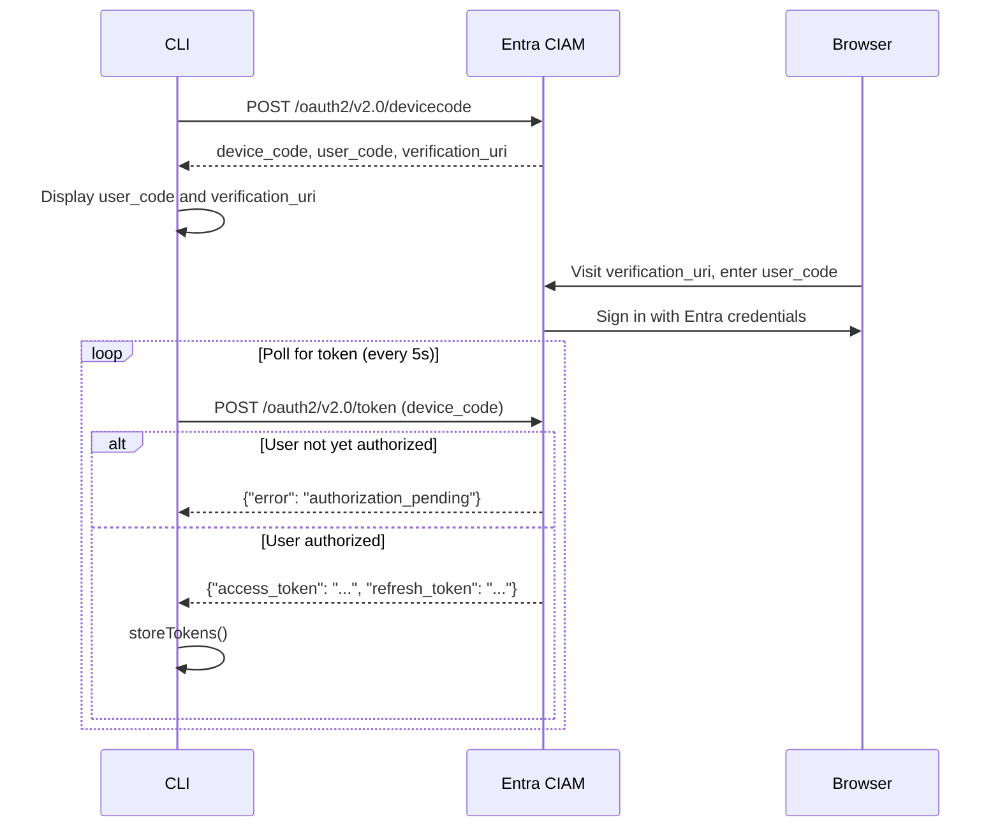
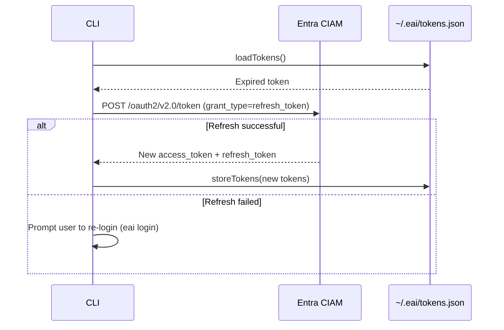

# EAI CLI — API Reference

## Overview

The CLI interacts with the **EAI Platform API v3**. All endpoints require Bearer token authentication obtained via Entra CIAM device code flow.

**Base URL**: Configured via `BASE_URL_PUBLIC_API` environment variable (e.g., `https://api.eai.example.com`)

**Authentication**: `Authorization: Bearer {access_token}`

## Platform API Endpoints

### Resources API

#### List Resources
```
GET /v3/resources/{tenant_id}/{object_type}
```

**Query Parameters**:
- `page` (number) — Page number (default: 1)
- `limit` (number) — Items per page (default: 20)
- `sort` (string) — Sort field (prefix with `-` for descending, e.g., `-created_at`)

**Response**:
```json
{
  "docs": [
    {
      "id": "uuid",
      "data": { /* resource fields */ },
      "created_at": "2026-03-11T12:00:00Z",
      "updated_at": "2026-03-11T12:00:00Z",
      "version": 1,
      "tenant": "tenant-id",
      "object_type": "ObjectTypeName"
    }
  ],
  "totalDocs": 100,
  "page": 1,
  "totalPages": 5,
  "limit": 20
}
```

**CLI Command**: `eai resources list <type> --page 1 --limit 20 --sort -created_at`

---

#### Get Resource
```
GET /v3/resources/{tenant_id}/{object_type}/{id}
```

**Response**:
```json
{
  "id": "uuid",
  "data": { /* resource fields */ },
  "version": 1,
  "created_at": "2026-03-11T12:00:00Z",
  "updated_at": "2026-03-11T12:00:00Z"
}
```

**CLI Command**: `eai resources get <type> <id>`

---

#### Create Resource
```
POST /v3/resources/{tenant_id}/{object_type}
Content-Type: application/json

{
  "data": {
    "field1": "value1",
    "field2": 123
  }
}
```

**Response**:
```json
{
  "id": "uuid",
  "data": { /* created resource */ },
  "version": 1,
  "created_at": "2026-03-11T12:00:00Z"
}
```

**CLI Command**: `eai resources create <type> --data '{"field1":"value1"}'`

---

#### Update Resource
```
PUT /v3/resources/{tenant_id}/{object_type}/{id}
Content-Type: application/json

{
  "data": {
    "field1": "updated-value"
  },
  "version": 1
}
```

**Notes**:
- `version` is required for optimistic locking
- Server returns 409 Conflict if version doesn't match

**CLI Command**: `eai resources update <type> <id> --data '{"field1":"updated"}' --version 1`

---

#### Delete Resource
```
DELETE /v3/resources/{tenant_id}/{object_type}/{id}
```

**Response**: 204 No Content

**CLI Command**: `eai resources delete <type> <id>`

---

#### Query Resources (Cross-Type)
```
POST /v3/resources/{tenant_id}/query
Content-Type: application/json

{
  "object_types": ["Type1", "Type2"],
  "where": {
    "field1": { "equals": "value" },
    "field2": { "gt": 100 }
  },
  "limit": 20
}
```

**Response**:
```json
{
  "results": [
    {
      "id": "uuid",
      "object_type": "Type1",
      "data": { /* fields */ }
    }
  ],
  "total": 15
}
```

**CLI Command**: `eai resources query --types Type1,Type2 --where '{"field1":{"equals":"value"}}' --limit 20`

---

#### Get Schema (Published Object Types)
```
GET /v3/resources/schema/{tenant_id}
```

**Response**:
```json
{
  "objectTypes": [
    {
      "name": "ObjectTypeName",
      "displayName": "Object Type Display Name",
      "properties": [
        {
          "name": "fieldName",
          "type": "text",
          "required": true,
          "indexed": true
        }
      ],
      "linkTypes": [
        {
          "name": "linkName",
          "targetObjectType": "TargetType",
          "cardinality": "one-to-many"
        }
      ],
      "actions": [
        {
          "name": "actionName",
          "displayName": "Action Display Name",
          "requiredRole": "tenant-user",
          "validationRules": {},
          "sideEffects": []
        }
      ]
    }
  ]
}
```

**CLI Command**: `eai resources schema`

---

#### Execute Resource Action
```
POST /v3/resources/{tenant_id}/{object_type}/{id}/actions/{action_name}
Content-Type: application/json

{
  "params": {
    "param1": "value1"
  }
}
```

**Response**: Varies based on action definition

---

#### Get Resource History
```
GET /v3/resources/{tenant_id}/{object_type}/{id}/history
```

**Response**:
```json
{
  "history": [
    {
      "version": 2,
      "data": { /* snapshot */ },
      "updated_at": "2026-03-11T13:00:00Z",
      "updated_by": "user-id"
    },
    {
      "version": 1,
      "data": { /* snapshot */ },
      "created_at": "2026-03-11T12:00:00Z"
    }
  ]
}
```

---

### Chat API

#### Send Chat Message
```
POST /v3/chat/{tenant_id}/{workflow_id}/{stage}
Content-Type: application/json

{
  "message": "User message text",
  "conversation_id": "uuid",
  "params": {
    "context_key": "context_value"
  }
}
```

**Response**:
```json
{
  "response": "AI response text",
  "conversation_id": "uuid",
  "metadata": {}
}
```

**CLI Command**: `eai chat send "Hello" --workflow wf-id --stage chat --conversation conv-id`

---

#### Stream Chat Message (SSE)
```
POST /v3/chat/stream/{tenant_id}/{workflow_id}/{stage}
Content-Type: application/json

{
  "message": "User message text",
  "conversation_id": "uuid",
  "params": {}
}
```

**Response**: Server-Sent Events stream

```
data: {"content": "Hello"}
data: {"content": " there"}
data: {"content": "!"}
data: [DONE]
```

**CLI Command**: `eai chat stream "Hello" --workflow wf-id --stage chat`

---

### Documents API

#### Classify Document
```
POST /v3/documents/classify
Content-Type: multipart/form-data

files: <file-blob>
```

**Response**:
```json
{
  "classification": "document-type",
  "confidence": 0.95,
  "metadata": {}
}
```

**CLI Command**: `eai docs classify ./document.pdf`

---

#### Index Document for RAG
```
POST /v3/documents/rag-index
Content-Type: application/json

{
  "document_id": "uuid"
}
```

**Response**:
```json
{
  "status": "indexed",
  "document_id": "uuid"
}
```

**CLI Command**: `eai docs index <document-id>`

---

### Authentication API

#### Get Current User
```
GET /v3/auth/me
Authorization: Bearer {token}
```

**Response**:
```json
{
  "user_id": "uuid",
  "upn": "user@example.com",
  "tenant_id": "tenant-id",
  "roles": ["tenant-user"]
}
```

**CLI Command**: `eai whoami`

---

#### Provision User
```
POST /v3/users/provisionme
Content-Type: application/json

{
  "tenant_id": "tenant-id"
}
```

**Response**:
```json
{
  "user_id": "uuid",
  "provisioned": true
}
```

---

### Platform Orchestration API

#### Platform Request (Internal Routing)
```
POST /v3/orchestrate
Content-Type: application/json

{
  "target_backend": "payload",
  "endpoint": "/object-types",
  "method": "GET",
  "params": {
    "where": { "name": { "equals": "ObjectType" } }
  }
}
```

**Purpose**: Routes requests to internal backend services (payload, type registry, etc.)

**Used By**:
- `eai types seed` — Routes to `/object-types` endpoint
- `eai tenant list` — Routes to `/tenants` endpoint

---

### Tenants API (via Orchestration)

#### List Tenants
```
Routed via /v3/orchestrate:
{
  "target_backend": "payload",
  "endpoint": "/tenants",
  "method": "GET",
  "params": {
    "limit": 100,
    "where": { "parent": { "equals": "parent-id" } }
  }
}
```

**CLI Command**: `eai tenant list`

---

#### Get Tenant
```
Routed via /v3/orchestrate:
{
  "target_backend": "payload",
  "endpoint": "/tenants/{id}",
  "method": "GET"
}
```

**CLI Command**: `eai tenant info <id>`

---

#### Create Tenant
```
Routed via /v3/orchestrate:
{
  "target_backend": "payload",
  "endpoint": "/tenants",
  "method": "POST",
  "body": {
    "name": "Tenant Name",
    "slug": "tenant-slug",
    "parent": "parent-id",
    "domain": ["example.com"]
  }
}
```

**CLI Command**: `eai tenant create`

---

## Object Type Management API

### Seed Object Types

**Endpoint**: Routed via `/v3/orchestrate` to `/object-types`

#### Check if Object Type Exists
```
GET /object-types?where={"name":{"equals":"TypeName"},"tenant":{"equals":"tenant-id"}}
```

#### Create Object Type
```
POST /object-types

{
  "name": "ObjectTypeName",
  "displayName": "Object Type Display Name",
  "description": "Description",
  "properties": [...],
  "linkTypes": [...],
  "actions": [...],
  "storageBackend": "mongodb",
  "status": "published",
  "tenant": "tenant-id"
}
```

#### Update Object Type
```
PATCH /object-types/{id}

{
  "displayName": "Updated Display Name",
  "properties": [...],
  "linkTypes": [...],
  "actions": [...]
}
```

**CLI Command**: `eai types seed`

---

## Object Type Definition Schema

### ObjectTypeDefinition Interface

```typescript
interface ObjectTypeDefinition {
  name: string;                    // PascalCase identifier
  displayName: string;             // Human-readable name
  description?: string;            // Optional description
  properties: ObjectTypeProperty[];
  linkTypes: ObjectTypeLinkType[];
  actions: ObjectTypeAction[];
  storageBackend?: string;         // Default: "mongodb"
  status: 'draft' | 'published' | 'deprecated';
}
```

### ObjectTypeProperty Interface

```typescript
interface ObjectTypeProperty {
  name: string;                    // camelCase field name
  type: 'text' | 'number' | 'boolean' | 'date' | 'select' | 'json' | 'file' | 'relationship';
  required: boolean;
  indexed?: boolean;               // Index for queries
  defaultValue?: string | number | boolean;
  options?: Array<{ label: string; value: string }>; // For select type
  description?: string;
}
```

### ObjectTypeLinkType Interface

```typescript
interface ObjectTypeLinkType {
  name: string;                    // Link name
  targetObjectType: string;        // Target type name
  cardinality: 'one-to-one' | 'one-to-many' | 'many-to-one' | 'many-to-many';
  cascadeDelete?: boolean;         // Delete linked resources
}
```

### ObjectTypeAction Interface

```typescript
interface ObjectTypeAction {
  name: string;                    // Action name
  displayName: string;             // UI display name
  requiredRole: 'tenant-user' | 'tenant-staff' | 'tenant-admin';
  validationRules: {
    requiredFields?: string[];     // Fields that must be present
    requiredStatus?: string;       // Required status value
  };
  sideEffects: Array<{
    type: 'set_field' | 'set_timestamp' | 'set_user';
    field: string;
    value?: string | number | boolean;
  }>;
}
```

---

## CLI Internal Interfaces

### StoredTokens Interface

```typescript
interface StoredTokens {
  accessToken: string;
  refreshToken?: string;
  expiresAt: number;               // Timestamp in ms
  tenantId: string;
  tenantName: string;
  clientId: string;
  upn?: string;                    // User Principal Name
}
```

### EAIProjectConfig Interface

```typescript
interface EAIProjectConfig {
  appName: string;
  displayName: string;
  tenantId: string;
  workflowId: string;
  environment: string;
  publicApiUrl: string;
  entra: {
    tenantName: string;
    tenantId: string;
    clientId: string;
  };
}
```

---

## Error Responses

### Standard Error Format

```json
{
  "error": "error_code",
  "message": "Human-readable error message",
  "details": {}
}
```

### Common HTTP Status Codes

| Status | Meaning | CLI Handling |
|--------|---------|--------------|
| 200 | Success | Parse response and display |
| 201 | Created | Display success message with resource ID |
| 204 | No Content | Display success message |
| 400 | Bad Request | Display error message and exit |
| 401 | Unauthorized | Prompt user to re-login |
| 403 | Forbidden | Display permission error |
| 404 | Not Found | Display not found error |
| 409 | Conflict | Display version conflict error (optimistic locking) |
| 500 | Server Error | Display error and suggest retrying |

---

## Authentication Flow

### Entra CIAM Device Code Flow



### Token Refresh Flow



---

## Rate Limits

Not determined from codebase. Rate limiting is expected to be enforced by the Platform API.

---

## Versioning

- **CLI Version**: Follows semantic versioning (e.g., `0.1.4`)
- **API Version**: `v3` (endpoints prefixed with `/v3/`)
- **Breaking Changes**: Major version bumps in CLI; platform API versioning is separate

**CLI Command**: `eai --version` displays current CLI version
