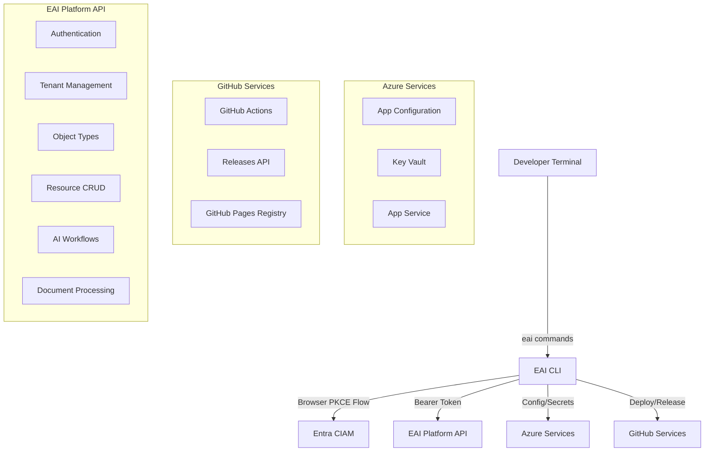
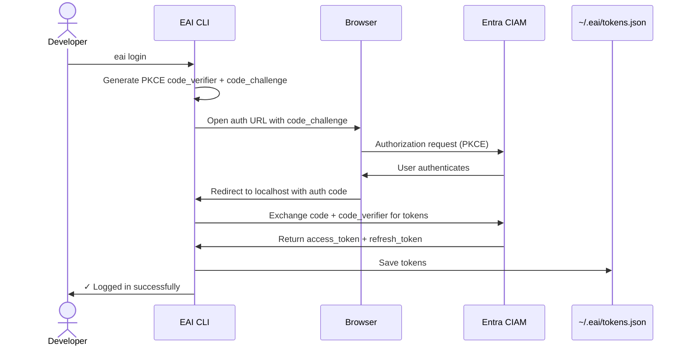
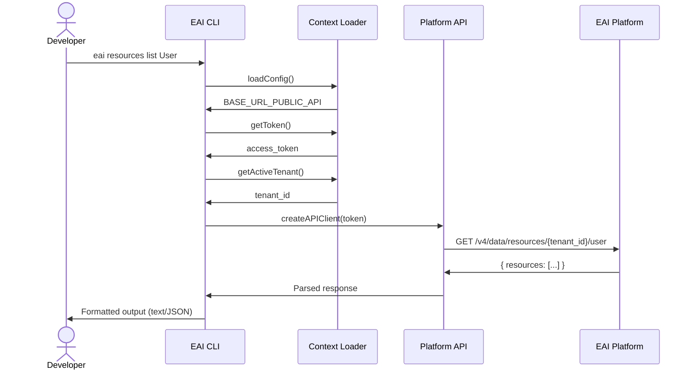
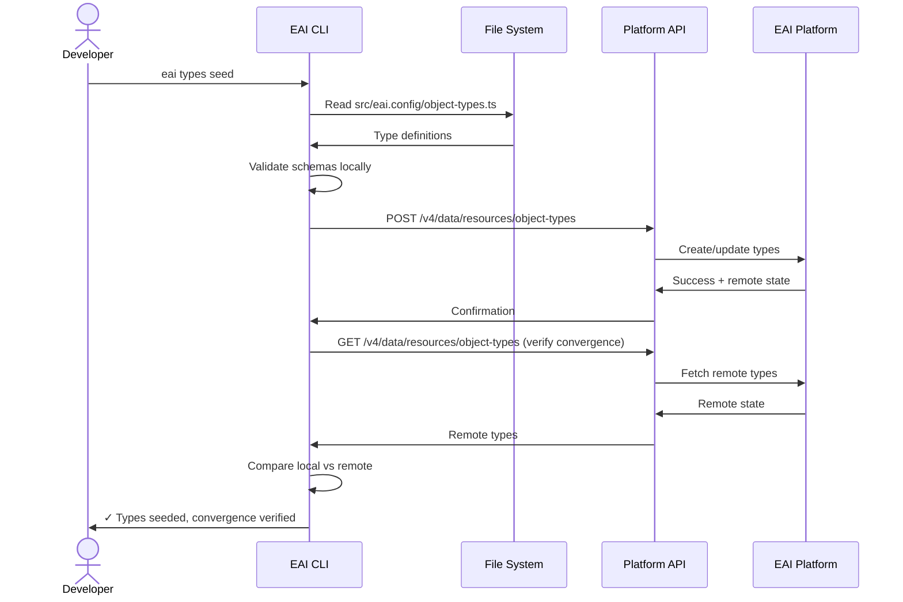
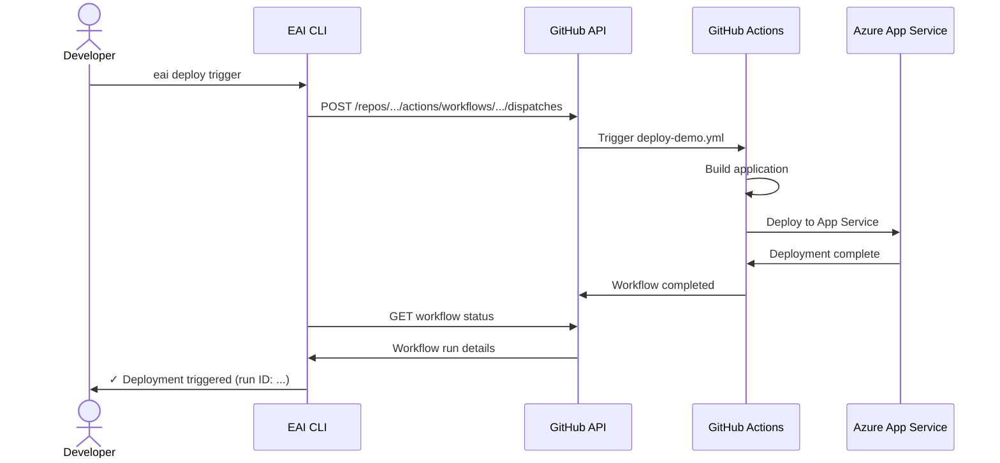

# EAI CLI — Architecture

## System Context

The EAI CLI serves as the developer interface to the Enterprise AI Platform, orchestrating authentication, data management, AI workflows, and deployment operations.



## Component Breakdown

### CLI Core (`src/index.ts`)
Commander.js program that:
- Registers all command modules
- Defines global flags (`--format`, `--simple`, `--no-color`, `--describe`, `--profile`)
- Implements pre-action hooks for flag processing
- Provides CLI introspection via `--describe` for AI agents

### Command Layer (`src/commands/`)

Commands are organized by functional domain:

| Command Group | Files | Purpose |
|--------------|-------|---------|
| **Scaffolding** | `init.ts`, `dev.ts` | Project initialization with Gofer assets, local dev server |
| **Auth** | `login.ts`, `whoami.ts` | Entra CIAM browser auth, token management, auth status |
| **Tenant** | `tenant.ts` | Tenant selection, creation, info, list (membership-driven) |
| **User** | `user.ts`, `provision.ts` | User invites, provisioning, Entra app registration |
| **Schema** | `types.ts` | Object Type validate, seed, diff, pull |
| **Data** | `resources.ts` | CRUD operations, cross-type queries, schema inspection |
| **AI** | `chat.ts`, `docs.ts`, `workflow.ts` | Chat streaming, document classification/indexing, workflow readiness |
| **Config** | `env.ts` | Azure App Config/Key Vault sync (pull/push/list) |
| **Deploy** | `deploy.ts` | GitHub Actions deployment orchestration |
| **Diagnostics** | `verify.ts` | Platform connectivity, health checks, doctor mode |
| **Maintenance** | `update.ts`, `gofer.ts`, `template.ts` | CLI updates, Gofer asset refresh, template drift |
| **Blocks** | `blocks.ts`, `vertical.ts` | UI block catalog management, app metadata |

Each command follows a consistent pattern:
1. Parse options and validate prerequisites
2. Authenticate (if needed) via `getToken()`
3. Create API client with `createAPIClient(token)`
4. Execute operation with structured error handling
5. Format output based on `--format` flag (text/JSON; YAML is not implemented)
6. Exit with structured error codes on failure

### Library Layer (`src/lib/`)

#### Core Libraries

**`api.ts` - Platform API Client**
- Fetch-based PublicAPI v4 client with Bearer token authentication
- Route families: platform, identity, resources, documents, workflows, AI, and integrations
- Base URL from active profile, project/process `BASE_URL_PUBLIC_API`, tenant regional routing, or public default
- Automatic JSON serialization/deserialization where streaming behavior does not require direct `fetch()`
- Error handling with structured server context

**`auth.ts` - Authentication**
- Entra CIAM browser-based PKCE flow
- Encrypted local token storage in `~/.eai/tokens.json` or profile-specific token files
- Token refresh logic
- Functions include token load/store, browser login, logout, access-token resolution, and refresh

**`config.ts` - Configuration Loader**
- Multi-source configuration merging (`.env.local` → `eai.config.ts` → `process.env`)
- Dotenv integration
- TypeScript config file support
- Functions: `loadConfig()`, `getEnvVar()`

**`error-codes.ts` - Error System**
- Structured error codes (E001-E399)
- Categories:
  - E001-E099: Project errors (config, not in project)
  - E100-E199: Auth errors (not logged in, token expired)
  - E200-E299: Platform errors (API down, not found)
  - E300-E399: Validation errors (invalid schema, missing field)
- Functions: `exitWithError()`, `formatError()`
- Format-aware output (text/JSON)

**`output.ts` - Output Utilities**
- TTY-aware colored output with chalk
- Symbol rendering: `✓`, `✗`, `⚠`, `→`, `○`, `↻`, `=`, `+`, `-`, `~`
- Simple mode for screen readers (`--simple` flag)
- Color detection (respects `NO_COLOR`, `FORCE_COLOR`, TTY state)
- Functions: `success()`, `error()`, `warn()`, `info()`

**`context.ts` - Project Context**
- Detects EAI project root
- Loads project manifest
- Validates project structure
- Functions: `getProjectRoot()`, `isInProject()`, `loadProjectContext()`

**`tenant-context.ts` - Tenant Context**
- Manages active tenant selection
- Stores active tenant metadata alongside the active profile token record
- Validates tenant membership via PublicAPI
- Functions include PublicAPI URL resolution, membership fetch, tenant selection, and usability refresh

**PublicAPI regional routing boundary**
- `resolvePublicApiUrl()` chooses the PublicAPI base URL in this order: named profile override, project/process `BASE_URL_PUBLIC_API`, stored active tenant `homeRegion`, authenticated session routing, then the AU production default.
- Session routing uses the current bearer token from `auth.ts` only against the configured bootstrap resolver. The returned `apiBaseUrl` is accepted only when it is a trusted PublicAPI host or a loopback host for local dev-stack.
- Host-only regional responses are normalized to the PublicAPI gateway path (`/public`) before later CLI calls attach bearer tokens.

**`schema-builder.ts` - CLI Introspection**
- Generates JSON schema from Commander.js program structure
- Enables AI agents to discover CLI capabilities at runtime
- Used by `--describe` flag
- Functions: `describeProgram()`, `describeCommand()`

**`update-check.ts` - Version Management**
- Checks the static EAI release registry for updates
- Rate-limited to once per day
- Stores last check in `~/.eai/update-check.json`
- Non-blocking notifications
- Functions: `checkForUpdate()`, `notifyIfUpdateAvailable()`

#### Specialized Libraries

**`gofer-refresh.ts` - Gofer Asset Management**
- Manages Gofer AI terminal assets (Claude, Codex, Gemini, Copilot)
- Manifest-based tracking in `.eai-manifest.json`
- Conflict detection for locally modified files
- Backup creation before updates
- Functions: `planRefresh()`, `applyRefresh()`, `detectConflicts()`

**`gofer-installer.ts` - Gofer Installation**
- Installs Gofer assets during `eai init`
- Copies command definitions, agents, skills, prompts
- Configures `.specify/` pipeline directory
- Functions: `installGoferAssets()`, `skipGoferInstallation()`

**`project-manifest.ts` - Project Manifest**
- Persists `.eai-manifest.json` for Gofer refresh tracking
- Records file hashes for conflict detection
- Tracks installation metadata (timestamp, CLI version)
- Functions: `loadManifest()`, `saveManifest()`, `updateManifest()`

**`block-catalog.ts` - Block Catalog Parser**
- Parses UI component catalogs for AI-readable metadata
- Extracts foundation, product, addon, and demo blocks
- Validates block schemas
- Functions: `parseBlockCatalog()`, `validateBlocks()`

**`block-catalog-validation.ts` - Block Validation**
- Schema validation for block definitions
- Type checking for block metadata
- Functions: `validateBlockSchema()`, `checkBlockTypes()`

**`cloud-env.ts` - Azure Environment Sync**
- Azure App Configuration client
- Azure Key Vault integration
- Functions: `pullEnv()`, `pushEnv()`, `listEnv()`

**`profile.ts` - Profile Management**
- Private profile support for locally configured contexts
- Profile-specific configuration loading
- Functions: `loadProfile()`, `listProfiles()`, `setActiveProfile()`

**`npm.ts` - npm Utilities**
- Package installation helpers
- Registry configuration
- Functions: `installPackage()`, `configureRegistry()`

**`utils.ts` - General Utilities**
- File system helpers
- String formatting
- Validation utilities
- Functions: `ensureDir()`, `readJsonFile()`, `writeJsonFile()`

**`azure-cli.ts` - Azure CLI Integration**
- Azure CLI command wrappers
- Resource provisioning helpers
- Functions: `executeAzCommand()`, `checkAzLogin()`

## Data Flow

### Authentication Flow



### Resource Operation Flow



### Type Seeding Flow



### Deployment Flow



## Key Abstractions

### 1. Command Pattern
Each command is a self-contained Commander.js `Command` instance with:
- Description and help text
- Option definitions
- Action handler with async/await
- Format-aware output
- Structured error handling

### 2. API Client Abstraction
`PlatformAPIClient` wraps native `fetch()` with:
- Bearer token injection
- Base URL resolution
- JSON serialization
- Error transformation
- Type-safe responses

### 3. Error Code System
Structured error codes provide:
- Consistent error messages across commands
- Machine-readable error output (JSON)
- Contextual suggestions for resolution
- Exit code standardization

### 4. Output Formatting
Output utilities provide:
- TTY detection for color support
- Simple mode for accessibility
- Symbol-based status indicators
- Format flag support (text/JSON/YAML)

### 5. Configuration Cascade
Multi-source configuration with precedence:
1. CLI flags (highest priority)
2. Environment variables (`process.env`)
3. `eai.config.ts` exports
4. `.env.local` dotenv file
5. Defaults (lowest priority)

### 6. Tenant Context
Membership-driven tenant selection:
- Platform API determines user's tenant memberships
- CLI stores active tenant choice locally
- All tenant-scoped operations use active context
- Override with `--tenant-id` flag when needed

### 7. Gofer Manifest Tracking
`.eai-manifest.json` tracks:
- Installed Gofer asset versions
- File hashes for conflict detection
- Installation metadata (timestamp, CLI version)
- Enables safe, non-destructive updates

## Design Patterns

### 1. Facade Pattern
CLI commands act as facades over platform API endpoints, hiding complexity:
```typescript
// User sees:
eai resources list User --format json

// CLI translates to (tenant is part of the v4 path):
GET /v4/data/resources/<active-tenant>/user
Authorization: Bearer <token>
```

### 2. Strategy Pattern
Output formatting uses strategy pattern:
```typescript
if (options.format === 'json') {
  console.log(JSON.stringify(data, null, 2));
} else if (options.format === 'yaml') {
  console.log(yaml.stringify(data));
} else {
  // Text format
  success(`Found ${data.length} items`);
}
```

### 3. Builder Pattern
Schema builder constructs JSON schema from CLI structure:
```typescript
const schema = describeProgram(program);
// Builds hierarchical schema with commands, options, help text
```

### 4. Repository Pattern
Context loaders abstract storage:
```typescript
// Token storage
await saveToken({ accessToken, refreshToken });
const token = await getToken();

// Tenant context storage
await setActiveTenant(tenantId);
const tenant = await getActiveTenant();
```

### 5. Template Method Pattern
Command execution follows a template:
1. Parse and validate options
2. Load configuration and context
3. Authenticate if needed
4. Execute operation
5. Format and output result
6. Handle errors with structured codes

## Integration Points

### Entra CIAM (Microsoft Identity Platform)
- **Protocol**: OAuth 2.0 Authorization Code Flow with PKCE
- **Endpoints**: Token endpoint, authorization endpoint
- **Flow**: Browser-based with localhost-by-default callback and optional custom redirect URI
- **Storage**: Tokens in `~/.eai/tokens.json` (encrypted)

### EAI Platform API
- **Protocol**: REST over HTTPS
- **Authentication**: Bearer token (JWT from Entra CIAM)
- **Base URL**: `BASE_URL_PUBLIC_API` environment variable
- **Versioning**: `/v4/` prefix, grouped by domain (`/v4/platform`, `/v4/identity`, `/v4/data/resources`, `/v4/data/documents`, `/v4/ai`, `/v4/workflows`, `/v4/integrations`)
- **Endpoints**: Object Types, Resources, Tenants, Identity, AI chat, Workflows, Documents

### Azure Services
- **App Configuration**: Environment variable sync
- **Key Vault**: Secret storage and retrieval
- **App Service**: Deployment target
- **Authentication**: Uses Azure CLI credentials or managed identity

### GitHub Services
- **Actions API**: Workflow dispatch and status
- **Releases API**: Version checking
- **Pages**: Static npm registry hosting

## Trust Boundaries

### 1. Authentication Boundary
- **Untrusted**: User's browser, OAuth callback endpoint
- **Trusted**: Entra CIAM token endpoint
- **Control**: PKCE prevents authorization code interception

### 2. API Boundary
- **Untrusted**: CLI user input
- **Trusted**: Platform API responses
- **Control**: Bearer token validation, tenant membership checks

### 3. Configuration Boundary
- **Untrusted**: User-provided `.env.local` and `eai.config.ts`
- **Trusted**: Validated configuration after loading
- **Control**: Schema validation, type checking

### 4. File System Boundary
- **Untrusted**: User's project files
- **Trusted**: CLI-managed files (`~/.eai/`, `.eai-manifest.json`)
- **Control**: File permissions, atomic writes

## Security Controls

### 1. Token Storage
- Tokens stored in `~/.eai/tokens.json` with restrictive file permissions
- Token expiry validation before use
- Automatic refresh flow when expired

### 2. Tenant Isolation
- All operations scoped to active tenant
- Membership validation via platform API
- Override requires explicit `--tenant-id` flag

### 3. Input Validation
- JSON schema validation for Object Types
- Type checking for resource data
- Sanitization of user input before API calls

### 4. Secure Defaults
- HTTPS for all API calls
- No credentials in logs or error messages
- Secrets masked in output (`--include-secrets` required)

### 5. PKCE Flow
- Protects against authorization code interception
- No client secret required (public client pattern)
- State parameter prevents CSRF attacks

## Performance Considerations

### 1. Token Caching
- Tokens cached locally to avoid repeated auth flows
- Refresh tokens used to obtain new access tokens
- Only re-authenticate when refresh fails

### 2. Update Check Throttling
- Update checks limited to once per 24 hours
- Non-blocking background checks
- Cached in `~/.eai/update-check.json`

### 3. API Request Optimization
- Batch operations where supported (e.g., type seeding)
- Pagination for large result sets
- Conditional requests with ETags (where available)

### 4. Build Optimization
- TypeScript strict mode for type safety
- Tree-shaking via ESM
- Minimal runtime dependencies

## Extensibility

### Adding New Commands
1. Create command file in `src/commands/`
2. Export Commander `Command` instance
3. Register in `src/index.ts`
4. Update documentation

### Adding Error Codes
1. Add to `ErrorCode` enum in `src/lib/error-codes.ts`
2. Add to `errorCatalog` with message and suggestion
3. Use in commands with `exitWithError()`

### Adding Output Utilities
1. Add function to `src/lib/output.ts`
2. Respect `simpleMode` and color flags
3. Use consistent symbols

### Adding Global Flags
1. Add option to program in `src/index.ts`
2. Implement in `preAction` hook
3. Document in README

## Technology Choices

### Why Commander.js?
- Industry-standard CLI framework
- Declarative command definition
- Automatic help generation
- Subcommand support
- Hook system for cross-cutting concerns

### Why ESM over CommonJS?
- Future-proof (Node.js direction)
- Better tree-shaking
- Native TypeScript support
- Cleaner import semantics

### Why Fetch over axios/request?
- Native in Node.js 18+
- No external dependencies
- Standard Web API
- Smaller bundle size

### Why Vitest over Jest?
- ESM-first design
- Faster test execution
- Better TypeScript support
- Modern API

### Why GitHub Pages Registry over npm?
- No external service dependency
- Git-based versioning
- Free hosting
- Full control over distribution
