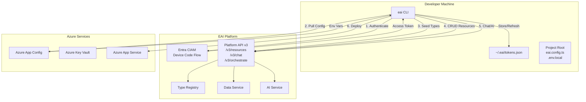
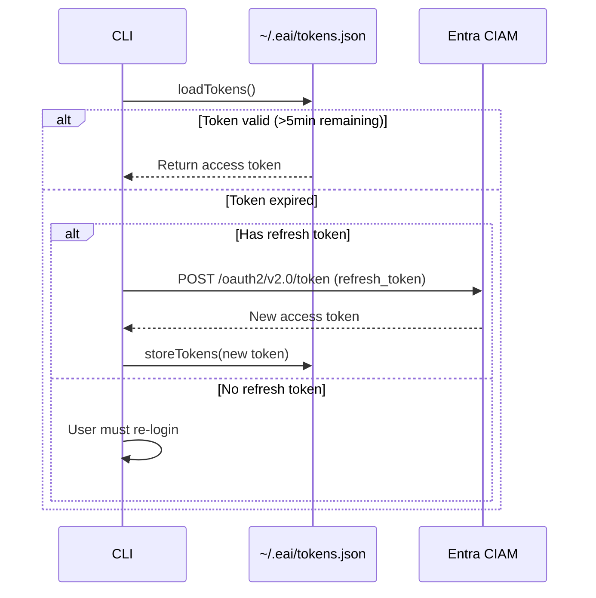
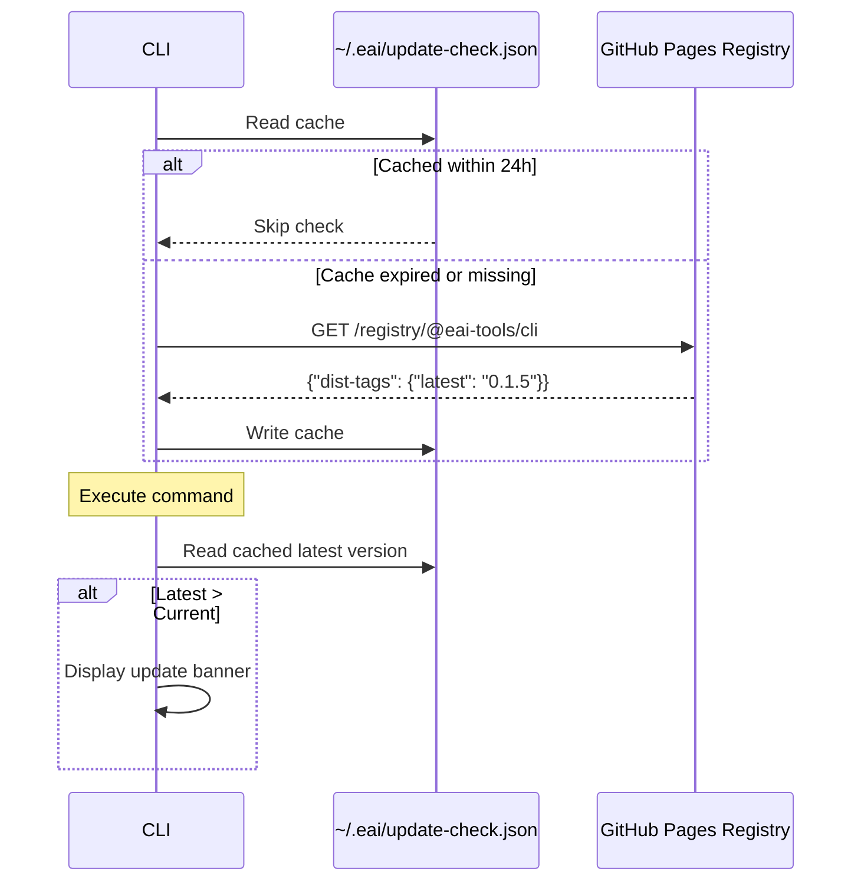

# EAI CLI — Architecture

## High-Level Architecture



## Component Breakdown

### 1. CLI Core (`src/index.ts`)

**Purpose**: Main entry point that registers all commands and orchestrates the CLI lifecycle.

**Responsibilities**:
- Initializes Commander.js program
- Registers 16 command groups (init, login, env, types, resources, tenant, user, chat, docs, deploy, verify, whoami, update)
- Checks for updates in background
- Displays update notification after command execution

**Key Flow**:
1. Import all command modules
2. Register commands with Commander
3. Fire background update check
4. Parse command-line arguments
5. Execute command handler
6. Display update notification if available

### 2. Authentication Module (`src/lib/auth.ts`)

**Purpose**: Handles Entra CIAM device code flow and token management.

**Key Functions**:
- `deviceCodeLogin()` — Initiates device code flow and polls for token
- `getAccessToken()` — Returns valid token, refreshing if expired (5min buffer)
- `storeTokens()` / `loadTokens()` — Encrypted storage in `~/.eai/tokens.json`
- `isAuthenticated()` — Checks if user has valid token

**Security**:
- Tokens encrypted with AES-256-CBC
- Encryption key derived from `sha256(eai-cli-${homedir}-token-store)`
- File mode `0o600` (owner read/write only)
- Supports `EAI_ACCESS_TOKEN` env var for headless/server use

**Token Lifecycle**:


### 3. API Client (`src/lib/api.ts`)

**Purpose**: Platform API client that wraps all PublicAPI v3 endpoints.

**Class**: `PlatformAPIClient`

**Constructor Parameters**:
- `baseUrl` — Platform API base URL (e.g., `https://api.eai.example.com`)
- `tenantId` — Target tenant ID

**Key Methods**:

| Method | Endpoint | Purpose |
|--------|----------|---------|
| `listResources()` | `GET /v3/resources/{tenant}/{type}` | List resources with pagination |
| `getResource()` | `GET /v3/resources/{tenant}/{type}/{id}` | Get single resource |
| `createResource()` | `POST /v3/resources/{tenant}/{type}` | Create resource |
| `updateResource()` | `PUT /v3/resources/{tenant}/{type}/{id}` | Update resource (optimistic locking) |
| `deleteResource()` | `DELETE /v3/resources/{tenant}/{type}/{id}` | Delete resource |
| `queryResources()` | `POST /v3/resources/{tenant}/query` | Cross-type query |
| `getSchema()` | `GET /v3/resources/schema/{tenant}` | Get published Object Types |
| `sendChat()` | `POST /v3/chat/{tenant}/{workflow}/{stage}` | Send chat message |
| `streamChat()` | `POST /v3/chat/stream/{tenant}/{workflow}/{stage}` | Stream chat (SSE) |
| `classifyDocument()` | `POST /v3/documents/classify` | Classify document |
| `indexDocument()` | `POST /v3/documents/rag-index` | Index document for RAG |
| `platformRequest()` | `POST /v3/orchestrate` | Internal routing to backend services |

**Design Pattern**: Each method returns a raw `Response` object, allowing commands to handle status codes and parse JSON as needed.

### 4. Configuration Module (`src/lib/config.ts`)

**Purpose**: Project discovery, config loading, and TypeScript evaluation.

**Key Functions**:

| Function | Purpose |
|----------|---------|
| `findProjectRoot()` | Walk up from cwd to find `eai.config.ts` or `src/eai.config/` |
| `loadObjectTypes()` | Load and evaluate Object Types from TypeScript |
| `loadEnvFile()` | Parse `.env.local` file |
| `resolveProjectConfig()` | Merge env vars with project config |

**TypeScript Evaluation Flow**:
```mermaid
flowchart LR
    TS[object-types.ts] -->|Read| Strip[stripTypeScript()]
    Strip -->|Remove types/interfaces| JS[Valid JS]
    JS -->|Write to temp| TempFile[/tmp/eai-*.mjs]
    TempFile -->|import()| Module[Module Exports]
    Module -->|Extract| ObjectTypes[objectTypes object]
    TempFile -->|Cleanup| Delete[unlink temp file]
```

**TypeScript Stripping Rules**:
- Remove `import` statements
- Remove `export type`, `export interface`, `interface`, `type` declarations
- Strip type annotations (`: Type` after identifiers)
- Remove `as const` assertions
- Keep `export const` (needed for module evaluation)

### 5. Command Modules (`src/commands/*.ts`)

Each command module exports a Commander command instance. Commands follow a consistent pattern:

**Common Structure**:
```typescript
// 1. Import dependencies
import { Command } from 'commander';
import { findProjectRoot, loadEnvFile } from '../lib/config.js';
import { PlatformAPIClient } from '../lib/api.js';
import * as out from '../lib/output.js';

// 2. Create command
export const exampleCommand = new Command('example')
  .description('...')
  .option('--flag', '...')
  .action(async (args, options) => {
    // 3. Discover project context
    const root = await findProjectRoot();

    // 4. Load environment
    const env = await loadEnvFile(root);

    // 5. Create API client
    const client = new PlatformAPIClient(env.BASE_URL_PUBLIC_API, tenantId);

    // 6. Execute API call with spinner
    const spinner = ora('Loading...').start();
    const res = await client.someMethod();

    // 7. Handle response
    if (!res.ok) {
      spinner.fail('Failed');
      process.exit(1);
    }

    const data = await res.json();
    spinner.succeed('Success');
    console.log(JSON.stringify(data, null, 2));
  });
```

**Command Categories**:

| Category | Commands | Purpose |
|----------|----------|---------|
| **Scaffolding** | `init`, `dev` | Project initialization and local dev server |
| **Authentication** | `login`, `logout`, `whoami` | User authentication and session management |
| **Environment** | `env pull/list/push` | Azure App Config + Key Vault sync |
| **Object Types** | `types validate/seed/diff/pull` | Data model management |
| **Resources** | `resources list/get/create/update/delete/query/schema` | CRUD operations |
| **Tenants** | `tenant list/info/create` | Multi-tenancy management |
| **Users** | `user provision` | User provisioning |
| **AI** | `chat send/stream`, `docs upload/classify/index` | AI and document processing |
| **Deployment** | `deploy setup/trigger/status` | GitHub Actions deployment orchestration |
| **Diagnostics** | `verify`, `doctor` | Platform connectivity checks |
| **Update** | `update` | Self-update to latest version |

### 6. Output Utilities (`src/lib/output.ts`)

**Purpose**: Consistent formatting and symbols across all commands.

**Exported Symbols**:
- `✓` success (green)
- `✗` error (red)
- `⚠` warning (yellow)
- `→` info (blue)
- `+` added (green)
- `-` removed (red)
- `~` changed (yellow)
- `=` unchanged (gray)

**Helper Functions**:
- `success()`, `error()`, `warn()`, `info()` — Styled console output
- `heading()` — Bold section headers
- `table()` — Aligned key-value tables
- `blank()` — Empty line for spacing

### 7. Update Check Module (`src/lib/update-check.ts`)

**Purpose**: Non-blocking background version check with 24h cache.

**Flow**:


**Features**:
- Fire-and-forget background check (non-blocking)
- Respects `NO_UPDATE_NOTIFIER=1` and `CI` env vars
- Skips if not in TTY (headless environments)
- Displays update banner after command execution (stderr)

## Key Design Patterns

### 1. Command Pattern
Each command is a separate module with a Commander command instance, allowing for easy extension and maintainability.

### 2. Client-Server Pattern
The CLI acts as a thin client, delegating all business logic to the platform API. No local state beyond authentication tokens.

### 3. Repository Pattern
`PlatformAPIClient` abstracts API calls into typed methods, isolating HTTP concerns from command logic.

### 4. Dependency Injection
Commands receive dependencies (API client, config) rather than constructing them, improving testability.

### 5. Fail-Fast Validation
Commands validate inputs and context early, exiting with clear error messages before attempting API calls.

### 6. Optimistic Locking
Resource updates require version numbers, preventing lost updates in concurrent scenarios.

### 7. Static Registry Pattern
Self-hosted npm registry on GitHub Pages eliminates npm.js dependency and provides full control over distribution.

## Integration Points

### Platform API v3

All platform interactions go through the PublicAPI v3 endpoints:

- **Direct Endpoints**: `/v3/resources`, `/v3/chat`, `/v3/auth`, `/v3/documents`
- **Internal Routing**: `/v3/orchestrate` routes requests to backend services (payload, type registry, etc.)

### Azure Services

- **App Config**: Environment variable sync via Azure SDK
- **Key Vault**: Secret retrieval (credentials, API keys)
- **App Service**: Deployment target for vertical applications

### GitHub Actions

- **Workflow Generation**: `eai deploy setup` generates `deploy-demo.yml`
- **Workflow Trigger**: `eai deploy trigger` uses `gh` CLI to dispatch workflows
- **Status Monitoring**: `eai deploy status` lists recent runs

### Entra CIAM

- **Device Code Flow**: OAuth 2.0 device authorization grant
- **Token Refresh**: Automatic refresh using refresh token
- **Authority**: `https://{tenantName}.ciamlogin.com/{tenantId}`

## Error Handling Strategy

1. **API Errors**: Check `res.ok` before parsing JSON; display status and body on failure
2. **Missing Config**: Exit early with helpful message directing user to `eai env pull` or config docs
3. **Auth Failures**: Catch refresh failures; prompt user to re-login
4. **Network Timeouts**: 5-second timeout on update checks (non-blocking)
5. **User Confirmation**: Destructive operations (delete, deploy) prompt for confirmation unless `--force`

## Performance Considerations

- **Parallel Requests**: Commands like `types seed` process multiple types sequentially but could be parallelized
- **Pagination**: List commands default to 20 items per page
- **Streaming**: Chat commands support SSE streaming for real-time responses
- **Caching**: Update checks cached for 24 hours
- **Token Refresh**: 5-minute buffer before expiry to avoid mid-request expiration
