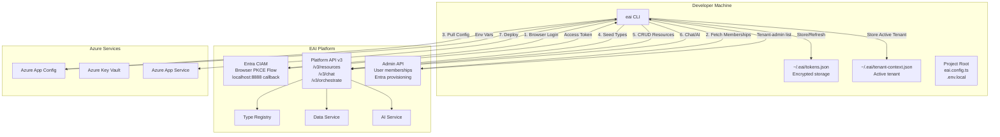
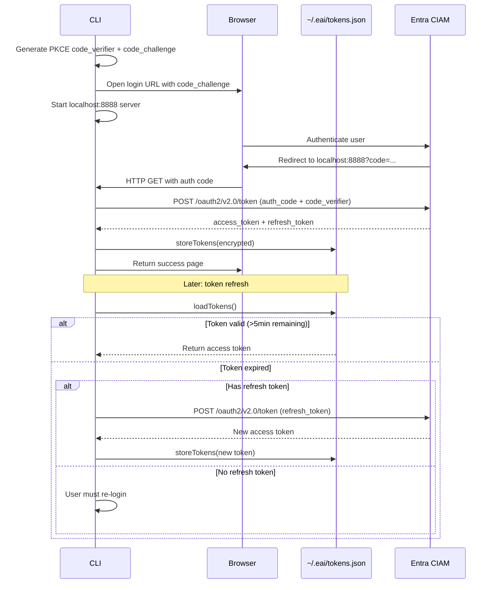
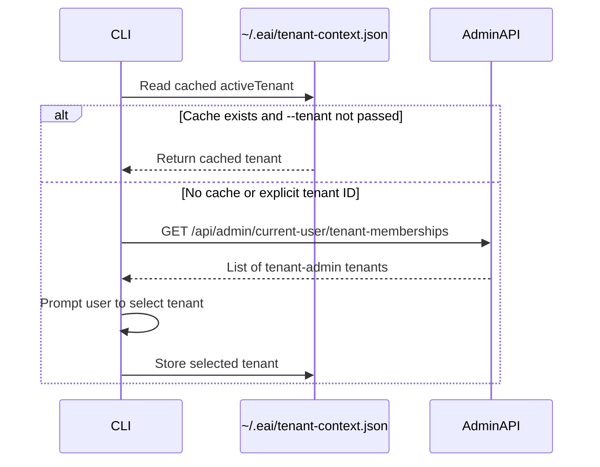
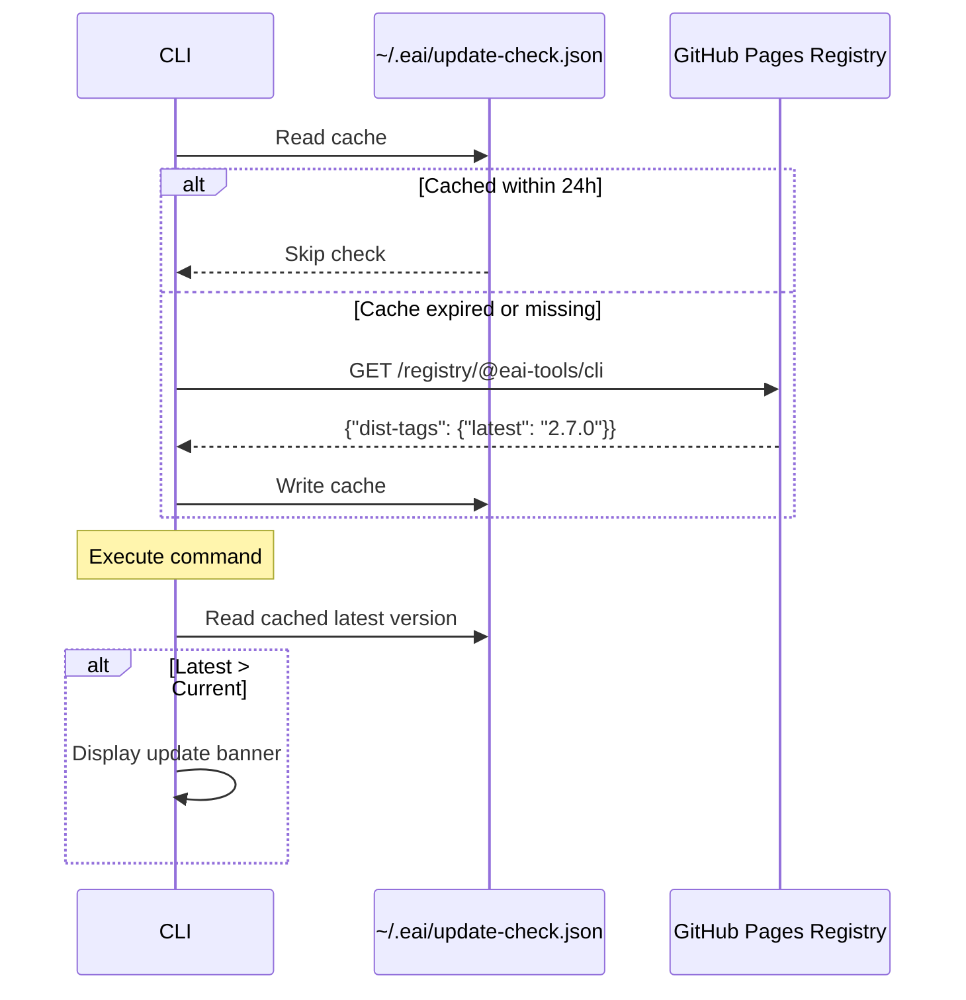

# EAI CLI — Architecture

## High-Level Architecture



## Component Breakdown

### 1. CLI Core (`src/index.ts`)

**Purpose**: Main entry point that registers all commands and orchestrates the CLI lifecycle.

**Responsibilities**:
- Initializes Commander.js program
- Registers 15 command groups: init, dev, login, logout, env, types, resources, tenant, user, chat, docs, deploy, verify, doctor, whoami, update, provision
- Handles global flags: `--profile`, `--simple`, `--no-color`, `--color`, `--describe`
- Checks for updates in background
- Displays update notification after command execution

**Key Flow**:
1. Import all command modules
2. Register commands with Commander
3. Apply `preAction` hook to handle global flags and profile selection
4. Fire background update check
5. Parse command-line arguments
6. Execute command handler
7. Display update notification if available

### 2. Authentication Module (`src/lib/auth.ts`)

**Purpose**: Handles Entra CIAM browser-based PKCE flow and token management.

**Key Functions**:
- `browserLogin()` — Initiates browser-based PKCE flow with localhost:8888 callback server
- `getToken()` — Returns valid access token, refreshing if expired (5min buffer)
- `storeTokens()` / `loadTokens()` — Encrypted storage in `~/.eai/tokens.json`
- `isAuthenticated()` — Checks if user has valid token
- `logout()` — Clears stored tokens

**Security**:
- Tokens encrypted with AES-256-CBC
- Encryption key derived from `sha256(eai-cli-${homedir}-token-store)`
- File mode `0o600` (owner read/write only)
- Supports `EAI_ACCESS_TOKEN` env var for headless/server use
- PKCE flow: code verifier + challenge (SHA-256 hash, base64url-encoded)

**Token Lifecycle**:


### 3. Tenant Context Module (`src/lib/tenant-context.ts`)

**Purpose**: Manages tenant membership discovery, selection, and active tenant persistence.

**Key Functions**:
- `loadActiveTenantContext()` — Loads active tenant from cached selection or prompts user
- `getCurrentUserTenantMemberships()` — Fetches tenant-admin memberships from AdminAPI
- `selectTenant()` — Interactive tenant selection with Inquirer prompts
- `getTenantRoles()` — Extracts user roles for a tenant
- `verifyTenantUsability()` — Confirms tenant can be used after creation (for child tenant bootstrap)

**Data Flow**:


**Tenant Usability Check** (for `eai tenant create`):
1. Create tenant document
2. Attempt first-admin bootstrap (if child tenant)
3. Refresh membership and verify direct `tenant-admin` role
4. Mark as `usable` only if all checks pass
5. Auto-select new tenant only if `usable` is true

### 4. Profile Module (`src/lib/profile.ts`)

**Purpose**: Manages environment profiles (dev, test, production) for switching between platform instances.

**Key Functions**:
- `getActiveProfile()` — Returns current profile name (default: 'default')
- `setActiveProfile()` — Sets active profile for session
- `loadProfileConfig()` — Loads profile-specific config from `eai.profiles.ts` or `~/.eai/profiles.json`
- `loadActiveProfileFromConfig()` — Reads persisted active profile
- `saveActiveProfile()` — Persists active profile selection

**Profile Priority**:
1. `--profile` CLI flag
2. `EAI_PROFILE` environment variable
3. Persisted active profile in `~/.eai/config.json`
4. Default profile (`default`)

**Use Cases**:
- `eai login --profile dev` → Connect to dev environment
- `eai provision entra --profile test` → Create Entra app in test CIAM
- `EAI_PROFILE=prod eai types seed` → Publish types to production

### 5. API Client (`src/lib/api.ts`)

**Purpose**: Platform API client that wraps all PublicAPI v3 and AdminAPI endpoints.

**Class**: `PlatformAPIClient`

**Constructor Parameters**:
- `baseUrl` — Platform API base URL (e.g., `https://api.eai.example.com/public`)
- `tenantId` — Target tenant ID (or `'system'` for admin operations)

**Key Methods**:

| Method | Endpoint | Purpose |
|--------|----------|---------|
| `listResources()` | `GET /v3/resources/{tenant}/{type}` | List resources with pagination |
| `getResource()` | `GET /v3/resources/{tenant}/{type}/{id}` | Get single resource |
| `createResource()` | `POST /v3/resources/{tenant}/{type}` | Create resource |
| `updateResource()` | `PUT /v3/resources/{tenant}/{type}/{id}` | Update resource (optimistic locking) |
| `deleteResource()` | `DELETE /v3/resources/{tenant}/{type}/{id}` | Delete resource |
| `queryResources()` | `POST /v3/resources/{tenant}/query` | Cross-type query |
| `getSchema()` | `GET /v3/resources/schema/{tenant}` | Get published Object Types |
| `sendChat()` | `POST /v3/chat/{tenant}/{workflow}/{stage}` | Send chat message |
| `streamChat()` | `POST /v3/chat/stream/{tenant}/{workflow}/{stage}` | Stream chat (SSE) |
| `classifyDocument()` | `POST /v3/documents/classify` | Classify document |
| `indexDocument()` | `POST /v3/documents/rag-index` | Index document for RAG |
| `platformRequest()` | `POST /v3/orchestrate` | Internal routing to backend services |
| `lookupUserByEmail()` | `POST /api/admin/users/lookup` | Look up user by email (AdminAPI) |
| `provisionUserToTenant()` | `POST /api/admin/tenants/{id}/users` | Add user to tenant (AdminAPI) |
| `getCurrentUserMemberships()` | `GET /api/admin/current-user/tenant-memberships` | Get tenant-admin memberships |
| `createTenant()` | `POST /api/admin/tenants` | Create new tenant |
| `bootstrapChildTenantAdmin()` | `POST /api/admin/tenants/{id}/bootstrap-admin` | Bootstrap first admin for child tenant |

**Design Pattern**: Each method returns a raw `Response` object, allowing commands to handle status codes and parse JSON/text as needed.

### 6. Configuration Module (`src/lib/config.ts`)

**Purpose**: Project discovery, config loading, and TypeScript evaluation.

**Key Functions**:

| Function | Purpose |
|----------|---------|
| `findProjectRoot()` | Walk up from cwd to find `eai.config.ts` or `src/eai.config/` |
| `loadObjectTypes()` | Load and evaluate Object Types from TypeScript |
| `loadEnvFile()` | Parse `.env.local` file |
| `resolveProjectConfig()` | Merge env vars with project config |

**TypeScript Evaluation Flow**:
```mermaid
flowchart LR
    TS[object-types.ts] -->|Read| Strip[stripTypeScript()]
    Strip -->|Remove types/interfaces| JS[Valid JS]
    JS -->|Write to temp| TempFile[/tmp/eai-*.mjs]
    TempFile -->|import()| Module[Module Exports]
    Module -->|Extract| ObjectTypes[objectTypes object]
    TempFile -->|Cleanup| Delete[unlink temp file]
```

**TypeScript Stripping Rules**:
- Remove `import` statements
- Remove `export type`, `export interface`, `interface`, `type` declarations
- Strip type annotations (`: Type` after identifiers)
- Remove `as const` assertions
- Keep `export const` (needed for module evaluation)

### 7. Context Module (`src/lib/context.ts`)

**Purpose**: Unified context resolution for commands that need tenant + API client.

**Key Function**:
- `resolveCommandContext(options)` — Returns `{ publicApiUrl, tenantId, tenantName, client }`
- Handles project root discovery, profile loading, token validation, tenant selection
- Respects `--tenant` flag for read-only tenant targeting
- Interactive mode prompts for tenant selection if needed

**Usage Pattern**:
```typescript
const ctx = await resolveCommandContext({ interactive: true });
// ctx.client is a PlatformAPIClient ready to make requests
// ctx.tenantId is the active or specified tenant
```

### 8. Error Codes Module (`src/lib/error-codes.ts`)

**Purpose**: Structured error catalog with exit codes and user-facing suggestions.

**Error Categories**:
- **E001-E099**: Project errors (not in EAI project, config missing)
- **E100-E199**: Auth errors (not logged in, token expired)
- **E200-E299**: Platform errors (API unreachable, resource not found)
- **E300-E399**: Validation errors (invalid schema, missing field)

**Key Function**:
- `exitWithError(code, vars?, format?)` — Display structured error and exit

**Output Format**:
```
✗ Not logged in

Run `eai login` to authenticate with the platform

Error code: E101
```

**JSON Format** (with `--format json`):
```json
{
  "error": {
    "code": "E101",
    "message": "Not logged in",
    "suggestion": "Run `eai login` to authenticate with the platform",
    "exitCode": 1
  }
}
```

### 9. Command Modules (`src/commands/*.ts`)

Each command module exports a Commander command instance. Commands follow a consistent pattern:

**Common Structure**:
```typescript
// 1. Import dependencies
import { Command } from 'commander';
import { resolveCommandContext } from '../lib/context.js';
import * as out from '../lib/output.js';

// 2. Create command
export const exampleCommand = new Command('example')
  .description('...')
  .option('--format <format>', 'Output format (text|json)', 'text')
  .action(async (options) => {
    // 3. Resolve context (project, auth, tenant)
    const ctx = await resolveCommandContext({ interactive: true });

    // 4. Execute API call with spinner
    const spinner = ora('Loading...').start();
    const res = await ctx.client.someMethod();

    // 5. Handle response
    if (!res.ok) {
      spinner.fail('Failed');
      const body = await res.text();
      out.error(`${res.status}: ${body}`);
      process.exit(1);
    }

    const data = await res.json();
    spinner.succeed('Success');

    // 6. Format output
    if (options.format === 'json') {
      console.log(JSON.stringify(data, null, 2));
    } else {
      console.log(data);
    }
  });
```

**Command Categories**:

| Category | Commands | Purpose |
|----------|----------|---------|
| **Scaffolding** | `init`, `dev` | Project initialization and local dev server |
| **Authentication** | `login`, `logout`, `whoami` | User authentication and session management |
| **Environment** | `env pull/list/push` | Azure App Config + Key Vault sync |
| **Object Types** | `types validate/seed/diff/pull` | Data model management |
| **Resources** | `resources list/get/create/update/delete/query/schema` | CRUD operations |
| **Tenants** | `tenant list/select/info/create` | Multi-tenancy management |
| **Users** | `user invite`, `user provision-me` | User provisioning to tenants |
| **Entra Provisioning** | `provision entra` | Entra app registration in CIAM |
| **AI** | `chat send/stream`, `docs upload/classify/index` | AI and document processing |
| **Deployment** | `deploy setup/trigger/status` | GitHub Actions deployment orchestration |
| **Diagnostics** | `verify`, `verify calls`, `doctor` | Platform connectivity checks and contract verification |
| **Update** | `update` | Self-update to latest version |

### 10. Output Utilities (`src/lib/output.ts`)

**Purpose**: Consistent formatting and symbols across all commands.

**Exported Symbols**:
- `✓` success (green)
- `✗` error (red)
- `⚠` warning (yellow)
- `→` info (blue)
- `+` added (green)
- `-` removed (red)
- `~` changed (yellow)
- `=` unchanged (gray)

**Helper Functions**:
- `success()`, `error()`, `warn()`, `info()` — Styled console output
- `heading()` — Bold section headers
- `table()` — Aligned key-value tables
- `blank()` — Empty line for spacing
- `setSimpleMode()` — Enable screen-reader friendly output (no symbols/colors)

**Accessibility**:
- Respects `--simple` flag (plain text)
- Respects `--no-color` flag (no ANSI codes)
- Respects `NO_COLOR` environment variable
- Auto-detects non-TTY environments

### 11. Update Check Module (`src/lib/update-check.ts`)

**Purpose**: Non-blocking background version check with 24h cache.

**Flow**:


**Features**:
- Fire-and-forget background check (non-blocking)
- Respects `NO_UPDATE_NOTIFIER=1` and `CI` env vars
- Skips if not in TTY (headless environments)
- Displays update banner after command execution (stderr)
- 5-second fetch timeout

## Key Design Patterns

### 1. Command Pattern
Each command is a separate module with a Commander command instance, allowing for easy extension and maintainability.

### 2. Client-Server Pattern
The CLI acts as a thin client, delegating all business logic to the platform API. No local state beyond authentication tokens and tenant selection.

### 3. Repository Pattern
`PlatformAPIClient` abstracts API calls into typed methods, isolating HTTP concerns from command logic.

### 4. Context Resolution Pattern
`resolveCommandContext()` centralizes discovery of project root, profile, auth, and tenant context, reducing boilerplate in commands.

### 5. Fail-Fast Validation
Commands validate inputs and context early, exiting with structured error codes before attempting API calls.

### 6. Optimistic Locking
Resource updates require version numbers, preventing lost updates in concurrent scenarios.

### 7. Static Registry Pattern
Self-hosted npm registry on GitHub Pages eliminates npm.js dependency and provides full control over distribution.

### 8. Membership-Driven Tenancy
Active tenant comes from login-time membership resolution, not environment variables, aligning with AdminAPI patterns.

## Integration Points

### Platform API v3 (PublicAPI)

All platform interactions go through PublicAPI v3 endpoints:

- **Direct Endpoints**: `/v3/resources`, `/v3/chat`, `/v3/documents`
- **Internal Routing**: `/v3/orchestrate` routes requests to backend services (payload, type registry, etc.)

### Admin API

Used for administrative operations:

- **Membership Resolution**: `/api/admin/current-user/tenant-memberships`
- **User Provisioning**: `/api/admin/tenants/{id}/users`, `/api/admin/users/lookup`
- **Tenant Management**: `/api/admin/tenants`, `/api/admin/tenants/{id}/bootstrap-admin`
- **Entra Provisioning**: `/api/admin/platform-ops/entra/confirm-app-registration`

### Azure Services

- **App Config**: Environment variable sync via Azure SDK
- **Key Vault**: Secret retrieval (credentials, API keys)
- **App Service**: Deployment target for vertical applications

### GitHub Actions

- **Workflow Generation**: `eai deploy setup` generates `deploy-demo.yml`
- **Workflow Trigger**: `eai deploy trigger` uses `gh` CLI to dispatch workflows
- **Status Monitoring**: `eai deploy status` lists recent runs

### Entra CIAM

- **Browser PKCE Flow**: OAuth 2.0 Authorization Code Flow with PKCE (RFC 7636)
- **Token Refresh**: Automatic refresh using refresh token
- **Profile-Based CIAM Selection**: Platform environment determines CIAM tenant
- **Authority**: `https://{tenantName}.ciamlogin.com/{tenantId}`

## Error Handling Strategy

1. **API Errors**: Check `res.ok` before parsing JSON; display status and body on failure
2. **Structured Error Codes**: Use `exitWithError()` for consistent error messages with codes (E001-E305)
3. **Missing Config**: Exit early with helpful message directing user to `eai env pull` or config docs
4. **Auth Failures**: Catch refresh failures; prompt user to re-login via structured error
5. **Network Timeouts**: 5-second timeout on update checks (non-blocking)
6. **User Confirmation**: Destructive operations (delete, deploy) prompt for confirmation unless `--force`
7. **Sanitized Diagnostics**: `eai provision entra` never exposes backend URLs, tenant IDs, or raw platform errors

## Performance Considerations

- **Parallel Requests**: Most commands execute sequentially; consider parallelizing where safe
- **Pagination**: List commands default to 20 items per page with `--limit` and `--offset` support
- **Streaming**: Chat commands support SSE streaming for real-time responses
- **Caching**: Update checks cached for 24 hours; tenant context cached until `eai tenant select`
- **Token Refresh**: 5-minute buffer before expiry to avoid mid-request expiration
- **Background Checks**: Update checks are fire-and-forget to avoid blocking command execution
