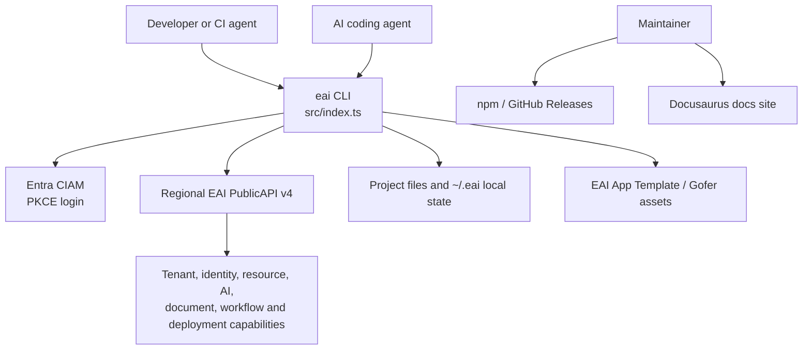
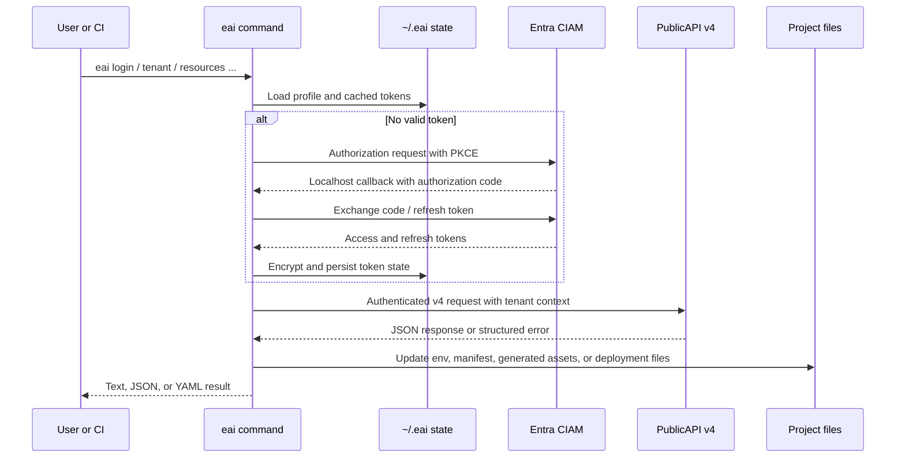
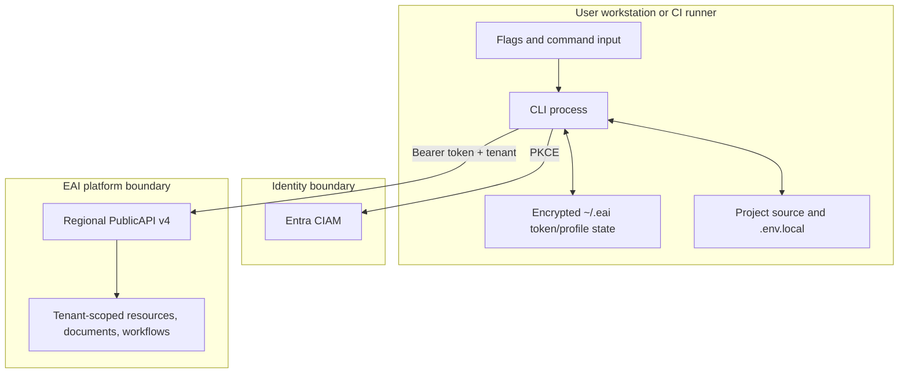

# Architecture

## System Context

## Components

| Component | Location | Responsibility |
|---|---|---|
| Command composition | `src/index.ts`, `src/commands/` | Registers Commander commands, parses flags, coordinates prompts and output |
| API client | `src/lib/api.ts` | Validates allowed v4 paths, adds bearer tokens and tenant context, exposes typed domain methods |
| Authentication | `src/lib/auth.ts` | PKCE browser login, callback server, token exchange/refresh, encrypted local persistence |
| Profiles and context | `src/lib/profile.ts`, `src/lib/tenant-context.ts` | Resolves default or named profile, active tenant, regional API URL, and project env synchronization |
| Project/configuration | `src/lib/config.ts`, `project-manifest.ts`, `runtime-contract.ts` | Reads app metadata, object-type manifests, environment files, and deployment contracts |
| Resource and schema helpers | `src/lib/schema-builder.ts`, `object-type-*`, `resourceapi-bundle.ts` | Validates object types, canonicalizes slugs, publishes schemas, and manages storage readiness |
| AI and Gofer surfaces | `agent-guide.ts`, `ai-surfaces.ts`, `gofer-installer.ts` | Describes agent capabilities, installs verified workspace assets, and refreshes managed files |
| Output and diagnostics | `output.ts`, `error-guidance/`, `verify.ts` | Human/machine-readable output, error explanations, connectivity checks, and doctor reports |

## Representative Runtime Flow

## Data Flow and Trust Boundaries

The main trust boundary is between local execution and the remote platform.
The API client rejects non-v4 and non-allow-listed paths. Tenant selection is
resolved from memberships before tenant-scoped operations. Secrets are not
committed by the repository, and public diagnostics intentionally avoid
exposing private infrastructure details.

## Design Patterns

- **Command modules over a shared client:** handlers stay focused on UX and
  validation while `PlatformAPIClient` centralizes HTTP and endpoint policy.
- **Explicit contract types:** request/result interfaces in `api.ts` and
  object-type interfaces in `config.ts` define the CLI/platform boundary.
- **Profile-scoped state:** the default profile preserves legacy paths while
  named profiles isolate API/auth settings and token files.
- **Fail-closed routing:** `publicRequest` accepts only `/v4/` paths under the
  declared PublicAPI prefix allow-list.
- **Capability and readiness checks:** tenant capability evaluation, builder
  readiness, runtime validation, and `doctor` precede higher-risk operations.

## Integration Security Controls

Authentication uses authorization code + PKCE, bearer access tokens, refresh
tokens, tenant membership resolution, and role-aware platform endpoints.
Local token files are encrypted with an installation-derived AES-256-CBC key
and written under the user's home directory. The source notes that an OS
keychain is a future improvement; keychain storage is not currently used.
