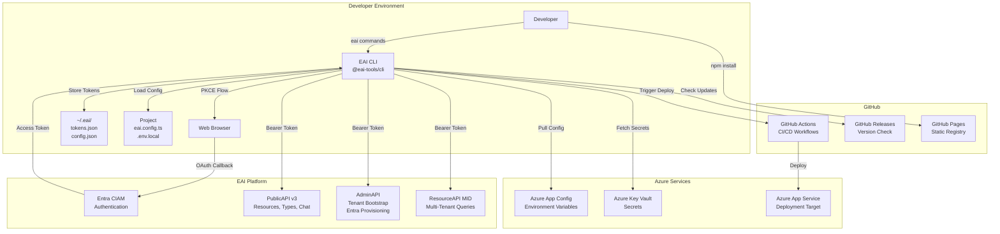
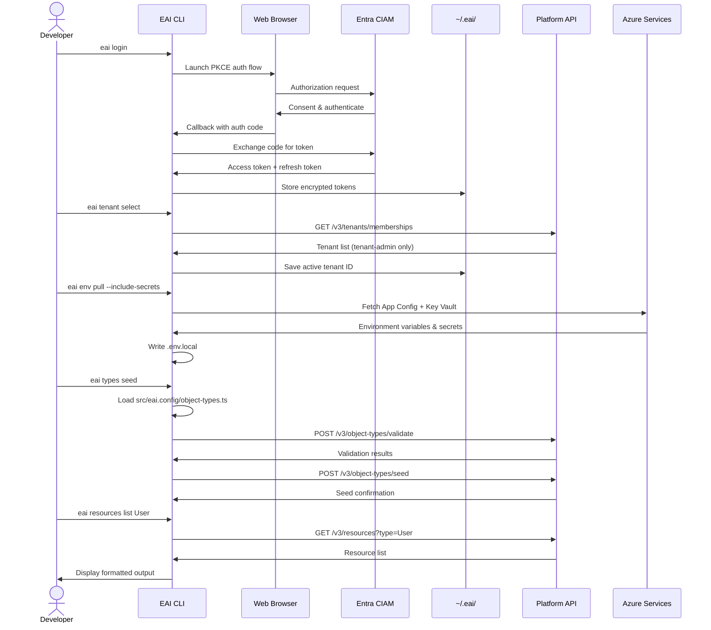
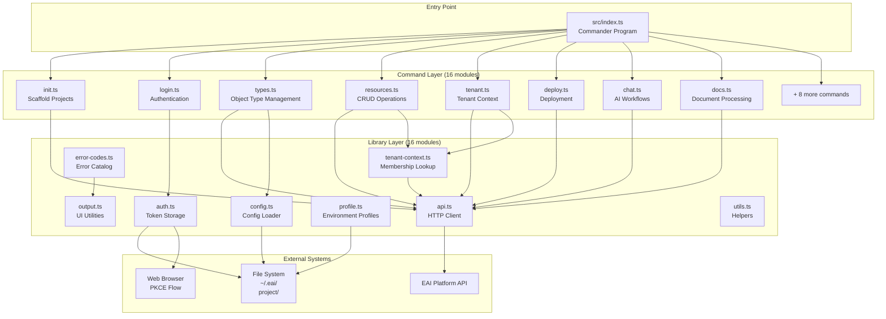
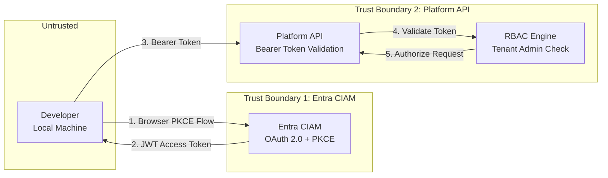
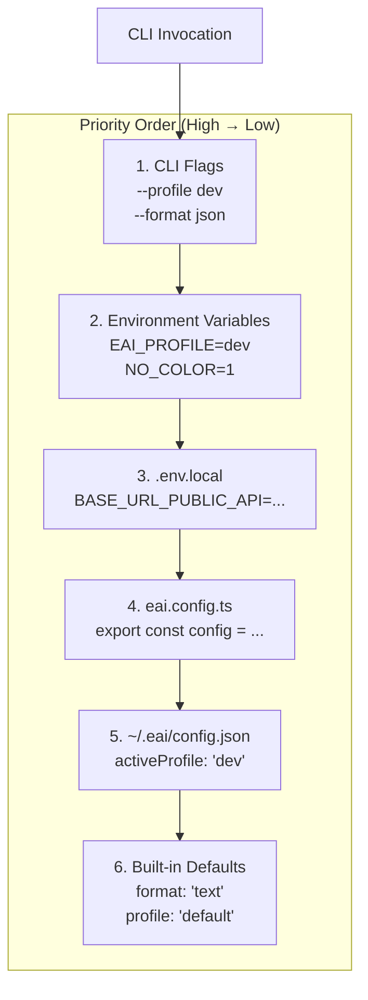
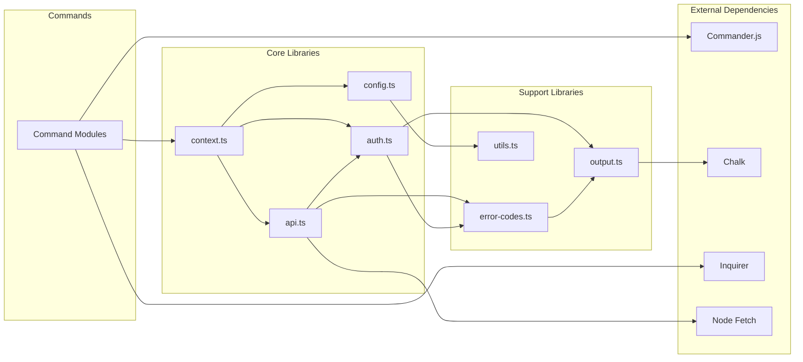

# EAI CLI — Architecture

## System Context

The EAI CLI serves as the developer-facing gateway to the EAI Platform, abstracting away platform complexity behind simple command-line operations.



## Runtime Flow: Typical User Session



## Component Architecture

### Core Components



### Command Layer (src/commands/)

| Module | Commands | Purpose |
|--------|----------|---------|
| **init.ts** | `init` | Scaffolds new vertical from template; installs Gofer AI assets |
| **dev.ts** | `dev` | Starts local dev server with connectivity checks |
| **login.ts** | `login`, `logout` | Entra CIAM authentication via browser PKCE flow |
| **whoami.ts** | `whoami` | Displays auth status, active tenant, profile |
| **user.ts** | `user invite`, `user provision-me` | User management (invite to tenant, self-provision) |
| **provision.ts** | `provision entra` | Creates/confirms Entra app registration in CIAM |
| **env.ts** | `env pull`, `env list`, `env push` | Azure App Config + Key Vault sync |
| **types.ts** | `types validate`, `types seed`, `types diff`, `types pull` | Object Type management |
| **resources.ts** | `resources list/get/create/update/delete`, `resources query`, `resources schema` | Resource CRUD operations |
| **tenant.ts** | `tenant list`, `tenant select`, `tenant info`, `tenant create` | Tenant context management |
| **vertical.ts** | `vertical info`, `vertical enroll`, `vertical unenroll` | Vertical enrollment operations |
| **chat.ts** | `chat send`, `chat stream` | AI chat workflows (sync/streaming) |
| **docs.ts** | `docs upload`, `docs classify`, `docs index` | Document operations (upload, classify, RAG indexing) |
| **deploy.ts** | `deploy setup`, `deploy trigger`, `deploy status` | GitHub Actions deployment orchestration |
| **verify.ts** | `verify`, `verify calls`, `doctor` | Platform connectivity checks and diagnostics |
| **update.ts** | `update` | CLI self-update from GitHub registry |

### Library Layer (src/lib/)

| Module | Exports | Purpose |
|--------|---------|---------|
| **api.ts** | `PlatformAPIClient` | HTTP client for PublicAPI, AdminAPI, ResourceAPI with Bearer token auth |
| **auth.ts** | `getToken`, `saveToken`, `clearToken`, `startAuthFlow` | Entra CIAM authentication and token storage in `~/.eai/tokens.json` |
| **config.ts** | `loadConfig` | Loads `.env.local`, evaluates `eai.config.ts` as JS, merges env vars |
| **tenant-context.ts** | `getActiveTenant`, `setActiveTenant`, `getTenantMemberships` | Tenant membership lookup and active tenant persistence |
| **profile.ts** | `setActiveProfile`, `getActiveProfile`, `loadProfile` | Environment profile management (dev, test, prod) |
| **context.ts** | `resolveCommandContext` | Command context resolver (project root, token, tenant, profile) |
| **error-codes.ts** | `ErrorCode`, `exitWithError`, `formatError` | Structured error catalog (E001-E399) with suggestions |
| **output.ts** | `success`, `error`, `warn`, `info`, `symbols` | Colored output utilities with TTY detection and simple mode |
| **utils.ts** | `toObjectTypeSlug`, `isRecord`, `sleep` | Helper functions for string manipulation, type guards, delays |
| **schema-builder.ts** | `describeProgram` | JSON schema generator for `--describe` flag (AI agent introspection) |
| **update-check.ts** | `checkForUpdate`, `notifyIfUpdateAvailable` | Static EAI registry integration for version checks |
| **gofer-installer.ts** | `installGoferAssets` | Copies Gofer AI terminal assets to new vertical projects |
| **object-type-defaults.ts** | `getObjectTypeDefaults` | Default field definitions for Object Type scaffolding |
| **cloud-env.ts** | `pullCloudEnv`, `pushCloudEnv` | Azure App Config + Key Vault integration |
| **azure-cli.ts** | `execAzureCLI` | Azure CLI command wrapper for cloud operations |
| **npm.ts** | `installDependencies`, `checkNpmVersion` | npm integration for package installation |

## Data Flow

### Authentication Flow

1. **User Initiates**: `eai login`
2. **CLI Generates**: PKCE code verifier + challenge
3. **CLI Launches**: Browser to Entra CIAM authorize endpoint
4. **User Authenticates**: In browser via CIAM
5. **Browser Redirects**: To `http://localhost:3000/callback` with auth code
6. **CLI Exchanges**: Auth code + verifier for tokens
7. **CLI Stores**: Encrypted tokens in `~/.eai/tokens.json`
8. **CLI Fetches**: User memberships from `/v3/tenants/memberships`
9. **CLI Persists**: Active tenant in `~/.eai/config.json`

### Object Type Seeding Flow

1. **CLI Loads**: `src/eai.config/object-types.ts` (TypeScript)
2. **CLI Strips**: Type annotations via regex
3. **CLI Evaluates**: As JavaScript to extract type definitions
4. **CLI Calls**: `POST /v3/object-types/validate` with payload
5. **Platform Validates**: Against schema rules
6. **CLI Calls**: `POST /v3/object-types/seed` if validation passes
7. **Platform Persists**: Types to registry
8. **CLI Polls**: `GET /v3/object-types/schema` until convergence

### Resource CRUD Flow

1. **CLI Resolves**: Active tenant from `~/.eai/config.json`
2. **CLI Validates**: Token from `~/.eai/tokens.json` (refreshes if expired)
3. **CLI Calls**: `GET /v3/resources?type=<Type>&tenant_id=<ID>`
4. **Platform Filters**: By tenant membership and RBAC
5. **CLI Formats**: Response as JSON, YAML, or colored text based on `--format`

## Trust Boundaries

### Authentication & Authorization



**Security Controls**:
- **Entra CIAM**: OAuth 2.0 Authorization Code + PKCE flow (no client secret)
- **Token Storage**: Encrypted at rest in `~/.eai/tokens.json` (OS-level file permissions)
- **Token Expiry**: Auto-refresh tokens before expiration
- **Tenant Isolation**: Platform enforces tenant membership via RBAC
- **HTTPS Only**: All platform API calls over TLS 1.2+

## Design Patterns

### Command Pattern (Commander.js)

Each command is a self-contained module that registers with the Commander program:

```typescript
// src/commands/resources.ts
export const resourcesCommand = new Command('resources')
  .description('CRUD operations on platform resources')
  .addCommand(listCommand)
  .addCommand(getCommand)
  .addCommand(createCommand)
  .addCommand(updateCommand)
  .addCommand(deleteCommand);
```

### Centralized Error Handling

All errors route through `error-codes.ts` for consistent formatting:

```typescript
import { ErrorCode, exitWithError } from '../lib/error-codes.js';

if (!token) {
  exitWithError(ErrorCode.E101, undefined, options.format);
}
```

### Context Resolver Pattern

`resolveCommandContext` aggregates project state, auth, and tenant context:

```typescript
const ctx = await resolveCommandContext({
  requireProject: true,
  requireAuth: true,
  requireTenant: true,
});
// ctx: { projectRoot, token, tenantId, profile }
```

### Lazy Evaluation (TypeScript Config)

Object Types are loaded from TypeScript files by stripping types and evaluating as JS:

```typescript
const tsCode = fs.readFileSync('src/eai.config/object-types.ts', 'utf-8');
const jsCode = stripTypeAnnotations(tsCode);
const module = { exports: {} };
new Function('module', 'exports', jsCode)(module, module.exports);
const types = module.exports.objectTypes;
```

### API Client Factory

`PlatformAPIClient` encapsulates auth, base URL, and error handling:

```typescript
const client = new PlatformAPIClient(token, baseUrl);
const response = await client.get('/v3/resources');
// Throws PlatformAPIRequestError on non-2xx
```

## Configuration Hierarchy

The CLI resolves configuration from multiple sources in priority order:



## Module Dependencies



## Performance Characteristics

| Operation | Typical Duration | Notes |
|-----------|-----------------|-------|
| `eai login` | 5-15s | Browser launch + user interaction |
| `eai tenant select` | 0.5-2s | API call to fetch memberships |
| `eai types validate` | 0.2-1s | Local TypeScript evaluation + API validation |
| `eai types seed` | 1-5s | API seed call + polling for convergence |
| `eai resources list` | 0.5-3s | API call with pagination |
| `eai resources create` | 0.3-1s | Single API POST |
| `eai env pull` | 2-10s | Azure App Config + Key Vault queries |
| `eai deploy trigger` | 0.5-2s | GitHub Actions workflow dispatch |

**Caching**: 
- Token refresh is avoided if token TTL > 5 minutes
- Update checks cached for 24 hours in `~/.eai/update-check.json`
- Tenant memberships are not cached (always fetched fresh)

## Scalability Considerations

- **Stateless Design**: CLI maintains no persistent connections; all state in local files
- **Token Auto-Refresh**: Prevents auth errors during long-running operations
- **Pagination Support**: `eai resources list` supports `--limit` and `--skip` for large datasets
- **Streaming Output**: `eai chat stream` uses Server-Sent Events (SSE) for real-time responses
- **Profile Isolation**: Multiple profiles (dev, test, prod) enable parallel workflows

## Extensibility

### Adding a New Command

1. Create `src/commands/my-command.ts`
2. Define Commander `Command` with options and action handler
3. Import and register in `src/index.ts`
4. Add error codes to `src/lib/error-codes.ts` if needed
5. Write tests in `tests/commands/my-command.test.ts`

### Adding a New Library Module

1. Create `src/lib/my-module.ts`
2. Export typed functions with JSDoc comments
3. Import in command modules as needed
4. Add unit tests in `tests/lib/my-module.test.ts`

### Adding a New Error Code

1. Add enum value to `ErrorCode` in `src/lib/error-codes.ts`
2. Add entry to `errorCatalog` with message and suggestion
3. Use `exitWithError(ErrorCode.EXXX, context, format)` in commands
