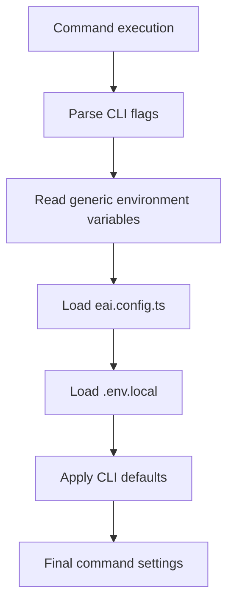

# EAI CLI - Configuration

## Overview

For normal public use, the EAI CLI should need very little configuration.
After `eai login`, the CLI uses your signed-in account and selected tenant to
route requests automatically. Public documentation must not describe private
environment names, endpoint hostnames, internal routing, cloud resources, or
platform infrastructure behind the public API.

Use this page for safe, user-facing configuration only:

1. Output and accessibility preferences
2. Project-local app metadata
3. Local files that must not be committed
4. Troubleshooting commands that do not expose infrastructure details

---

## Configuration Sources

Configuration is loaded with this public-facing precedence:

| Source | Purpose |
|--------|---------|
| CLI flags | One-off command behavior, such as JSON output |
| Environment variables | Generic runtime behavior, such as color handling |
| `eai.config.ts` | Optional project metadata |
| `.env.local` | Optional developer-local app values |
| CLI defaults | Built-in public behavior |

The CLI may keep local auth and tenant state on your machine after login. Treat
that state as private and manage it through CLI commands such as `eai login`,
`eai logout`, `eai whoami`, and `eai tenant select`.

---

## Sign-In Context

Most configuration starts with sign-in:

```bash
eai login
eai tenant select
eai whoami
```

`eai whoami` is the safest way to confirm which account and tenant the CLI is
using. If you need to change tenant, run `eai tenant select`. If you need to
clear local sign-in state, run `eai logout`.

---

## CLI Flags

All commands support these public global flags:

| Flag | Type | Description | Default |
|------|------|-------------|---------|
| `--format <format>` | string | Output format: `text`, `json`, or `yaml` | `text` |
| `--simple` | boolean | Plain text output for screen readers | `false` |
| `--no-color` | boolean | Disable colored output | `false` |
| `--color` | boolean | Force colored output | `false` |
| `--describe` | boolean | Output machine-readable command metadata | `false` |

Examples:

```bash
eai whoami --format json
eai tenant list --simple
eai doctor --no-color
```

---

## Environment Variables

Public documentation only describes generic runtime environment variables:

| Variable | Description |
|----------|-------------|
| `NO_COLOR` | Disable colored terminal output |
| `FORCE_COLOR` | Force colored terminal output |
| `NODE_ENV` | Standard Node.js runtime mode |

Do not put credentials, tokens, endpoint URLs, or tenant-specific values into
committed files. Automation credentials should be stored in your CI provider's
secret store and supplied according to your organization's onboarding guide.

---

## Project Files

### `.env.local`

**File**: `.env.local` in the project root

**Purpose**: Optional developer-local app values. This file is private to your
machine and should not be committed.

Public-safe example:

```bash
NEXT_PUBLIC_APP_NAME=My App
NODE_ENV=development
```

Rules:

1. Keep `.env.local` in `.gitignore`.
2. Do not commit tokens, API keys, client secrets, tenant-specific values, or
   endpoint URLs.
3. Use your deployment provider's secret management for deployed applications.

### `eai.config.ts`

**File**: `eai.config.ts` in the project root

**Purpose**: Optional type-safe project metadata.

Public-safe example:

```typescript
export default {
  appName: 'My App',
  features: {
    chat: true,
    documents: true,
  },
};
```

Keep this file free of secrets and environment-specific endpoints.

### `.eai-manifest.json`

**File**: `.eai-manifest.json` in the project root

**Purpose**: Track Gofer-managed files installed by the CLI.

This file is managed by CLI commands such as `eai init`, `eai gofer refresh`,
and `eai doctor --check-updates`. Do not edit it manually.

---

## Secrets

Never commit secrets. That includes:

1. Access tokens
2. API keys
3. Client secrets
4. Private endpoint URLs
5. Tenant-specific identifiers
6. Generated credentials

For local development, keep private values in ignored local files. For CI/CD and
hosted deployments, use the secret store provided by your deployment platform.

---

## Configuration Loading Flow



---

## Troubleshooting

**Not sure which account or tenant is active?**

Run:

```bash
eai whoami
```

**Need to switch tenant?**

Run:

```bash
eai tenant select
```

**Need to clear local sign-in state?**

Run:

```bash
eai logout
```

**Need a quick health check?**

Run:

```bash
eai doctor
```

**Need machine-readable output for automation?**

Run commands with JSON output:

```bash
eai whoami --format json
```

---

## Public Checklist

Before committing a project that uses the EAI CLI:

1. `.env.local` is ignored.
2. No secrets or tokens are committed.
3. No private endpoint URLs are committed.
4. No tenant-specific identifiers are committed.
5. `eai.config.ts` contains only public-safe project metadata.
6. `eai doctor` runs successfully for your local setup.
