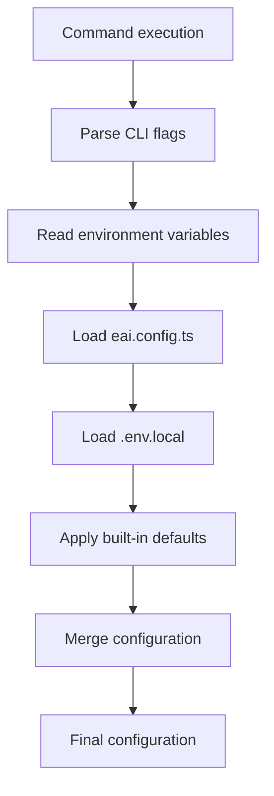

# EAI CLI - Configuration

## Overview

The EAI CLI uses project-local configuration and environment variables for
normal public use. Public documentation must not include private environment
names, internal endpoint hostnames, tenant IDs, client IDs, or developer
profile setup details.

The supported public configuration layers are:

1. **CLI flags** - command-line overrides such as `--format json`
2. **Environment variables** - runtime overrides via `process.env`
3. **`eai.config.ts`** - optional project configuration
4. **`.env.local`** - optional project-local environment values
5. **Built-in defaults** - public production defaults compiled into the CLI

---

## Configuration Sources

Configuration is loaded with the following precedence, highest to lowest:

| Source | Purpose |
|--------|---------|
| CLI flags | One-off command overrides |
| Environment variables | Runtime and CI/CD configuration |
| `eai.config.ts` | Type-safe project configuration |
| `.env.local` | Developer-local project configuration |
| Built-in defaults | Public production login and API defaults |

Do not commit `.env.local`, local tokens, generated secrets, or tenant-specific
values.

---

## Project Configuration

### `.env.local`

**File**: `.env.local` in the project root

**Format**: dotenv `KEY=value`

**Purpose**: Project-specific configuration and secrets that are not committed.

Common variables:

| Variable | Required | Description | Example |
|----------|----------|-------------|---------|
| `BASE_URL_PUBLIC_API` | No | Platform API base URL override | `https://api.example.com/public` |
| `ENTRA_TENANT_ID` | For Entra provisioning | Entra tenant ID for the app being provisioned | `<tenant-id>` |
| `ENTRA_CLIENT_ID` | For Entra provisioning | Entra client ID for the app being provisioned | `<client-id>` |
| `ENTRA_CLIENT_SECRET` | For app auth | Entra client secret for the app being provisioned | `<client-secret>` |
| `AZURE_APP_CONFIG_ENDPOINT` | For env sync | Azure App Configuration endpoint | `https://example.azconfig.io` |
| `AZURE_KEY_VAULT_URL` | For secret sync | Azure Key Vault URL | `https://example.vault.azure.net/` |
| `GITHUB_TOKEN` | For deploy automation | GitHub token with the required workflow permissions | `<github-token>` |
| `GITHUB_REPOSITORY` | For deploy automation | GitHub repository in `owner/repo` form | `org/my-app` |
| `NEXT_PUBLIC_APP_NAME` | No | Application display name | `My App` |
| `NODE_ENV` | No | Node environment | `development` |

Example:

```bash
# Platform API override, only when your organization gives you one.
BASE_URL_PUBLIC_API=https://api.example.com/public

# Entra CIAM app registration values for your project.
ENTRA_TENANT_ID=<tenant-id>
ENTRA_CLIENT_ID=<client-id>
ENTRA_CLIENT_SECRET=<client-secret>

# Azure resources.
AZURE_APP_CONFIG_ENDPOINT=https://example.azconfig.io
AZURE_KEY_VAULT_URL=https://example.vault.azure.net/

# GitHub automation.
GITHUB_TOKEN=<github-token>
GITHUB_REPOSITORY=org/my-app

# Application.
NEXT_PUBLIC_APP_NAME=My App
NODE_ENV=development
```

Security rules:

1. Add `.env.local` to `.gitignore`.
2. Never commit secrets or tokens.
3. Prefer `eai env pull --include-secrets` when syncing secrets from Key Vault.
4. Rotate app secrets when people leave a project or after accidental exposure.

### `eai.config.ts`

**File**: `eai.config.ts` in the project root

**Format**: TypeScript module with a default export

**Purpose**: Type-safe project configuration.

Example:

```typescript
export default {
  appName: 'My App',
  apiUrl: process.env.BASE_URL_PUBLIC_API,
  features: {
    chat: true,
    documents: true,
  },
};
```

The CLI loads this file through `src/lib/config.ts` and merges it with
environment values.

### `.eai-manifest.json`

**File**: `.eai-manifest.json` in the project root

**Format**: JSON

**Purpose**: Track Gofer assets and managed files installed by the CLI.

Example:

```json
{
  "version": "1.0.0",
  "cliVersion": "2.8.13",
  "installedAt": 1748025600000,
  "managedFiles": {
    ".claude/commands/0_business_scenario.md": {
      "path": ".claude/commands/0_business_scenario.md",
      "hash": "sha256:abc123...",
      "source": "gofer",
      "installedAt": 1748025600000,
      "modifiedLocally": false
    }
  }
}
```

Do not edit the manifest manually; it is managed by `eai init`,
`eai gofer refresh`, and `eai doctor --check-updates`.

---

## Environment Variables

### CLI Runtime

| Variable | Type | Description | Default |
|----------|------|-------------|---------|
| `EAI_ACCESS_TOKEN` | string | Access token override for CI/CD or headless use | none |
| `EAI_PROFILE` | string | Optional local profile selector for private/internal setups | `default` |
| `BASE_URL_PUBLIC_API` | string | Platform API base URL override | public production default |
| `NO_COLOR` | string | Disable colored output | not set |
| `FORCE_COLOR` | string | Force colored output | not set |
| `NODE_ENV` | string | Node environment | `production` |

### Project Commands

| Variable | Used By | Description |
|----------|---------|-------------|
| `BASE_URL_PUBLIC_API` | API commands | Platform API base URL override |
| `ENTRA_TENANT_ID` | `eai provision entra` | Entra tenant ID |
| `ENTRA_CLIENT_ID` | `eai provision entra` | Entra client ID |
| `ENTRA_CLIENT_SECRET` | `eai provision entra` | Entra client secret |
| `AZURE_APP_CONFIG_ENDPOINT` | `eai env pull` | Azure App Configuration endpoint |
| `AZURE_KEY_VAULT_URL` | `eai env pull --include-secrets` | Azure Key Vault URL |
| `GITHUB_TOKEN` | `eai deploy trigger` | GitHub token |
| `GITHUB_REPOSITORY` | `eai deploy trigger` | GitHub repository |

---

## CLI Flags

All commands support these global flags:

| Flag | Type | Description | Default |
|------|------|-------------|---------|
| `--format <format>` | string | Output format: `text`, `json`, or `yaml` | `text` |
| `--simple` | boolean | Plain text output for screen readers | `false` |
| `--no-color` | boolean | Disable colored output | `false` |
| `--color` | boolean | Force colored output | `false` |
| `--describe` | boolean | Output JSON schema for commands | `false` |
| `--profile <name>` | string | Use a locally configured private profile | `default` |

CLI flags override every other source.

---

## Secrets

| Secret | Storage | Required For |
|--------|---------|--------------|
| Access token | CLI-managed local token cache | Authenticated API calls |
| Entra client secret | `.env.local` or Key Vault | App authentication |
| Azure App Config connection string | `.env.local` or Key Vault | Environment sync |
| GitHub token | `.env.local` or CI secret storage | Deployment automation |

Best practices:

1. Never commit `.env.local`, tokens, API keys, client secrets, or generated
   credentials.
2. Use GitHub Actions secrets for CI/CD.
3. Use Azure Key Vault for deployed app secrets.
4. Use `eai env list` to inspect configuration; secret values are masked.

---

## Configuration Loading Flow



Precedence:

1. CLI flags
2. Environment variables
3. `eai.config.ts`
4. `.env.local`
5. Built-in defaults

---

## Validation

The CLI validates configuration at runtime:

| Command Area | Validation |
|--------------|------------|
| API commands | Platform API URL, authentication token, tenant context |
| `eai types seed` | Object Type schema shape and JSON Schema compatibility |
| `eai provision entra` | Entra tenant/client values and redirect URI settings |
| `eai env pull` | Azure App Configuration endpoint, Key Vault URL, Azure CLI auth |

---

## Troubleshooting

**Error: `E002: BASE_URL_PUBLIC_API environment variable not set`**

Cause: the command needs a Platform API URL and no default or override was
available.

Fix: set `BASE_URL_PUBLIC_API` to the public API URL supplied by your
organization.

**Error: `E101: Not logged in`**

Cause: no valid access token is available.

Fix: run `eai login`.

**Error: `E104: Authentication failed`**

Cause: the token expired or is invalid.

Fix: run `eai login` again.

**Error: `ENTRA_CLIENT_ID environment variable not set`**

Cause: Entra credentials are missing for the current project.

Fix: run `eai provision entra` or add the required values to `.env.local`.

### Diagnostics

```bash
eai doctor
eai doctor --check-updates
eai whoami
eai env list
```

`eai env list` masks secrets in text and JSON output.

---

## Configuration Files Summary

| File | Purpose | Format | Source |
|------|---------|--------|--------|
| CLI token cache | Access and refresh tokens | JSON | CLI-managed |
| CLI tenant context cache | Active tenant and memberships | JSON | CLI-managed |
| CLI update cache | Update check timestamp | Plain text | CLI-managed |
| `.env.local` | Project configuration and secrets | dotenv | User-managed |
| `eai.config.ts` | TypeScript project configuration | TypeScript | User-managed |
| `.eai-manifest.json` | Gofer managed file tracking | JSON | CLI-managed |
