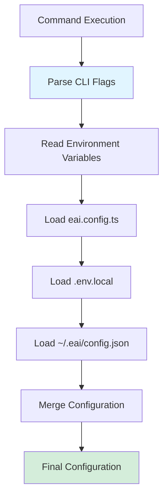

# EAI CLI — Configuration

## Overview

The EAI CLI uses a **multi-layered configuration system** that combines:

1. **Global CLI configuration** — `~/.eai/config.json` for profiles and preferences
2. **Profile-based authentication** — Per-environment token storage
3. **Project configuration** — `.env.local` and `eai.config.ts` for project-specific settings
4. **Environment variables** — Runtime overrides via `process.env`
5. **CLI flags** — Command-line flag overrides (highest precedence)

---

## Configuration Sources (Precedence Order)

Configuration is loaded with the following precedence (highest to lowest):

1. **CLI Flags** — `--format json`, `--profile dev`, `--tenant-id xxx`
2. **Environment Variables** — `EAI_PROFILE`, `BASE_URL_PUBLIC_API`, `NO_COLOR`, `FORCE_COLOR`
3. **`eai.config.ts`** — TypeScript configuration exports (project-specific)
4. **`.env.local`** — Dotenv file (project-specific)
5. **`~/.eai/config.json`** — Global CLI configuration (user-specific)
6. **Defaults** — Hardcoded defaults in source code

---

## Global CLI Configuration

### Profile System

**File**: `~/.eai/config.json`

**Format**: JSON

**Schema**:
```json
{
  "activeProfile": "dev",
  "profiles": {
    "dev": {
      "name": "dev",
      "baseUrl": "https://dev-api.ae.myenterprise.ai/public",
      "description": "Development environment"
    },
    "test": {
      "name": "test",
      "baseUrl": "https://test-api.ae.myenterprise.ai/public",
      "description": "Testing environment"
    },
    "prod": {
      "name": "prod",
      "baseUrl": "https://api.ae.myenterprise.ai/public",
      "description": "Production environment"
    }
  }
}
```

**Managed by**:
- Created automatically on first `eai login --profile <name>`
- Updated by `eai login` when switching profiles
- Read by all CLI commands to determine active environment

**Profile Fields**:
| Field | Type | Required | Description |
|-------|------|----------|-------------|
| `name` | string | Yes | Profile identifier (dev, test, prod, etc.) |
| `baseUrl` | string | Yes | Platform API base URL |
| `description` | string | No | Human-readable description |

**Profile Selection**:
1. `--profile <name>` flag (highest priority)
2. `EAI_PROFILE` environment variable
3. `activeProfile` in `~/.eai/config.json`
4. `default` (falls back to environment variables or errors)

---

### Token Storage

**File**: `~/.eai/tokens.json` (default) or `~/.eai/tokens/{profile}.json` (named profiles)

**Format**: JSON (plain text, file permissions `0o600`)

**Schema**:
```json
{
  "accessToken": "eyJhbGciOiJSUzI1NiIs...",
  "refreshToken": "0.AXEA...",
  "expiresAt": 1748025600000,
  "tokenType": "Bearer",
  "scope": "openid profile email offline_access",
  "idToken": "eyJhbGciOiJSUzI1NiIs..."
}
```

**Security**:
- File mode set to `0o600` (owner read/write only)
- Contains sensitive Bearer tokens
- Should never be committed to version control
- Future: AES-256-CBC encryption planned

**Lifecycle**:
- Created by `eai login`
- Updated on token refresh (auto-refresh when < 5 minutes remaining)
- Deleted by `eai logout`

---

### Tenant Context

**File**: `~/.eai/context.json` (default) or `~/.eai/context/{profile}.json` (named profiles)

**Format**: JSON

**Schema**:
```json
{
  "activeTenant": {
    "id": "tenant-123",
    "displayName": "Acme Corp",
    "slug": "acme-corp",
    "domain": "acme.example.com",
    "isActive": true,
    "roles": ["tenant-admin"]
  },
  "memberships": [
    {
      "id": "tenant-123",
      "displayName": "Acme Corp",
      "slug": "acme-corp",
      "roles": ["tenant-admin"],
      "isActive": true
    }
  ],
  "lastUpdated": 1748025600000
}
```

**Lifecycle**:
- Created/updated by `eai tenant select`
- Read by all tenant-scoped commands
- Cleared by `eai logout`
- Membership cache TTL: 1 hour

---

## Project Configuration

### `.env.local` (Dotenv)

**File**: `.env.local` (project root)

**Format**: KEY=value (dotenv format)

**Purpose**: Project-specific configuration and secrets

**Common Variables**:

#### Platform API Configuration
| Variable | Required | Description | Example |
|----------|----------|-------------|---------|
| `BASE_URL_PUBLIC_API` | Yes | Platform API base URL | `https://api.ae.myenterprise.ai/public` |

#### Entra CIAM Configuration (for vertical app)
| Variable | Required | Description | Example |
|----------|----------|-------------|---------|
| `ENTRA_TENANT_ID` | Yes* | Entra CIAM tenant ID | `abc-123-def-456` |
| `ENTRA_CLIENT_ID` | Yes* | Client ID for vertical app | `client-id-from-entra` |
| `ENTRA_CLIENT_SECRET` | Yes* | Client secret for vertical app | `secret-from-entra` |

*Required for `eai provision entra` command

#### Azure Resource Configuration
| Variable | Required | Description | Example |
|----------|----------|-------------|---------|
| `AZURE_APP_CONFIG_ENDPOINT` | No | Azure App Configuration endpoint | `https://my-appconfig.azconfig.io` |
| `AZURE_KEY_VAULT_URL` | No | Azure Key Vault URL | `https://my-vault.vault.azure.net/` |

#### GitHub Configuration
| Variable | Required | Description | Example |
|----------|----------|-------------|---------|
| `GITHUB_TOKEN` | No | GitHub personal access token | `ghp_xxxxx` |
| `GITHUB_REPOSITORY` | No | GitHub repository (owner/repo) | `org/my-vertical` |

#### Application Configuration
| Variable | Required | Description | Example |
|----------|----------|-------------|---------|
| `NEXT_PUBLIC_APP_NAME` | No | Application display name | `My Vertical App` |
| `NODE_ENV` | No | Node environment | `development` |

**Example `.env.local`**:
```bash
# Platform API
BASE_URL_PUBLIC_API=https://api.ae.myenterprise.ai/public

# Entra CIAM (vertical app registration)
ENTRA_TENANT_ID=abc-123-def-456
ENTRA_CLIENT_ID=client-id-from-entra
ENTRA_CLIENT_SECRET=secret-from-entra

# Azure Resources
AZURE_APP_CONFIG_ENDPOINT=https://my-appconfig.azconfig.io
AZURE_KEY_VAULT_URL=https://my-vault.vault.azure.net/

# GitHub
GITHUB_TOKEN=ghp_xxxxx
GITHUB_REPOSITORY=org/my-vertical

# Application
NEXT_PUBLIC_APP_NAME=My Vertical App
NODE_ENV=development
```

**Security**:
- Add `.env.local` to `.gitignore`
- Never commit secrets or tokens
- Use `eai env pull --include-secrets` to sync from Azure Key Vault

---

### `eai.config.ts` (TypeScript Configuration)

**File**: `eai.config.ts` (project root)

**Format**: TypeScript module with default export

**Purpose**: Type-safe project configuration with TypeScript support

**Example**:
```typescript
export default {
  appName: 'My Vertical App',
  apiUrl: process.env.BASE_URL_PUBLIC_API,
  features: {
    chat: true,
    documents: true,
    workflows: ['strategy-monitor', 'compliance-audit'],
  },
  ui: {
    theme: 'modern',
    primaryColor: '#0066cc',
  },
};
```

**Loading**:
- Loaded by `src/lib/config.ts`
- Merged with `.env.local` and environment variables
- TypeScript allows imports, type checking, and complex logic

---

### `.eai-manifest.json` (Gofer Manifest)

**File**: `.eai-manifest.json` (project root)

**Format**: JSON

**Purpose**: Track Gofer AI assets and managed files for safe updates

**Schema**:
```json
{
  "version": "1.0.0",
  "cliVersion": "2.8.13",
  "installedAt": 1748025600000,
  "managedFiles": {
    ".claude/commands/0_business_scenario.md": {
      "path": ".claude/commands/0_business_scenario.md",
      "hash": "sha256:abc123...",
      "source": "gofer",
      "installedAt": 1748025600000,
      "modifiedLocally": false
    }
  }
}
```

**Managed by**:
- Created by `eai init` (if Gofer assets installed)
- Updated by `eai gofer refresh`
- Read by `eai doctor --check-updates` to detect drift

**Never edit manually** — managed by CLI

---

## Environment Variables

### CLI Runtime Variables

| Variable | Type | Description | Default |
|----------|------|-------------|---------|
| `EAI_PROFILE` | string | Active profile name | `default` |
| `EAI_ACCESS_TOKEN` | string | Override access token (for CI/CD) | (none) |
| `EAI_APP_CONFIG_STORE` | string | Azure App Config endpoint | (from `.env.local`) |
| `NO_COLOR` | string | Disable colored output | (not set) |
| `FORCE_COLOR` | string | Force colored output | (not set) |
| `NODE_ENV` | string | Node environment | `production` |

### Project Configuration Variables

These are read from `.env.local` and used by CLI commands:

| Variable | Used By | Description |
|----------|---------|-------------|
| `BASE_URL_PUBLIC_API` | All API commands | Platform API base URL |
| `ENTRA_TENANT_ID` | `eai provision entra` | Entra CIAM tenant ID |
| `ENTRA_CLIENT_ID` | `eai provision entra` | Entra client ID |
| `ENTRA_CLIENT_SECRET` | `eai provision entra` | Entra client secret |
| `AZURE_APP_CONFIG_ENDPOINT` | `eai env pull` | Azure App Configuration endpoint |
| `AZURE_KEY_VAULT_URL` | `eai env pull --include-secrets` | Azure Key Vault URL |
| `GITHUB_TOKEN` | `eai deploy trigger` | GitHub personal access token |
| `GITHUB_REPOSITORY` | `eai deploy trigger` | GitHub repository (owner/repo) |

---

## CLI Flags

All commands support these global flags:

| Flag | Type | Description | Default |
|------|------|-------------|---------|
| `--profile <name>` | string | Use named profile (dev, test, prod) | `default` |
| `--format <format>` | string | Output format (text\|json\|yaml) | `text` |
| `--simple` | boolean | Plain text output for screen readers | `false` |
| `--no-color` | boolean | Disable colored output | `false` |
| `--color` | boolean | Force colored output | `false` |
| `--describe` | boolean | Output JSON schema of commands | `false` |

**Precedence**: CLI flags override all other configuration sources.

---

## Feature Flags

The CLI does not currently use feature flags. All features are enabled by default.

**Future**: Feature flags may be added to `eai.config.ts` for opt-in/opt-out of experimental features.

---

## Required Secrets

### For CLI Operation

| Secret | Storage | Required For | How to Obtain |
|--------|---------|--------------|---------------|
| Access Token | `~/.eai/tokens.json` | All API calls | `eai login` |

### For Vertical App Operation

| Secret | Storage | Required For | How to Obtain |
|--------|---------|--------------|---------------|
| Entra Client Secret | `.env.local` | End-user authentication | `eai provision entra` or Azure Portal |
| Azure App Config Connection String | `.env.local` | `eai env pull` | Azure Portal |
| Azure Key Vault Access | Azure CLI credentials | `eai env pull --include-secrets` | `az login` |
| GitHub Token | `.env.local` | `eai deploy trigger` | GitHub Settings → Developer settings → Personal access tokens |

**Security Best Practices**:
1. Never commit `.env.local` to version control
2. Use `eai env pull --include-secrets` instead of manually copying secrets
3. Rotate secrets regularly via `eai provision entra --rotate-secret`
4. Use Azure Key Vault for production secrets
5. Use GitHub Secrets for CI/CD workflows

---

## Configuration Loading Flow



**Precedence (highest to lowest)**:
1. CLI Flags (`--profile dev`)
2. Environment Variables (`EAI_PROFILE=dev`)
3. `eai.config.ts` exports
4. `.env.local` variables
5. `~/.eai/config.json` profile settings
6. Hardcoded defaults

---

## Configuration Validation

The CLI validates configuration at runtime:

### On Every Command
- Checks if `BASE_URL_PUBLIC_API` is set (for API commands)
- Validates token expiry
- Validates profile exists (if `--profile` specified)

### On `eai types seed`
- Validates Object Type schemas
- Checks for required fields
- Validates field types match JSON Schema spec

### On `eai provision entra`
- Validates `ENTRA_TENANT_ID`, `ENTRA_CLIENT_ID`, `ENTRA_CLIENT_SECRET` are set
- Validates format of Entra CIAM credentials

### On `eai env pull`
- Validates `AZURE_APP_CONFIG_ENDPOINT` is set
- Validates `AZURE_KEY_VAULT_URL` is set (if `--include-secrets`)
- Checks Azure CLI authentication

---

## Troubleshooting Configuration

### Common Issues

**Error: `E002: BASE_URL_PUBLIC_API environment variable not set`**
- **Cause**: Platform API URL not configured
- **Fix**: Add `BASE_URL_PUBLIC_API=https://api.ae.myenterprise.ai/public` to `.env.local`

**Error: `E101: Not logged in`**
- **Cause**: No valid access token
- **Fix**: Run `eai login`

**Error: `E104: Authentication failed`**
- **Cause**: Token expired or invalid
- **Fix**: Run `eai login` to re-authenticate

**Error: `Profile 'dev' not found`**
- **Cause**: Profile specified but not configured
- **Fix**: Run `eai login --profile dev` to create profile

**Error: `ENTRA_CLIENT_ID environment variable not set`**
- **Cause**: Entra credentials missing
- **Fix**: Run `eai provision entra` or add manually to `.env.local`

### Diagnostics

Use `eai doctor` for comprehensive diagnostics:

```bash
# Check all configuration
eai doctor

# Check with update drift detection
eai doctor --check-updates
```

Use `eai whoami` to check authentication status:

```bash
# Check login status
eai whoami

# Check with JSON output
eai whoami --format json
```

Use `eai env list` to view current configuration:

```bash
# List all environment variables
eai env list

# List with JSON output (secrets masked)
eai env list --format json
```

---

## Configuration Files Summary

| File | Purpose | Format | Source |
|------|---------|--------|--------|
| `~/.eai/config.json` | Global CLI configuration (profiles) | JSON | User-managed |
| `~/.eai/tokens.json` | Access tokens (default profile) | JSON | CLI-managed |
| `~/.eai/tokens/{profile}.json` | Access tokens (named profile) | JSON | CLI-managed |
| `~/.eai/context.json` | Tenant context (default profile) | JSON | CLI-managed |
| `~/.eai/context/{profile}.json` | Tenant context (named profile) | JSON | CLI-managed |
| `~/.eai/last-update-check` | Update check timestamp | Plain text | CLI-managed |
| `.env.local` | Project configuration and secrets | Dotenv | User-managed |
| `eai.config.ts` | TypeScript project configuration | TypeScript | User-managed |
| `.eai-manifest.json` | Gofer managed files tracking | JSON | CLI-managed |
