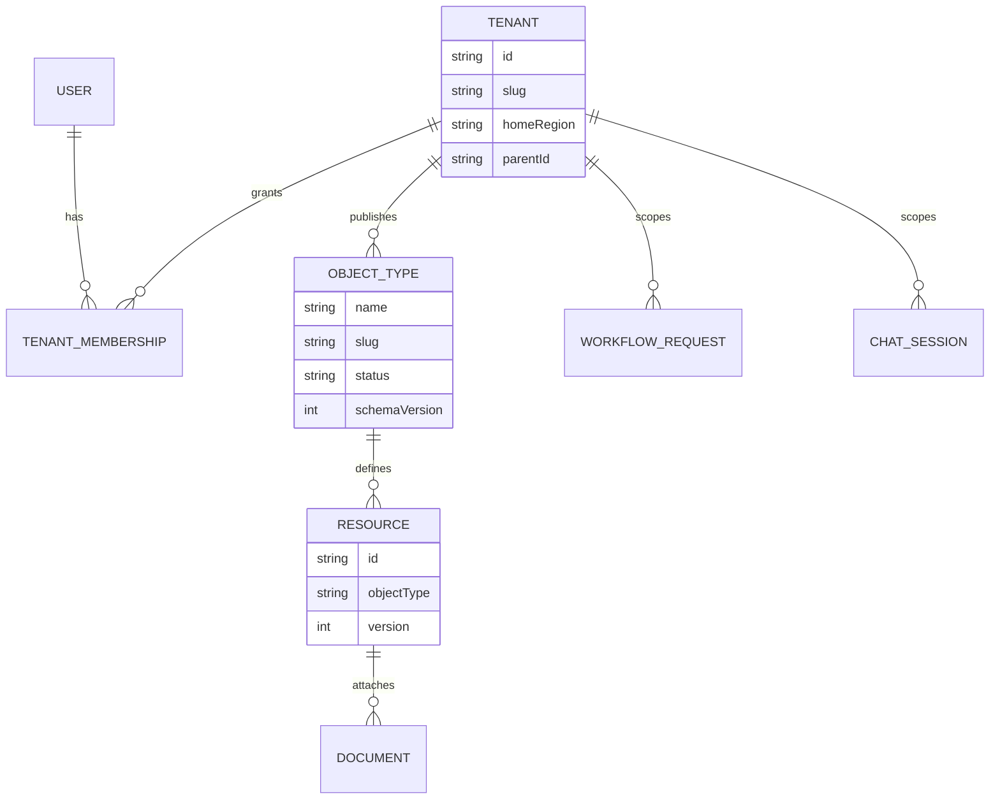

# Data Model

## Scope

This repository owns a CLI and local configuration; it does not define or
migrate a database. Tenant, resource, document, workflow, and identity data
are owned by the remote EAI PublicAPI. The CLI transports and validates those
contracts but cannot provide authoritative database columns, migrations, or
indexes from this checkout.

## Local State Schemas

| Store | Fields or shape | Constraints and purpose |
|---|---|---|
| `~/.eai/tokens.json` | `accessToken`, optional `refreshToken`, `expiresAt`, `tenantId`, `tenantName`, `clientId`, optional active tenant and regional URL | Default profile token store; encrypted and private |
| `~/.eai/tokens/<profile>.json` | Same token shape per named profile | Profile isolation |
| `~/.eai/config.json` | `profiles.<name>.publicApiUrl`, `authTenantName`, `authTenantId`, `authClientId`, optional `authScope` | Named profile configuration; file mode `0600` |
| Project `.env.local` | App key, tenant values, regional `BASE_URL_PUBLIC_API`, runtime flags, and optional access token | Local-only environment input; must not be committed |
| `.eai-manifest.json` | CLI-managed asset and scaffold metadata | Managed by init/gofer refresh/update commands |
| Object Type manifest | `name`, exact `slug`, properties, links, actions, status, optional storage binding | Names are PascalCase; transport slugs are explicit lowercase kebab-case |

## Object Type Contract

`ObjectTypeDefinition` supports property types `text`, `number`, `boolean`,
`date`, `select`, `json`, `file`, and `relationship`. Links declare
cardinality and optional cascade deletion. Actions declare a required tenant
role, validation rules, and side effects. Storage bindings can describe SQL,
DocumentDB, blob, or search targets, but those bindings are sent to the
platform and are not local database implementations.

## Remote Entity Relationships

The entity names and relationships above reflect the typed client and command
contracts; field completeness, physical storage, indexes, and referential
constraints are **not determined from codebase**.

## Migration and Index History

No database migration directory or migration runner is present. Remote schema
operations are exposed as API actions such as object-type publish, storage
provision, schema sync, index-plan, and cache-refresh. Their server-side
history and physical indexes are **not determined from codebase**.
