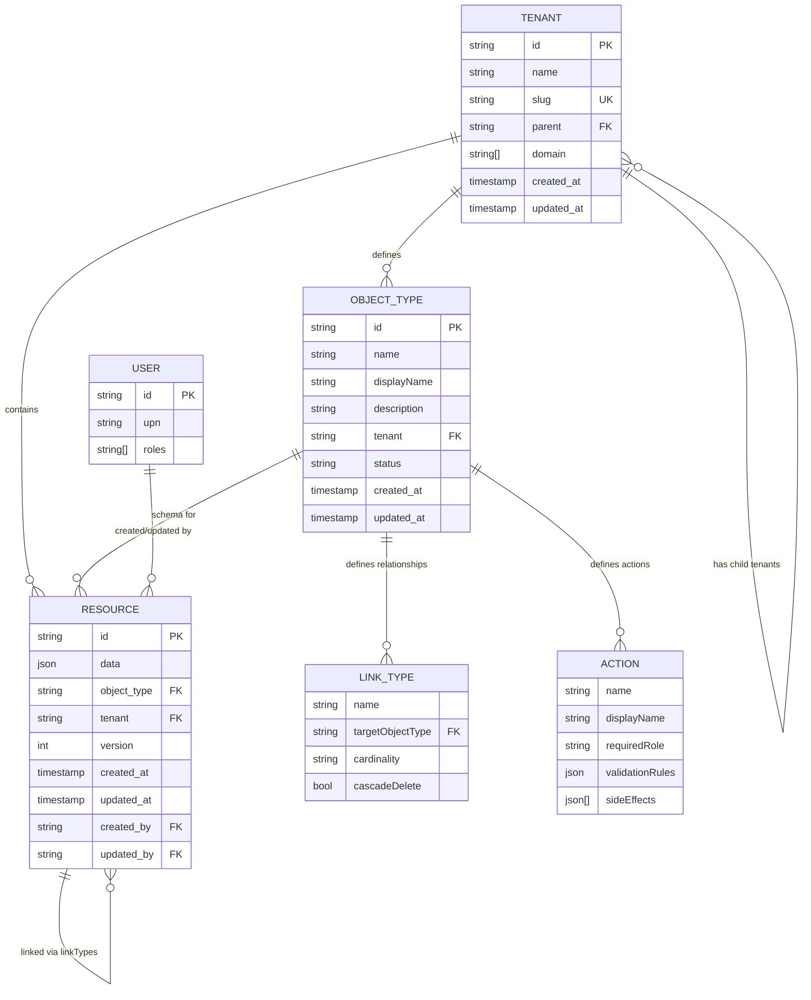

# EAI CLI — Data Model

## Overview

The EAI CLI is a client-side tool with **no persistent database**. It manages two types of local data:

1. **Authentication Tokens** — Stored in `~/.eai/tokens.json` (encrypted)
2. **Update Check Cache** — Stored in `~/.eai/update-check.json`

All business data (resources, object types, tenants) is stored in the **Platform API** and accessed via REST endpoints.

---

## Local Storage Entities

### 1. Authentication Tokens (`~/.eai/tokens.json`)

**Purpose**: Store encrypted access and refresh tokens for Entra CIAM authentication.

**Storage Format**: AES-256-CBC encrypted JSON

**Schema**:
```typescript
interface StoredTokens {
  accessToken: string;        // JWT access token
  refreshToken?: string;      // OAuth refresh token
  expiresAt: number;          // Expiry timestamp (ms since epoch)
  tenantId: string;           // Entra tenant ID
  tenantName: string;         // Entra tenant name (subdomain)
  clientId: string;           // Entra client ID
  upn?: string;               // User Principal Name (email)
}
```

**Example** (decrypted):
```json
{
  "accessToken": "eyJ0eXAiOiJKV1QiLCJhbGc...",
  "refreshToken": "0.ARAA...",
  "expiresAt": 1709825400000,
  "tenantId": "12345678-1234-1234-1234-123456789abc",
  "tenantName": "eaiplatform",
  "clientId": "87654321-4321-4321-4321-abcdef123456",
  "upn": "user@example.com"
}
```

**Encryption**:
- Algorithm: AES-256-CBC
- Key derivation: SHA-256 hash of `eai-cli-${homedir}-token-store`
- Format: `{iv_hex}:{encrypted_hex}`
- File permissions: `0o600` (owner read/write only)

**Lifecycle**:
- **Created**: On `eai login` success
- **Read**: On every command execution (via `getAccessToken()`)
- **Updated**: On token refresh (5min before expiry)
- **Deleted**: On `eai logout`

**Security Considerations**:
- Encryption key is machine-specific (derived from home directory path)
- Not portable across machines
- Not suitable for shared machines (use `EAI_ACCESS_TOKEN` env var instead)

---

### 2. Update Check Cache (`~/.eai/update-check.json`)

**Purpose**: Cache latest version info to avoid excessive registry checks.

**Storage Format**: Plaintext JSON

**Schema**:
```typescript
interface UpdateCache {
  lastCheck: number;          // Timestamp of last check (ms)
  latestVersion: string;      // Latest version from registry
  currentVersion: string;     // CLI version at time of check
}
```

**Example**:
```json
{
  "lastCheck": 1709825400000,
  "latestVersion": "0.1.5",
  "currentVersion": "0.1.4"
}
```

**Lifecycle**:
- **Created/Updated**: Background check on CLI invocation (if 24h elapsed)
- **Read**: After command execution to display update banner
- **TTL**: 24 hours

**Registry Source**: `https://eai-tools.github.io/eai-cli/registry/@eai-tools/cli`

---

## Platform Data Models

The CLI interacts with these data models on the Platform API:

### 3. Resource (Platform Entity)

**Storage**: Platform Data Service (MongoDB)

**Schema** (as returned by API):
```typescript
interface Resource {
  id: string;                 // UUID
  data: Record<string, any>;  // Dynamic fields based on Object Type
  object_type: string;        // Object Type name
  tenant: string;             // Tenant ID
  version: number;            // Optimistic locking version
  created_at: string;         // ISO 8601 timestamp
  updated_at: string;         // ISO 8601 timestamp
  created_by?: string;        // User ID
  updated_by?: string;        // User ID
}
```

**Example**:
```json
{
  "id": "a1b2c3d4-e5f6-7890-abcd-ef1234567890",
  "data": {
    "title": "My Resource",
    "description": "A sample resource",
    "status": "active",
    "priority": 5
  },
  "object_type": "Task",
  "tenant": "tenant-123",
  "version": 3,
  "created_at": "2026-03-11T10:00:00Z",
  "updated_at": "2026-03-11T12:30:00Z",
  "created_by": "user-456",
  "updated_by": "user-789"
}
```

**Relationships**:
- Belongs to one `ObjectType` (defines schema)
- Belongs to one `Tenant` (multi-tenancy isolation)
- Has version history (tracked in platform)

---

### 4. Object Type (Schema Definition)

**Storage**: Platform Type Registry

**Schema**:
```typescript
interface ObjectTypeDefinition {
  name: string;               // PascalCase identifier (e.g., "Task")
  displayName: string;        // Human-readable (e.g., "Task")
  description?: string;       // Optional description
  properties: ObjectTypeProperty[];
  linkTypes: ObjectTypeLinkType[];
  actions: ObjectTypeAction[];
  storageBackend?: string;    // Default: "mongodb"
  status: 'draft' | 'published' | 'deprecated';
  tenant: string;             // Tenant ID
  id?: string;                // Platform-assigned ID
  created_at?: string;        // ISO 8601 timestamp
  updated_at?: string;        // ISO 8601 timestamp
}
```

**Example**:
```json
{
  "name": "Task",
  "displayName": "Task",
  "description": "A work item to be completed",
  "properties": [
    {
      "name": "title",
      "type": "text",
      "required": true,
      "indexed": true
    },
    {
      "name": "description",
      "type": "text",
      "required": false
    },
    {
      "name": "status",
      "type": "select",
      "required": true,
      "options": [
        { "label": "Todo", "value": "todo" },
        { "label": "In Progress", "value": "in_progress" },
        { "label": "Done", "value": "done" }
      ],
      "defaultValue": "todo"
    },
    {
      "name": "priority",
      "type": "number",
      "required": false,
      "defaultValue": 3
    }
  ],
  "linkTypes": [
    {
      "name": "assignedTo",
      "targetObjectType": "User",
      "cardinality": "many-to-one"
    },
    {
      "name": "comments",
      "targetObjectType": "Comment",
      "cardinality": "one-to-many",
      "cascadeDelete": true
    }
  ],
  "actions": [
    {
      "name": "complete",
      "displayName": "Mark as Complete",
      "requiredRole": "tenant-user",
      "validationRules": {
        "requiredFields": ["title"],
        "requiredStatus": "in_progress"
      },
      "sideEffects": [
        {
          "type": "set_field",
          "field": "status",
          "value": "done"
        },
        {
          "type": "set_timestamp",
          "field": "completed_at"
        }
      ]
    }
  ],
  "storageBackend": "mongodb",
  "status": "published",
  "tenant": "tenant-123"
}
```

**Relationships**:
- Defines schema for many `Resources`
- Belongs to one `Tenant`
- Can reference other Object Types via `linkTypes`

---

### 5. Tenant (Multi-Tenancy)

**Storage**: Platform Payload Service

**Schema**:
```typescript
interface Tenant {
  id: string;                 // UUID
  name: string;               // Tenant name
  slug: string;               // URL-safe identifier
  parent?: string;            // Parent tenant ID (hierarchical)
  domain?: string[];          // Associated domains
  created_at: string;         // ISO 8601 timestamp
  updated_at: string;         // ISO 8601 timestamp
}
```

**Example**:
```json
{
  "id": "tenant-123",
  "name": "Acme Corporation",
  "slug": "acme-corp",
  "parent": "parent-tenant-456",
  "domain": ["acme.com"],
  "created_at": "2026-01-01T00:00:00Z",
  "updated_at": "2026-03-11T12:00:00Z"
}
```

**Relationships**:
- Has many `Resources`
- Has many `ObjectTypes`
- Has many child `Tenants` (hierarchical)

---

## Entity Relationship Diagram



---

## Property Type Reference

### Supported Property Types

| Type | Description | Example Value |
|------|-------------|---------------|
| `text` | String value | `"Hello World"` |
| `number` | Numeric value (int or float) | `42`, `3.14` |
| `boolean` | True/false value | `true`, `false` |
| `date` | ISO 8601 date/datetime | `"2026-03-11"`, `"2026-03-11T12:00:00Z"` |
| `select` | Enum value (requires `options`) | `"todo"` (from predefined options) |
| `json` | Arbitrary JSON object/array | `{"key": "value"}`, `[1, 2, 3]` |
| `file` | File reference (UUID or URL) | `"file-uuid-123"` |
| `relationship` | Reference to another resource | `"resource-uuid-456"` |

### Link Cardinality

| Cardinality | Description | Example |
|-------------|-------------|---------|
| `one-to-one` | Resource has exactly one linked resource | User → Profile |
| `one-to-many` | Resource has multiple linked resources | Post → Comments |
| `many-to-one` | Multiple resources link to one resource | Tasks → User (assignee) |
| `many-to-many` | Multiple resources link to multiple resources | Students ↔ Courses |

---

## Indexing Strategy

**Not determined from codebase**. Indexing is configured per Object Type via the `indexed` property flag. The platform handles index creation in the underlying storage (MongoDB).

**Common Indexes** (inferred):
- `id` — Primary key (unique)
- `object_type` + `tenant` — Scoped queries
- `created_at`, `updated_at` — Sorting by time
- Custom properties with `indexed: true`

---

## Version History

Resources support **optimistic locking** via the `version` field:

- Every update increments the version
- Update requests must include current version
- Platform returns 409 Conflict if version mismatch
- History is queryable via `/history` endpoint

**Example Version History**:
```json
{
  "history": [
    {
      "version": 3,
      "data": { "status": "done" },
      "updated_at": "2026-03-11T14:00:00Z",
      "updated_by": "user-789"
    },
    {
      "version": 2,
      "data": { "status": "in_progress" },
      "updated_at": "2026-03-11T12:00:00Z",
      "updated_by": "user-456"
    },
    {
      "version": 1,
      "data": { "status": "todo" },
      "created_at": "2026-03-11T10:00:00Z",
      "created_by": "user-456"
    }
  ]
}
```

---

## Data Constraints

### Object Type Validation Rules

| Constraint | Rule | Enforced By |
|------------|------|-------------|
| Name format | PascalCase (`^[A-Z][a-zA-Z0-9]*$`) | CLI validation |
| Unique property names | No duplicates within type | CLI validation |
| Valid property types | One of 8 supported types | CLI validation |
| Select options | Must have options if type is `select` | CLI validation |
| Link target | Target Object Type must exist | Platform validation |
| Action role | One of 3 roles | CLI validation |
| Side effect type | One of 3 types | CLI validation |

### Resource Validation Rules

| Constraint | Rule | Enforced By |
|------------|------|-------------|
| Required fields | Must be present if `required: true` | Platform validation |
| Type correctness | Field values match property type | Platform validation |
| Version match | Must match current version on update | Platform (optimistic locking) |
| Tenant isolation | Resources belong to single tenant | Platform (multi-tenancy) |

---

## Migration History

**Not applicable** — The CLI does not manage database migrations. Object Type changes are versioned and managed by the platform.

---

## Data Retention

**Not determined from codebase**. Retention policies are managed by the platform, not the CLI.

**Local Data Retention**:
- Tokens: Persisted until `eai logout` or manual file deletion
- Update cache: 24-hour TTL, auto-refreshed
