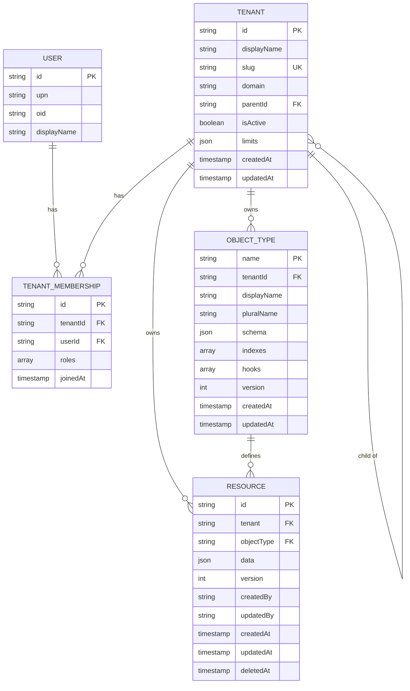
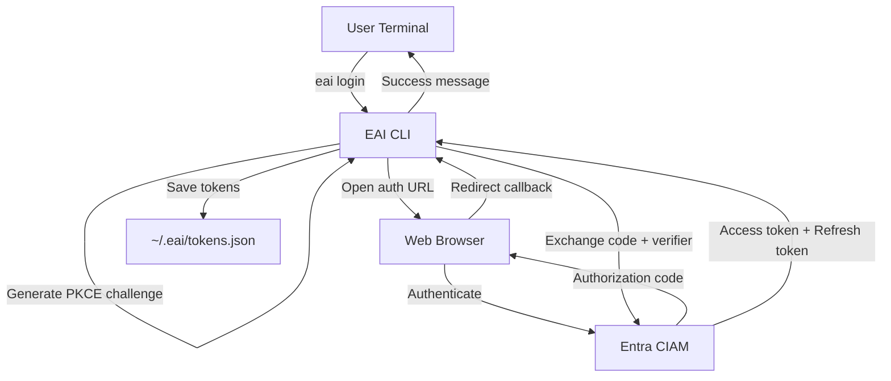
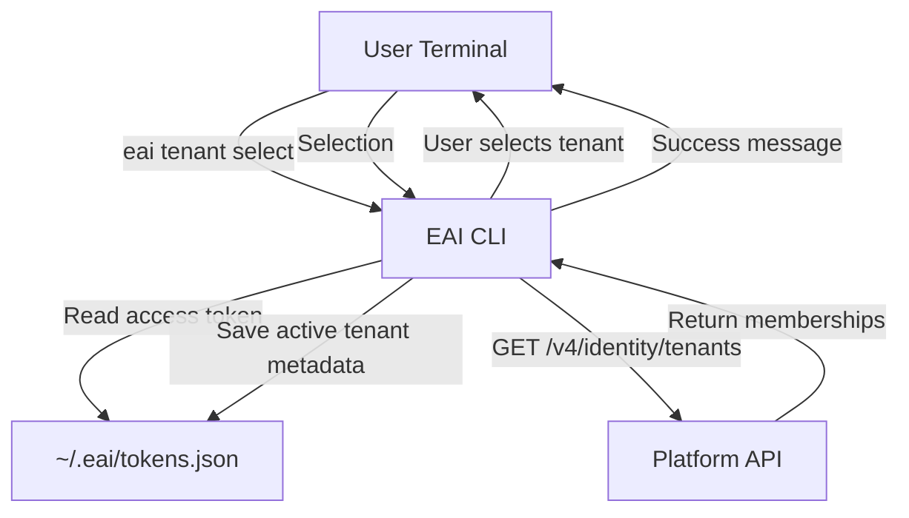

# EAI CLI — Data Model

## Overview

The EAI CLI is a **stateless client** that does not maintain a local database. All persistent state resides either:

1. **Locally** in `~/.eai/` directory (encrypted tokens, active tenant metadata, cache)
2. **On the Platform** via the EAI Platform API (resources, types, tenants)
3. **In Project** via configuration files (`.env.local`, `eai.config.ts`, `.eai-manifest.json`)

---

## Local Storage (`~/.eai/`)

### Authentication Tokens

**File**: `~/.eai/tokens.json` (default profile) or `~/.eai/tokens/{profile}.json` (named profiles)

**Format**: Encrypted token payload managed by `src/lib/auth.ts`

**Schema**:
```typescript
interface StoredTokens {
  accessToken: string;           // Bearer token for platform API auth
  refreshToken?: string;          // Refresh token for auto-refresh
  expiresAt: number;              // Unix timestamp (ms)
  tenantId: string;                // CIAM authority tenant ID
  tenantName: string;              // CIAM authority tenant name
  clientId: string;                // Public client ID used for PKCE
  authScope?: string;              // OAuth scopes granted
  upn?: string;                    // Signed-in user principal name
  oid?: string;                    // Signed-in user object ID
  activeTenantId?: string;         // Selected platform tenant ID
  activeTenantName?: string;       // Selected platform tenant name
  publicApiUrl?: string;           // Resolved PublicAPI base URL when known
}
```

**Lifecycle**:
- Created on `eai login` after Entra CIAM PKCE flow
- Updated on token refresh (when `expiresAt` approaching)
- Cleared on `eai logout`
- Per-profile isolation (multiple environments)

**Security**:
- File mode `0o600` (owner read/write only)
- Contains sensitive Bearer tokens
- Should not be committed to version control

**Location**: `~/.eai/tokens.json` or `~/.eai/tokens/{profile}.json`

---

### Active Tenant Selection

**File**: Stored with the active profile's token record in `~/.eai/tokens.json`
or `~/.eai/tokens/{profile}.json`.

**Format**: Encrypted token payload managed by `src/lib/auth.ts`

**Schema**:
```typescript
interface StoredTokens {
  accessToken: string;
  refreshToken?: string;
  expiresAt: number;
  tenantId: string;
  tenantName: string;
  clientId: string;
  authScope?: string;
  upn?: string;
  oid?: string;
  activeTenantId?: string;
  activeTenantName?: string;
  activeTenantSlug?: string;
  activeTenantDomain?: string;
  activeTenantHomeRegion?: string | null;
  activeTenantHqCountryCode?: string | null;
  publicApiUrl?: string;
  membershipsCachedAt?: number;
}
```

**Lifecycle**:
- Created/updated on `eai tenant select`
- Cleared on `eai logout`
- Cached memberships refreshed periodically (1 hour TTL)

**Location**: Active profile token storage

---

### Update Check Cache

**File**: `~/.eai/update-check.json`

**Format**: JSON

**Purpose**: Throttle update checks to once per 24 hours

**Lifecycle**:
- Created/updated on CLI version check
- Read by `update-check.ts` to determine if check is needed

**Location**: `~/.eai/update-check.json`

---

## Project Storage

### Environment Configuration

**File**: `.env.local` (in project root)

**Format**: Dotenv format (KEY=value)

**Purpose**: Project-specific configuration and secrets

**Common Variables**:
```bash
# Platform API
BASE_URL_PUBLIC_API=https://api.example.com/public

# Entra CIAM (app registration)
ENTRA_TENANT_ID=<tenant-id>
ENTRA_CLIENT_ID=<client-id>
ENTRA_CLIENT_SECRET=<client-secret>

# Azure Resources
AZURE_APP_CONFIG_ENDPOINT=https://my-appconfig.azconfig.io
AZURE_KEY_VAULT_URL=https://my-vault.vault.azure.net/

# GitHub
GITHUB_TOKEN=<github-token>
GITHUB_REPOSITORY=org/repo

# Application
NEXT_PUBLIC_APP_NAME=My App
```

**Lifecycle**:
- Created by `eai init` or manually
- Updated by `eai env pull` (syncs from Azure App Config)
- Read by `eai` commands for configuration

**Security**:
- Should be added to `.gitignore`
- Never commit secrets
- Use `eai env pull --include-secrets` to sync secrets from Key Vault

---

### TypeScript Configuration

**File**: `eai.config.ts` (in project root)

**Format**: TypeScript module with exports

**Purpose**: Type-safe configuration for CLI

**Example**:
```typescript
export default {
  appName: 'My App',
  apiUrl: process.env.BASE_URL_PUBLIC_API,
  features: {
    chat: true,
    documents: true,
  },
};
```

**Lifecycle**:
- Created by `eai init` or manually
- Read by CLI commands that support TypeScript config

---

### Gofer Manifest

**File**: `.eai-manifest.json` (in project root)

**Format**: JSON

**Schema**:
```typescript
interface GoferManifest {
  version: string;               // Manifest version
  cliVersion: string;            // CLI version that created manifest
  installedAt: number;           // Unix timestamp (ms)
  managedFiles: Record<string, ManagedFile>;
}

interface ManagedFile {
  path: string;                  // Relative path from project root
  hash: string;                  // SHA-256 hash of file content
  source: 'gofer' | 'template';  // Source of managed file
  installedAt: number;           // Unix timestamp (ms)
  modifiedLocally: boolean;      // Whether file has local edits
}
```

**Purpose**: Track Gofer AI assets and template files for safe updates

**Lifecycle**:
- Created by `eai init` (if Gofer assets installed)
- Updated by `eai gofer refresh`
- Used by `eai doctor --check-updates` to detect drift

**Location**: `.eai-manifest.json` (project root)

---

## Platform Data Structures

### Object Type

**Source**: Platform API (`GET /v4/data/resources/object-types`)

**Schema**:
```typescript
interface ObjectType {
  name: string;                  // Type name (PascalCase)
  displayName: string;           // Human-readable name
  pluralName: string;            // Plural form
  description?: string;          // Type description
  icon?: string;                 // Icon identifier
  schema: {
    type: 'object';
    properties: Record<string, JSONSchemaProperty>;
    required?: string[];
    additionalProperties?: boolean;
  };
  indexes?: Index[];             // Database indexes
  hooks?: Hook[];                // Lifecycle hooks
  permissions?: Permission[];    // Access control rules
  version: number;               // Schema version
  createdAt: string;             // ISO 8601 timestamp
  updatedAt: string;             // ISO 8601 timestamp
  tenantId: string;              // Owning tenant
}

interface JSONSchemaProperty {
  type: 'string' | 'number' | 'boolean' | 'object' | 'array';
  format?: string;               // e.g., 'email', 'date-time'
  enum?: string[];               // Allowed values
  items?: JSONSchemaProperty;    // Array item schema
  properties?: Record<string, JSONSchemaProperty>;  // Object properties
  required?: string[];           // Required nested properties
  minLength?: number;
  maxLength?: number;
  minimum?: number;
  maximum?: number;
  pattern?: string;              // Regex pattern
  default?: unknown;             // Default value
}

interface Index {
  fields: string[];              // Field names
  unique?: boolean;              // Unique constraint
  sparse?: boolean;              // Sparse index
}

interface Hook {
  event: 'beforeCreate' | 'afterCreate' | 'beforeUpdate' | 'afterUpdate' | 'beforeDelete' | 'afterDelete';
  handler: string;               // Handler function name
}

interface Permission {
  role: string;                  // Role name
  actions: ('create' | 'read' | 'update' | 'delete')[];
}
```

---

### Resource

**Source**: Platform API (`GET /v4/data/resources/{tenant_id}/{object_type}/{id}`)

**Schema**:
```typescript
interface Resource {
  id: string;                    // UUID
  data: Record<string, unknown>; // Resource fields (matches Object Type schema)
  version: number;               // Optimistic locking version
  createdAt: string;             // ISO 8601 timestamp
  updatedAt: string;             // ISO 8601 timestamp
  tenant: string;                // Tenant ID
  objectType: string;            // Object Type name
  createdBy?: string;            // User ID who created
  updatedBy?: string;            // User ID who last updated
  deletedAt?: string;            // Soft delete timestamp (if applicable)
}
```

---

### Tenant

**Source**: Platform API (`GET /v4/platform/tenants/{id}/management`)

**Schema**:
```typescript
interface Tenant {
  id: string;                    // UUID
  displayName: string;           // Tenant display name
  slug: string;                  // URL-friendly slug
  domain?: string;               // Custom domain
  parentId?: string;             // Parent tenant ID (for hierarchy)
  isActive: boolean;             // Active status
  limits: {
    tenants?: number;            // Max child tenants
    users?: number;              // Max users
    storage?: number;            // Max storage (bytes)
    apiCalls?: number;           // Max API calls per month
  };
  metadata?: Record<string, unknown>;  // Custom metadata
  createdAt: string;             // ISO 8601 timestamp
  updatedAt: string;             // ISO 8601 timestamp
}
```

---

### Tenant Membership

**Source**: Platform API (`GET /v4/identity/tenants`)

**Schema**:
```typescript
interface TenantMembership {
  id: string;                    // Membership ID
  tenantId: string;              // Tenant ID
  userId: string;                // User ID
  roles: string[];               // Assigned roles (e.g., ['tenant-admin', 'tenant-member'])
  displayName: string;           // Tenant display name
  slug: string;                  // Tenant slug
  domain?: string;               // Tenant domain
  isActive: boolean;             // Tenant active status
  joinedAt: string;              // ISO 8601 timestamp
}
```

---

### Workflow Status

**Source**: Platform API (`GET /v4/workflows/runtime/{key}/status`)

**Schema**:
```typescript
interface WorkflowStatus {
  key: string;                   // Workflow key
  status: 'available' | 'operator_required' | 'paid_upgrade_required' | 'rate_limited' | 'blocked' | 'unsupported';
  message?: string;              // Status message
  tenantId: string;              // Tenant ID
  metadata?: Record<string, unknown>;  // Additional metadata
}
```

---

## Entity Relationship Diagram



---

## Data Flow Diagrams

### Authentication Data Flow



### Tenant Selection Data Flow



### Resource Creation Data Flow

```mermaid
flowchart TB
    User[User Terminal]
    CLI[EAI CLI]
    TokenFile[~/.eai/tokens.json]
    Platform[Platform API]
    
    User -->|eai resources create User --data ...| CLI
    CLI -->|Read access token| TokenFile
    CLI -->|Read active tenant metadata| TokenFile
    CLI -->|POST /v4/data/resources/{tenant}/{type}| Platform
    Platform -->|Return created resource| CLI
    CLI -->|Success message + resource ID| User
```

---

## Key Constraints

### Local Storage Constraints
- **Token expiry**: Tokens are valid for 1 hour, refreshed automatically when < 5 minutes remaining
- **Membership cache**: Cached for 1 hour to reduce API calls
- **Update check throttle**: Once per 24 hours
- **Profile isolation**: Tokens and context are per-profile to prevent cross-environment leakage

### Platform Constraints
- **Object Type naming**: PascalCase, alphanumeric + underscore, must start with letter
- **Tenant slug**: Lowercase, alphanumeric + hyphen, must be unique per parent
- **Resource version**: Optimistic locking prevents concurrent update conflicts
- **Tenant hierarchy**: Maximum depth of 5 levels
- **Rate limits**: Vary by tenant tier (enforced by platform)

### File System Constraints
- **Token file permissions**: Must be `0o600` (owner read/write only)
- **Config file encoding**: UTF-8
- **Manifest file size**: Should remain under 1 MB (limit: 10k managed files)

---

## Migration History

### Not Applicable
The CLI is a stateless client with no database migrations. Configuration and data structures evolve with CLI versions, and the platform handles all schema migrations server-side.

---

## Indexes and Performance

### Local File Access
- Token lookups: O(1) file read
- Context lookups: O(1) file read
- Manifest lookups: O(1) file read, O(n) managed file search

### Platform API Performance
- Refer to platform API documentation for index and query performance characteristics
- CLI uses pagination for large result sets (default: 20 items per page, max: 100)
- Resource queries support indexed filters via `--where` flags
