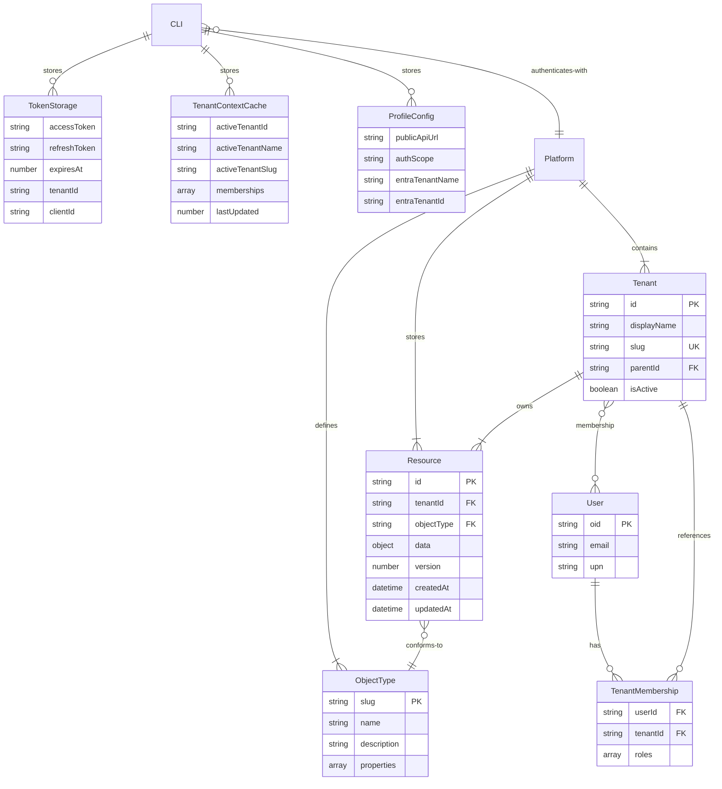
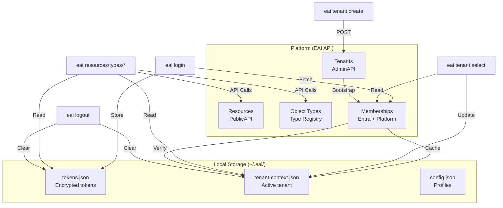

# EAI CLI — Data Model

## Overview

The EAI CLI is a **stateless client** that interacts with the EAI Platform API. It does not maintain a local database. All persistent state resides either:

1. **Locally** in the user's home directory (`~/.eai/`)
2. **On the Platform** via the PublicAPI and AdminAPI

---

## Local Storage

### Authentication Tokens

**File**: `~/.eai/tokens.json` (default profile) or `~/.eai/tokens/{profile}.json` (named profiles)

**Format**: AES-256-CBC encrypted JSON

**Schema**:
```typescript
interface StoredTokens {
  accessToken: string;           // Bearer token for API auth
  refreshToken?: string;          // Refresh token for auto-refresh
  expiresAt: number;              // Unix timestamp (ms)
  tenantId: string;               // Entra CIAM tenant ID
  tenantName: string;             // Entra CIAM tenant name
  clientId: string;               // Entra app registration client ID
  authScope?: string;             // OAuth scope used
  upn?: string;                   // User principal name
  oid?: string;                   // User object ID
  activeTenantId?: string;        // Active platform tenant ID
  activeTenantName?: string;      // Active platform tenant name
  activeTenantSlug?: string;      // Active platform tenant slug
  activeTenantDomain?: string;    // Active platform tenant domain
  publicApiUrl?: string;          // Platform API base URL
  membershipsCachedAt?: number;   // Timestamp of last membership fetch
}
```

**Lifecycle**:
- Created on `eai login`
- Updated on token refresh (auto, when &lt;5 min remaining)
- Cleared on `eai logout`
- Per-profile isolation (multiple environments)

**Security**:
- File mode `0o600` (owner read/write only)
- AES-256-CBC encryption with key derived from `sha256(eai-cli-${homedir}-token-store)`

---

### Tenant Context

**File**: `~/.eai/tenant-context.json`

**Format**: Plain JSON

**Schema**:
```typescript
interface TenantContextCache {
  activeTenant?: {
    id: string;              // Platform tenant ID
    displayName: string;     // Tenant display name
    slug: string;            // URL-friendly tenant slug
    domain?: string;         // Custom domain (if any)
    isActive: boolean;       // Tenant active status
    roles: string[];         // User roles in this tenant
  };
  memberships?: TenantMembership[];  // Cached tenant-admin memberships
  lastUpdated?: number;               // Unix timestamp (ms)
}

interface TenantMembership {
  id: string;
  displayName: string;
  slug: string;
  domain?: string;
  isActive: boolean;
  roles: string[];  // e.g., ["tenant-admin"]
}
```

**Lifecycle**:
- Created/updated on `eai tenant select`
- Read by commands that need tenant context
- Cleared on `eai logout`

**Note**: Tenant selection is membership-driven; the CLI resolves available tenants from AdminAPI `/api/admin/current-user/tenant-memberships`, not from `.env.local`.

---

### Profile Configuration

**File**: `~/.eai/config.json`

**Format**: Plain JSON

**Schema**:
```typescript
interface CliConfig {
  activeProfile?: string;  // Last selected profile ("default", "dev", "test", "prod")
  profiles?: Record<string, ProfileConfig>;
}

interface ProfileConfig {
  publicApiUrl: string;        // Platform API base URL
  authScope: string;           // OAuth scope
  entraTenantName: string;     // Entra CIAM subdomain
  entraTenantId: string;       // Entra CIAM tenant ID
  entraClientId: string;       // Entra app registration client ID
}
```

**Lifecycle**:
- Created on first `eai login --profile <name>`
- Updated when switching profiles
- Persistent across sessions

**Purpose**: Enables multi-environment workflows (dev, test, prod) without modifying project files.

---

### Update Check Cache

**File**: `~/.eai/update-check.json`

**Format**: Plain JSON

**Schema**:
```typescript
interface UpdateCheckCache {
  latestVersion: string;     // e.g., "2.7.0"
  checkedAt: number;         // Unix timestamp (ms)
}
```

**Lifecycle**:
- Created on first update check
- Refreshed every 24 hours
- Used to display update notification banner

---

## Platform Storage

The CLI does not create platform resources directly (except via explicit commands). All platform data is managed through PublicAPI and AdminAPI.

### Resources (via PublicAPI)

**Endpoint**: `/v3/resources/{tenant_id}/{object_type}`

**Schema**: Platform-defined resource schema with metadata wrapper

```typescript
interface PlatformResource {
  id: string;                      // UUID
  data: Record<string, unknown>;   // Object Type fields
  version: number;                 // Optimistic locking version
  object_type: string;             // Object Type slug
  tenant: string;                  // Tenant ID
  created_at: string;              // ISO 8601
  updated_at: string;              // ISO 8601
  created_by?: string;             // User OID
  updated_by?: string;             // User OID
}
```

**CLI Operations**:
- `eai resources list` → GET
- `eai resources get` → GET by ID
- `eai resources create` → POST
- `eai resources update` → PUT (with version)
- `eai resources delete` → DELETE

---

### Object Types (via PublicAPI)

**Endpoint**: `/v3/orchestrate` → Payload CMS backend

**Schema**: Platform Type Registry schema

```typescript
interface ObjectTypeDefinition {
  slug: string;                    // URL-friendly identifier
  name: string;                    // Display name
  description?: string;            // Human-readable description
  properties: PropertyDefinition[];
  required?: string[];
  indexes?: IndexDefinition[];
  displayProperty?: string;
  titleProperty?: string;
}

interface PropertyDefinition {
  name: string;
  type: 'text' | 'email' | 'number' | 'boolean' | 'date' | 'relationship' | ...;
  label?: string;
  required?: boolean;
  unique?: boolean;
  defaultValue?: unknown;
  validationRules?: ValidationRule[];
  relationTo?: string;  // For relationship fields
}
```

**CLI Operations**:
- `eai types validate` → Local validation
- `eai types seed` → POST to Type Registry
- `eai types diff` → Compare local vs. remote
- `eai types pull` → GET from Type Registry

**Storage**: Type Registry (platform-internal Payload CMS collection)

---

### Tenants (via AdminAPI)

**Endpoint**: `/api/admin/tenants`

**Schema**: Platform tenant document

```typescript
interface Tenant {
  id: string;                      // UUID or slug
  displayName: string;             // Human-readable name
  slug: string;                    // URL-friendly identifier
  domain?: string;                 // Custom domain (optional)
  isActive: boolean;               // Active status
  parent?: string | { id?: string } | null;  // Parent tenant reference
  parentId?: string | null;        // Parent tenant ID
  limits?: {
    tenants?: number;              // Max child tenants
    users?: number;                // Max users
  };
  created_at?: string;
  updated_at?: string;
}
```

**CLI Operations**:
- `eai tenant list` → GET current user memberships
- `eai tenant info <id>` → GET tenant details
- `eai tenant create` → POST new tenant + bootstrap first admin
- `eai tenant select` → Interactive selection (updates local cache)

**Storage**: Platform tenant collection (via AdminAPI)

---

### User Memberships (via AdminAPI)

**Endpoint**: `/api/admin/current-user/tenant-memberships`

**Schema**: Tenant membership with roles

```typescript
interface TenantMembership {
  tenant: {
    id: string;
    displayName: string;
    slug: string;
    domain?: string;
    isActive: boolean;
  };
  roles: string[];               // e.g., ["tenant-admin", "user"]
  isTenantAdmin: boolean;        // Convenience flag
  roleAssignments?: Array<{
    baseRole?: string;
    displayName?: string;
  }>;
}
```

**CLI Operations**:
- Fetched on `eai login` (cached)
- Refreshed on `eai tenant select`
- Used for tenant list and access control

**Storage**: Platform memberships (Entra ID groups + platform roles)

---

## Entity Relationship Diagram



---

## Data Flow Diagram



---

## Migration History

The CLI is stateless and does not manage schema migrations. However, version updates may introduce changes to local storage formats:

| Version | Change | Impact |
|---------|--------|--------|
| 2.0.0 | Introduced profile-based token storage | Tokens moved from `~/.eai/tokens.json` to profile-specific files |
| 2.1.0 | Added tenant context cache | New file `~/.eai/tenant-context.json` |
| 2.5.0 | Tenant selection from memberships | Removed `TENANT_DEFAULT_ID` requirement from `.env.local` |
| 2.6.0 | Error code catalog | Structured error responses with E001-E305 codes |

**Upgrade Path**: CLI automatically handles local storage format changes. Old token files are migrated on first run after upgrade.

---

## Key Indexes and Constraints

### Local Storage

- **Tokens**: No indexes (single-file encryption)
- **Tenant Context**: No indexes (small JSON cache)
- **Profiles**: No indexes (single config file)

### Platform Storage (CLI Perspective)

The CLI does not create indexes; it queries platform-managed resources:

- **Resources**: Indexed by `tenant`, `object_type`, `id` (platform-managed)
- **Tenants**: Indexed by `id`, `slug` (platform-managed)
- **Memberships**: Indexed by `userId`, `tenantId` (platform-managed)

---

## Data Retention

| Data Type | Retention | Cleanup |
|-----------|-----------|---------|
| **Access Tokens** | 1 hour (platform TTL) | Auto-refreshed or cleared on logout |
| **Refresh Tokens** | 90 days (platform TTL) | Cleared on logout |
| **Tenant Context** | Until `eai logout` or `eai tenant select` | User-controlled |
| **Update Check Cache** | 24 hours | Auto-refreshed |
| **Profile Config** | Indefinite | User-controlled |

**Manual Cleanup**:
```bash
# Clear all CLI state
rm -rf ~/.eai/

# Clear tokens only
rm -f ~/.eai/tokens.json ~/.eai/tokens/*.json

# Clear tenant context only
rm -f ~/.eai/tenant-context.json
```

---

## Security Considerations

1. **Token Encryption**: All tokens encrypted at rest with AES-256-CBC
2. **File Permissions**: `~/.eai/tokens.json` is mode `0o600` (owner read/write only)
3. **No Secrets in .env.local**: Tenant IDs are not secrets; tenant selection from memberships
4. **CI/Headless Use**: Use `EAI_ACCESS_TOKEN` env var to avoid storing tokens on disk
5. **Profile Isolation**: Per-profile token storage prevents credential leakage across environments
