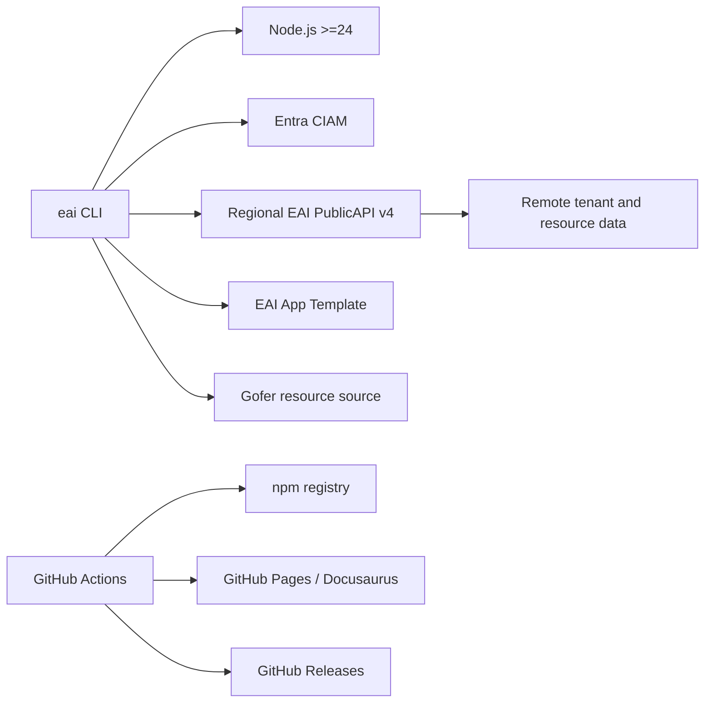

# Dependencies

## Dependency Graph

## Upstream Dependencies

| Dependency | Used for | Evidence |
|---|---|---|
| Node.js 24+ | Runtime and native ESM/fetch APIs | `package.json` engines |
| Entra CIAM | Login, token exchange, refresh | `src/lib/auth.ts` |
| Regional PublicAPI v4 | All authenticated platform operations | `src/lib/api.ts`, `src/lib/tenant-context.ts` |
| EAI App Template | App scaffolding and template drift checks | `src/commands/init.ts`, `template.ts` |
| Gofer resources | Agent commands, skills, templates, scripts, and hooks | `src/lib/gofer-installer.ts`, `resources/gofer/` |

## External Runtime and Build Dependencies

Production dependencies are `chalk`, `commander`, `dotenv`, `inquirer`, `ora`,
and `typescript`. Development dependencies include ESLint, Vitest, MSW, and
TypeScript ESLint. The docs site separately depends on Docusaurus, React, MDX,
and Prism.

## Downstream Consumers

| Consumer | Interface |
|---|---|
| Developers and CI | `eai` executable and text/JSON/YAML command output |
| AI coding agents | `eai --describe`, `eai agent guide`, `eai start`, and installed Gofer assets |
| Generated EAI applications | Project manifests, `.env.local`, runtime contract, and published object-type schemas |
| npm consumers | `@enterpriseai/cli` canonical package and `eai-cli` alias |
| Documentation users | GitHub Pages Docusaurus site and static registry/LLM assets |

No repository code identifies a service that imports this CLI as a long-running
library. Downstream use is primarily process execution and generated-file
consumption.

## Downstream Dependents

Known downstream dependents include the central `tech-docs` aggregation flow and any repo-local `docs-site` publisher that renders content from `.tech-docs/`. Service-specific downstream consumers should remain documented here as they are confirmed from code or runtime contracts.
