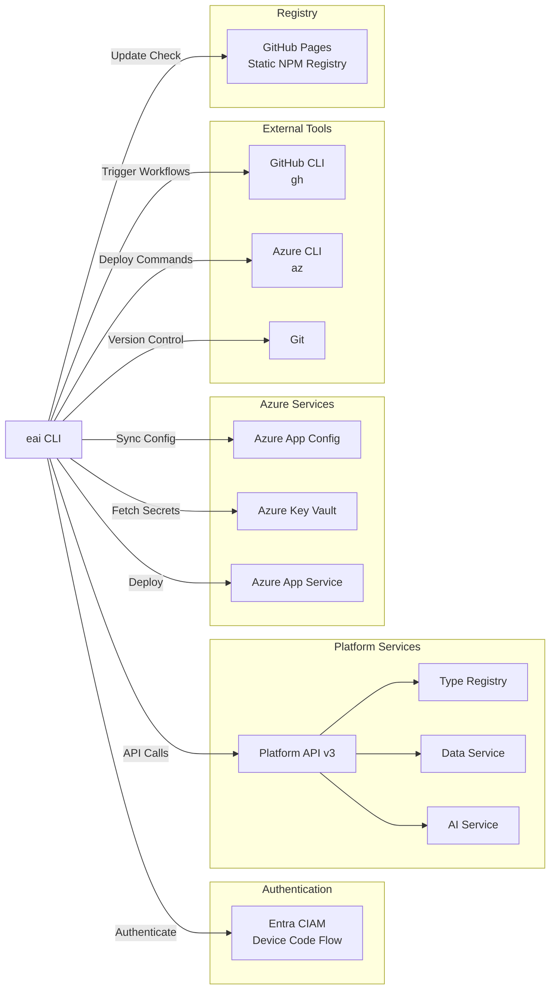
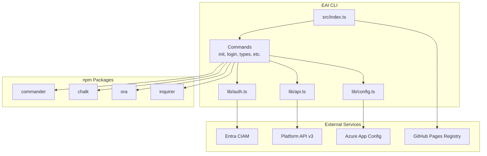

# EAI CLI — Dependencies

## Overview

The EAI CLI is a **client-side tool with no downstream dependents**. It depends on external services for authentication, platform API access, and deployment.

---

## Dependency Diagram



---

## Upstream Dependencies

### 1. Entra CIAM (Microsoft Entra)

**Type**: Authentication Service

**Dependency Level**: Critical

**Endpoints**:
- Device Code: `https://{tenantName}.ciamlogin.com/{tenantId}/oauth2/v2.0/devicecode`
- Token: `https://{tenantName}.ciamlogin.com/{tenantId}/oauth2/v2.0/token`

**Commands Affected**:
- `eai login`
- Any command requiring authentication (when token refresh needed)

**Failure Impact**:
- Users cannot authenticate
- Token refresh fails → must re-login
- Headless/CI environments unaffected (can use `EAI_ACCESS_TOKEN` env var)

**Fallback**: Use `EAI_ACCESS_TOKEN` environment variable for headless scenarios

---

### 2. Platform API v3

**Type**: REST API

**Dependency Level**: Critical

**Base URL**: Configured via `BASE_URL_PUBLIC_API` (e.g., `https://api.eai.example.com`)

**Endpoints Used**:

| Endpoint Pattern | Purpose | Commands |
|-----------------|---------|----------|
| `/v3/resources/{tenant}/{type}` | Resource CRUD | `eai resources *` |
| `/v3/resources/{tenant}/query` | Cross-type queries | `eai resources query` |
| `/v3/resources/schema/{tenant}` | Get published types | `eai resources schema` |
| `/v3/chat/{tenant}/{workflow}/{stage}` | AI chat | `eai chat send/stream` |
| `/v3/documents/classify` | Document classification | `eai docs classify` |
| `/v3/documents/rag-index` | Document indexing | `eai docs index` |
| `/v3/auth/me` | Get current user | `eai whoami` |
| `/v3/users/provisionme` | User provisioning | `eai user provision` |
| `/v3/orchestrate` | Internal routing | `eai types seed`, `eai tenant *` |

**Failure Impact**:
- All resource/type/chat commands fail
- CLI displays error message with status code
- Retry logic: None (user must re-run command)

**Monitoring**: Not determined from codebase

---

### 3. Azure App Config

**Type**: Configuration Service

**Dependency Level**: Optional (for `eai env pull`)

**Connection**: Azure SDK via connection string (`AZURE_APP_CONFIG_CONNECTION_STRING`)

**Commands Affected**:
- `eai env pull`
- `eai env push` (admin)

**Data Fetched**:
- Environment variables for the project
- Tenant IDs, workflow IDs, API URLs

**Failure Impact**:
- `eai env pull` fails
- Users must manually configure `.env.local`
- Other commands unaffected (read from `.env.local`)

**Fallback**: Manual configuration of `.env.local`

---

### 4. Azure Key Vault

**Type**: Secrets Management

**Dependency Level**: Optional (for `eai env pull --include-secrets`)

**Connection**: Azure SDK via Key Vault name (`AZURE_KEY_VAULT_NAME`)

**Commands Affected**:
- `eai env pull --include-secrets`

**Data Fetched**:
- API keys
- Client secrets
- Other sensitive credentials

**Failure Impact**:
- Secret sync fails
- Users must manually add secrets to `.env.local` or environment

**Fallback**: Manual secret configuration

---

### 5. GitHub Pages (Static NPM Registry)

**Type**: Package Registry

**Dependency Level**: Optional (for update checks)

**URL**: `https://eai-tools.github.io/eai-cli/registry/@eai-tools/cli`

**Commands Affected**:
- Update check (background, non-blocking)
- `eai update`

**Data Fetched**:
- Latest CLI version
- Package metadata

**Failure Impact**:
- Update check fails silently
- No update banner displayed
- `eai update` fails → user must manually `npm install -g @eai-tools/cli@latest`

**Fallback**: Manual `npm install -g @eai-tools/cli@latest`

**Timeout**: 5 seconds (non-blocking)

---

### 6. Azure App Service

**Type**: Deployment Target

**Dependency Level**: Optional (for `eai deploy trigger`)

**Connection**: Azure CLI (`az webapp deploy`)

**Commands Affected**:
- `eai deploy trigger`
- `eai deploy status`

**Failure Impact**:
- Deployment fails
- Users must deploy manually via Azure Portal or Azure CLI

**Fallback**: Manual deployment via Azure Portal

---

## External Tool Dependencies

### 1. GitHub CLI (`gh`)

**Purpose**: Workflow management and deployment triggering

**Commands**:
- `eai deploy trigger` → `gh workflow run`
- `eai deploy status` → `gh run list`
- `eai deploy setup` → `gh secret list/set`

**Installation**:
```bash
# macOS
brew install gh

# Linux
sudo apt install gh
```

**Authentication**: `gh auth login`

**Failure Impact**:
- Deployment commands fail with "gh command not found"
- Users must install and authenticate `gh` CLI

**Fallback**: Manual workflow trigger via GitHub Actions UI

---

### 2. Azure CLI (`az`)

**Purpose**: Azure resource management (used in generated workflows)

**Commands** (in generated `deploy-demo.yml`):
- `az webapp deploy` — Deploy ZIP to App Service
- `az webapp restart` — Restart App Service

**Installation**:
```bash
# macOS
brew install azure-cli

# Linux
curl -sL https://aka.ms/InstallAzureCLIDeb | sudo bash
```

**Authentication**: `az login` or service principal in GitHub Actions

**Failure Impact**:
- Generated workflows fail if `az` not available
- Deployment steps fail

**Fallback**: Manual deployment via Azure Portal

---

### 3. Git

**Purpose**: Version control and repo detection

**Commands**:
- `eai deploy trigger` — Detects GitHub repo from `git remote`
- `eai deploy status` — Detects GitHub repo from `git remote`

**Failure Impact**:
- Auto-detection of repo fails → user must specify `--repo` explicitly
- No impact on other commands

**Fallback**: Specify `--repo org/name` explicitly

---

## Runtime Dependencies (npm packages)

### Production Dependencies

| Package | Version | Purpose |
|---------|---------|---------|
| `commander` | 13.1.0 | CLI framework for command parsing |
| `chalk` | 5.3.0 | Terminal color output |
| `ora` | 8.1.1 | Spinners for async operations |
| `inquirer` | 12.3.2 | Interactive prompts (confirmation, select) |
| `dotenv` | 16.4.7 | Environment variable loading (internal use) |

### Dev Dependencies

| Package | Version | Purpose |
|---------|---------|---------|
| `typescript` | 5.7.3 | TypeScript compiler |
| `eslint` | 10.0.3 | Linting |
| `typescript-eslint` | 8.56.1 | TypeScript ESLint plugin |
| `@types/node` | 22.13.0 | Node.js type definitions |

### Zero Native Dependencies

**Design Decision**: Avoid native dependencies (e.g., `keytar` for OS keychain) to ensure cross-platform compatibility and easy installation.

**Token Storage**: Uses Node.js crypto module (pure JS) instead of OS keychain.

---

## Downstream Dependents

**None** — The EAI CLI is a client-side tool with no downstream services depending on it.

**User Projects**: Vertical applications use the CLI as a development tool, but do not runtime-depend on it.

---

## Service-to-Service Dependencies

Not applicable — The CLI does not expose APIs or services for other systems to consume.

---

## Dependency Health Monitoring

### Update Check (Self-Monitoring)

- Checks GitHub Pages registry every 24h
- Caches result in `~/.eai/update-check.json`
- Displays banner if newer version available

**Command**: `eai --version` displays current version

### Platform API Health

**Command**: `eai verify`

**Checks**:
- Platform API reachable
- Authentication valid
- Tenant accessible

**Diagnostic Command**: `eai doctor`

**Provides**:
- Comprehensive diagnostics
- Fix suggestions for common issues

---

## Dependency Versioning

### CLI Versioning

**Scheme**: Semantic Versioning (semver)

**Current**: `0.1.4`

**Breaking Changes**: Major version bump (e.g., `0.1.4` → `1.0.0`)

### Platform API Versioning

**Version**: `v3` (embedded in endpoint paths: `/v3/resources`)

**Breaking Changes**: Platform introduces new API version (e.g., `v4`)

**Compatibility**: CLI would need update to support new API version

### Node.js Version Requirement

**Minimum**: `20.0.0` (specified in `package.json` engines)

**Reason**: Uses native Fetch API (available in Node 18+), ESM modules

**Verification**: `node --version` must be ≥ 20.0.0

---

## Dependency Isolation

### Authentication Token Storage

**Location**: `~/.eai/tokens.json`

**Isolation**: User-specific (not shared across users on same machine)

**Encryption**: Machine-specific (key derived from home directory path)

### Project Configuration

**Location**: `.env.local` in project root

**Isolation**: Project-specific (each project has own config)

**Sharing**: `.env.local` not committed to Git (user must sync via `eai env pull`)

---

## Third-Party Service Dependencies

### Platform Services (Operated by EAI Platform)

- **Type Registry** — Object Type storage and validation
- **Data Service** — Resource CRUD and querying
- **AI Service** — Chat, document classification, RAG indexing

### Microsoft Services

- **Entra CIAM** — Authentication and identity management
- **Azure App Config** — Centralized configuration
- **Azure Key Vault** — Secrets management
- **Azure App Service** — Application hosting

### GitHub Services

- **GitHub Actions** — CI/CD workflows
- **GitHub Pages** — Static NPM registry hosting

---

## Failure Modes & Resilience

### Network Failures

**Scenario**: Platform API unreachable

**CLI Behavior**:
- Displays error message: "Failed to connect to Platform API"
- Suggests checking `BASE_URL_PUBLIC_API` configuration
- Exits with code 1

**User Action**: Check network, verify API URL, retry

---

### Authentication Failures

**Scenario**: Token expired and refresh failed

**CLI Behavior**:
- Displays error: "Authentication failed. Please re-login."
- Prompts user to run `eai logout && eai login`

**User Action**: Re-authenticate via device code flow

---

### Configuration Missing

**Scenario**: `.env.local` missing or incomplete

**CLI Behavior**:
- Displays error: "Missing BASE_URL_PUBLIC_API or tenant ID"
- Suggests running `eai env pull` or manually configuring `.env.local`

**User Action**: Sync config or manually add required variables

---

### External Tool Missing

**Scenario**: `gh` CLI not installed

**CLI Behavior**:
- Displays error: "gh command not found"
- Suggests installing GitHub CLI and authenticating

**User Action**: Install `gh` via package manager, run `gh auth login`

---

## Dependency Update Strategy

### CLI Dependencies

**Frequency**: Monthly security updates, quarterly feature updates

**Process**:
1. Check for outdated packages: `npm outdated`
2. Update dependencies: `npm update`
3. Run tests: `npm run typecheck && npm run lint && npm run build`
4. Test smoke tests: `node dist/index.js --version`
5. Commit and release

**Breaking Changes**: Major version bumps reviewed carefully

### Platform API Compatibility

**Strategy**: Version API endpoints (`/v3/`)

**Backward Compatibility**: CLI maintains support for current API version

**Migration**: CLI updated to support new API version before old version deprecated

---

## Security Considerations

### Secrets in Dependencies

- No secrets hardcoded in CLI
- All credentials loaded from environment or local storage
- Token encryption uses machine-specific key

### Supply Chain Security

- `npm ci` used in CI/CD (lockfile integrity check)
- `npm audit` run in release pipeline
- Minimal dependencies to reduce attack surface

### Network Security

- All API calls use HTTPS
- No plaintext transmission of tokens
- Certificates verified by Node.js TLS

---

## Dependency Graph Visualization



---

## Integration Testing

Not determined from codebase. Integration tests would verify:

- Authentication flow end-to-end
- API client methods against real/mock API
- Type seeding and validation
- Environment sync from Azure

**Recommendation**: Add integration tests with mocked services

---

## Monitoring & Alerting

Not applicable — CLI is a client-side tool with no server-side monitoring.

**User-Side Monitoring**:
- `eai verify` — Manual health check
- `eai doctor` — Comprehensive diagnostics
