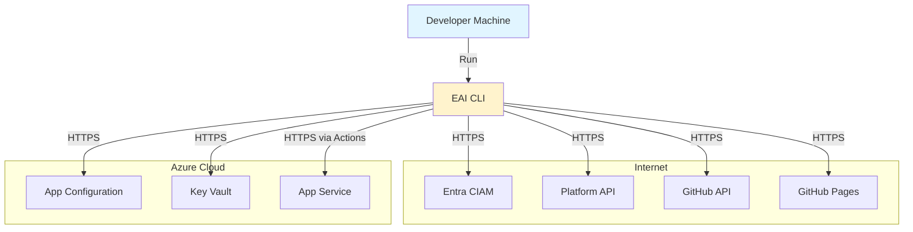

# EAI CLI — Dependencies

## Overview

The EAI CLI is a **client-side tool** that depends on external services for authentication, platform API access, Azure resources, and deployment. It has **no downstream dependents** — it is a terminal application used directly by developers.

---

## Dependency Diagram

```mermaid
graph TB
    CLI[eai CLI<br/>v2.9.5]
    
    subgraph "Authentication"
        Entra[Entra CIAM<br/>OAuth 2.0 PKCE]
    end
    
    subgraph "Platform API v4"
        PublicAPI[Platform PublicAPI<br/>/v4/*]
    end
    
    subgraph "Azure Services"
        AppConfig[Azure App Configuration]
        KeyVault[Azure Key Vault]
        AppService[Azure App Service]
    end
    
    subgraph "GitHub Services"
        ActionsAPI[GitHub Actions API]
        ReleasesAPI[GitHub Releases API]
        Pages[GitHub Pages Registry]
    end
    
    subgraph "Runtime Dependencies (npm)"
        Commander[commander@13.1.0]
        Chalk[chalk@5.6.2]
        Dotenv[dotenv@16.6.1]
        Inquirer[inquirer@12.11.1]
        Ora[ora@8.2.0]
    end
    
    CLI -->|Browser PKCE Flow| Entra
    CLI -->|Bearer Token Auth| PublicAPI
    CLI -->|Pull Config| AppConfig
    CLI -->|Pull Secrets| KeyVault
    CLI -->|Deploy Trigger| AppService
    CLI -->|Workflow Dispatch| ActionsAPI
    CLI -->|Version Check| ReleasesAPI
    CLI -->|Install/Update| Pages
    CLI --> Commander
    CLI --> Chalk
    CLI --> Dotenv
    CLI --> Inquirer
    CLI --> Ora
    
    style CLI fill:#e1f5ff
    style Pages fill:#d4edda
```

---

## Upstream Dependencies

Services and APIs that the CLI calls:

### 1. Entra CIAM (Microsoft Identity Platform)

**Type**: Authentication Service  
**Protocol**: OAuth 2.0 Authorization Code Flow with PKCE  
**Endpoints**:
- Authorization: `https://{tenant}.ciamlogin.com/{tenant-id}/oauth2/v2.0/authorize`
- Token: `https://{tenant}.ciamlogin.com/{tenant-id}/oauth2/v2.0/token`

**Used By**: `eai login` command  
**Purpose**: Obtain access tokens for platform API authentication  
**Failure Impact**: **Critical** — Users cannot authenticate  
**Fallback**: None (authentication is required)

---

### 2. EAI Platform API (PublicAPI v4)

**Type**: REST API  
**Base URL**: Configured via `BASE_URL_PUBLIC_API` when an override is required
**Authentication**: Bearer token (from Entra CIAM)  

**Endpoints Used** (grouped by v4 domain):

| Endpoint | Used By | Purpose |
|----------|---------|---------|
| `GET /health` | `eai verify`, `eai verify calls` | Gateway health check |
| `GET /v4/identity/tenants` | `eai tenant list/select/info` | Fetch user tenant memberships |
| `POST /v4/identity/me/provision` | `eai user provision-me` | Self-provision to a tenant |
| `POST /v4/platform/tenants/{parentId}/children` | `eai tenant create` (child) | Create child tenant |
| `POST /v4/platform/tenants` | `eai tenant create --allow-root` | Create root tenant |
| `POST /v4/platform/tenants/{parentId}/children/{childId}/bootstrap-admin` | `eai tenant create` | Bootstrap admin on child tenant |
| `POST /v4/platform/tenants/{tenantId}/delete` | `eai tenant delete` | Soft-delete tenant |
| `POST /v4/platform/tenants/{companyTenantId}/apps` | `eai vertical create` | Create app enrollment |
| `GET /v4/platform/users/by-email` | `eai user invite` | Look up a user by email |
| `POST /v4/platform/tenants/{tenantId}/users/{oid}/provision` | `eai user invite` | Provision a user into a tenant |
| `POST /v4/platform/provisioning/entra-apps[/{clientId}/rotate-secret]` | `eai provision entra` | Create/confirm/rotate Entra app registration |
| `GET /v4/data/resources/object-types` | `eai types diff/pull/seed` | Fetch Object Types |
| `POST /v4/data/resources/object-types` | `eai types seed` | Create an Object Type |
| `PATCH /v4/data/resources/object-types/{id}` | `eai types seed` | Update an Object Type |
| `GET /v4/data/resources/schema/{tenantId}` | `eai resources schema` | Get published schema |
| `GET /v4/data/resources/{tenantId}/{type}` | `eai resources list` | List resources |
| `GET /v4/data/resources/{tenantId}/{type}/{id}` | `eai resources get` | Get resource |
| `POST /v4/data/resources/{tenantId}/{type}` | `eai resources create` | Create resource |
| `PUT /v4/data/resources/{tenantId}/{type}/{id}` | `eai resources update` | Update resource |
| `DELETE /v4/data/resources/{tenantId}/{type}/{id}` | `eai resources delete` | Delete resource |
| `POST /v4/data/resources/{tenantId}/query` | `eai resources query` | Cross-type query |
| `POST /v4/data/resources/{tenantId}/{type}/aggregate` | `eai resources aggregate` | Aggregate query |
| `POST /v4/data/resources/{tenantId}/search` | `eai resources search` | Search projections |
| `POST /v4/data/resources/{tenantId}/{type}/batch/{create\|update\|delete}` | `eai resources batch-*` | Bulk operations |
| `*/v4/data/resources/{tenantId}/{type}/{id}/files/{prop}` | `eai resources file *` | File property upload/download/delete |
| `*/v4/data/resources/{tenantId}/storage[/doctor\|/provision\|/sync-schema]` | `eai resources storage*`, `eai provision storage`, `eai vertical provision` | Storage status/diagnostics/provision/reconcile |
| `GET /v4/data/resources/{tenantId}/tenant-vertical-enrollment` | `eai vertical list/select/provision` | List/validate app enrollments |
| `*/v4/data/resources/{tenantId}/shared-workflow-config` (+ `vertical-product-config`, `shared-ai-profile`, `shared-chatbot-config`) | `eai workflow provision` | Upsert workflow/AI runtime config |
| `POST /v4/ai/chat/{tenantId}/{workflowId}/{stage}` | `eai chat send` | Send chat message |
| `POST /v4/ai/chat/stream/{tenantId}/{workflowId}/{stage}` | `eai chat stream` | Stream chat response (SSE) |
| `GET /v4/integrations/builder/readiness` | `eai workflow readiness` | Check workflow readiness |
| `GET /v4/workflows/runtime/{key}/status` | `eai workflow status` | Check runtime workflow status |
| `POST /v4/workflows/runtime-requests` | `eai workflow request` | Request operator-assisted binding |
| `POST /v4/data/documents/upload` | `eai docs upload` | Upload document |
| `POST /v4/data/documents/classify` | `eai docs classify` | Classify document |
| `GET /v4/data/documents/records/{id}` + `POST /v4/data/documents/rag-index` | `eai docs index` | Index document for RAG |

> `eai env pull` / `eai env push` are **not** in this table — they use Azure App Configuration / Key Vault directly (see sections 4–5), not the platform API.

**Failure Impact**: **Critical** — Most CLI commands require platform API  
**Fallback**: Local-only operations (init, dev, verify connection check)

---

### 3. Entra App Provisioning (via PublicAPI)

**Type**: REST API (PublicAPI `/v4/platform`)  
**Base URL**: Configured via `BASE_URL_PUBLIC_API`  
**Authentication**: Bearer token (from Entra CIAM)

Entra app provisioning is served by PublicAPI under `/v4/platform/provisioning` — there is no separate AdminAPI dependency for the CLI.

**Endpoints Used**:
| Endpoint | Used By | Purpose |
|----------|---------|---------|
| `POST /v4/platform/provisioning/entra-apps` | `eai provision entra` | Create/confirm Entra app registration |
| `POST /v4/platform/provisioning/entra-apps/{clientId}/rotate-secret` | `eai provision entra --rotate-secret` | Rotate the app secret |

**Failure Impact**: **Medium** — Only affects Entra provisioning  
**Fallback**: Manual Entra app registration via Azure Portal

---

### 4. Azure App Configuration

**Type**: Azure PaaS Service  
**Endpoint**: `AZURE_APP_CONFIG_ENDPOINT` environment variable  
**Authentication**: Azure CLI credentials or managed identity

**Used By**: `eai env pull`  
**Purpose**: Sync environment variables from cloud to `.env.local`  
**Failure Impact**: **Low** — Manual configuration possible  
**Fallback**: Manually edit `.env.local`

---

### 5. Azure Key Vault

**Type**: Azure PaaS Service  
**Endpoint**: `AZURE_KEY_VAULT_URL` environment variable  
**Authentication**: Azure CLI credentials or managed identity

**Used By**: `eai env pull --include-secrets`  
**Purpose**: Fetch secrets for `.env.local`  
**Failure Impact**: **Low** — Manual secret management possible  
**Fallback**: Manually add secrets to `.env.local`

---

### 6. Azure App Service

**Type**: Azure PaaS Service  
**Deployment**: Via GitHub Actions (not directly by CLI)

**Used By**: `eai deploy` (indirectly via GitHub Actions)  
**Purpose**: Deployment target for applications
**Failure Impact**: **Medium** — Affects app deployment only
**Fallback**: Manual Azure Portal deployment

---

### 7. GitHub Actions API

**Type**: REST API  
**Base URL**: `https://api.github.com`  
**Authentication**: `GITHUB_TOKEN` environment variable

**Endpoints Used**:
| Endpoint | Used By | Purpose |
|----------|---------|---------|
| `POST /repos/{owner}/{repo}/actions/workflows/{workflow}/dispatches` | `eai deploy trigger` | Trigger deployment workflow |
| `GET /repos/{owner}/{repo}/actions/runs` | `eai deploy status` | Check workflow status |

**Failure Impact**: **Medium** — Only affects deployment automation  
**Fallback**: Manual workflow trigger via GitHub UI

---

### 8. GitHub Releases API

**Type**: REST API  
**Base URL**: `https://api.github.com`  
**Authentication**: None (public API)

**Endpoints Used**:
| Endpoint | Used By | Purpose |
|----------|---------|---------|
| `GET /repos/eai-tools/eai/releases/latest` | `eai update --check` | Check for CLI updates |

**Failure Impact**: **Low** — Only affects update notifications  
**Fallback**: Manual version check via GitHub web UI

---

### 9. GitHub Pages Static Registry

**Type**: Static file hosting  
**URL**: `https://eai-tools.github.io/eai/registry`

**Files Served**:
- `/@eai-tools/cli` — Packument metadata
- `/-/@eai-tools/cli-{version}.tgz` — Tarball releases
- `/-/@eai-tools/cli-latest.tgz` — Latest tarball

**Used By**: `npm install -g @eai-tools/cli`, `eai update`  
**Purpose**: Distribute CLI package without npmjs dependency  
**Failure Impact**: **Critical** — Users cannot install or update CLI  
**Fallback**: Install from tarball file directly

---

## Downstream Dependents

The EAI CLI has **no downstream dependents**. It is a terminal application used directly by developers. It does not expose APIs or services that other systems depend on.

**Users of the CLI**:
- Enterprise AI application developers (direct users)
- CI/CD pipelines (invoking CLI commands)
- AI terminal tools (Claude, Codex, Gemini, Copilot using CLI via Gofer pipeline)

---

## npm Runtime Dependencies

Production dependencies (shipped with CLI):

| Package | Version | Purpose | License |
|---------|---------|---------|---------|
| `commander` | 13.1.0 | CLI framework, command parsing, help generation | MIT |
| `chalk` | 5.6.2 | Terminal output coloring | MIT |
| `dotenv` | 16.6.1 | `.env.local` file parsing | BSD-2-Clause |
| `inquirer` | 12.11.1 | Interactive prompts (tenant selection, confirmations) | MIT |
| `ora` | 8.2.0 | Loading spinners and status indicators | MIT |

**Total Production Dependencies**: 5 (plus transitive dependencies)

---

## npm Development Dependencies

Development-only dependencies (not shipped):

| Package | Version | Purpose |
|---------|---------|---------|
| `typescript` | 5.9.3 | TypeScript compiler |
| `@types/node` | 22.19.15 | Node.js type definitions |
| `eslint` | 10.0.3 | Linting |
| `@eslint/js` | 10.0.1 | ESLint JavaScript config |
| `typescript-eslint` | 8.56.1 | TypeScript ESLint plugin |
| `vitest` | 4.1.3 | Test framework |
| `@vitest/ui` | 4.1.3 | Vitest UI |
| `msw` | 2.12.10 | API mocking for tests |

**Total Dev Dependencies**: 8

---

## External Tool Dependencies

Optional tools that enhance CLI functionality:

| Tool | Required | Used By | Purpose |
|------|----------|---------|---------|
| `git` | Yes | `eai init`, `eai deploy` | Version control operations |
| `npm` | Yes | All installation | Package management |
| `gh` (GitHub CLI) | No | `eai deploy` | GitHub API calls (alternative to GITHUB_TOKEN) |
| `az` (Azure CLI) | No | `eai env pull`, `eai provision entra` | Azure resource access |

---

## Dependency Health

### Security

All dependencies are regularly updated via Renovate bot:
- Security patches applied automatically
- Dependency updates tested in CI before merge
- No known critical vulnerabilities (as of 2026-05-23)

### Versioning

Dependencies follow semantic versioning:
- Exact versions pinned in `package.json` (no `^` or `~`)
- `package-lock.json` committed for reproducible builds
- Updates reviewed via pull requests

### License Compatibility

All dependencies use permissive licenses compatible with MIT:
- MIT: commander, chalk, inquirer, ora
- BSD-2-Clause: dotenv
- No GPL or viral licenses

---

## Network Topology



**Network Requirements**:
- Outbound HTTPS (port 443) required
- No inbound connections beyond the local OAuth callback listener used during `eai login`
- Proxy support via `HTTP_PROXY`, `HTTPS_PROXY` environment variables

---

## Dependency Risks

### High Risk

| Dependency | Risk | Mitigation |
|------------|------|------------|
| EAI Platform API | Service outage breaks most commands | Implement graceful degradation, cache tenant context |
| Entra CIAM | Auth failures prevent all operations | Token refresh logic, clear error messages |
| GitHub Pages Registry | Install/update failures | Fallback to tarball installation, local cache |

### Medium Risk

| Dependency | Risk | Mitigation |
|------------|------|------------|
| GitHub Actions API | Deployment automation broken | Manual workflow trigger via GitHub UI |
| Azure App Configuration | Config sync failures | Manual `.env.local` editing |
| npm Ecosystem | Dependency vulnerabilities | Automated security updates via Renovate |

### Low Risk

| Dependency | Risk | Mitigation |
|------------|------|------------|
| GitHub Releases API | Update check failures | Silent failure, non-blocking |
| Azure Key Vault | Secret sync failures | Manual secret management |

---

## Dependency Update Strategy

### Automated Updates

Renovate bot monitors dependencies and creates PRs for:
- Security patches (auto-merged if CI passes)
- Minor version updates (reviewed before merge)
- Major version updates (requires manual testing)

### Manual Updates

Major version updates require:
1. Review changelog for breaking changes
2. Update code if necessary
3. Run full test suite
4. Smoke test CLI commands
5. Update documentation if APIs changed

### Update Frequency

- **Security patches**: Immediate (within 24 hours)
- **Minor updates**: Weekly batch
- **Major updates**: Quarterly review
- **Dev dependencies**: As needed

---

## Dependency Alternatives

### Current vs. Alternative Choices

| Current | Alternative | Reason for Current Choice |
|---------|-------------|---------------------------|
| Commander.js | yargs, oclif | Industry standard, simple API, excellent TypeScript support |
| chalk | kleur, picocolors | Feature-rich, widely adopted, stable |
| dotenv | cross-env, env-cmd | Simple, standard `.env` parsing |
| inquirer | prompts, enquirer | Comprehensive prompt types, battle-tested |
| ora | cli-spinners, listr | Simple API, visual appeal |
| Vitest | Jest, Mocha | ESM-first, fast, modern |
| GitHub Pages Registry | npmjs, GitHub Packages | No external account required, full control, free |

---

## Future Dependency Changes

### Planned Additions

- [ ] `axios` or `ky` — Replace native `fetch()` for better error handling (if needed)
- [ ] `zod` — Runtime validation for API responses (if schemas stabilize)
- [ ] `winston` or `pino` — Structured logging (if debug mode added)

### Planned Removals

- None currently planned

### Upgrade Roadmap

- Node.js 22: Planned for Q3 2026
- TypeScript 6.0: When released
- Commander.js 14: Monitor for breaking changes
