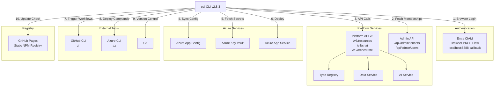

# EAI CLI — Dependencies

## Overview

The EAI CLI is a **client-side tool with no downstream dependents**. It depends on external services for authentication, platform API access, and deployment.

---

## Dependency Diagram



---

## Upstream Dependencies

### 1. Entra CIAM (Microsoft Entra)

**Type**: Authentication Service

**Dependency Level**: Critical

**Protocol**: OAuth 2.0 Authorization Code Flow with PKCE (RFC 7636)

**Endpoints**:
- Authorization: `https://{tenantName}.ciamlogin.com/{tenantId}/oauth2/v2.0/authorize`
- Token Exchange: `https://{tenantName}.ciamlogin.com/{tenantId}/oauth2/v2.0/token`
- Token Refresh: `https://{tenantName}.ciamlogin.com/{tenantId}/oauth2/v2.0/token` (refresh_token grant)

**Commands Affected**:
- `eai login` — Browser-based authentication
- Any command requiring authentication (when token &lt;5 min remaining → auto-refresh)

**Profile-Specific**:
- Each profile (`dev`, `test`, `prod`) may use a different CIAM tenant
- Platform resolves correct CIAM from environment/profile

**Failure Impact**:
- Users cannot authenticate
- Token refresh fails → must re-login
- Headless/CI environments unaffected (can use `EAI_ACCESS_TOKEN` env var)

**Fallback**: Use `EAI_ACCESS_TOKEN` environment variable for headless scenarios

---

### 2. Platform API v3 (PublicAPI)

**Type**: REST API

**Dependency Level**: Critical

**Base URL**: Profile-specific or from `BASE_URL_PUBLIC_API` (e.g., `https://api.ae.myenterprise.ai/public`)

**Endpoints Used**:
- `/v3/resources/{tenant}/{type}` — Resource CRUD
- `/v3/resources/{tenant}/query` — Cross-type queries
- `/v3/resources/schema/{tenant}` — Published Object Types
- `/v3/chat/{tenant}/{workflow}/{stage}` — AI chat
- `/v3/chat/stream/{tenant}/{workflow}/{stage}` — Streaming chat (SSE)
- `/v3/documents/classify` — Document classification
- `/v3/documents/rag-index` — RAG indexing
- `/v3/orchestrate` — Internal routing to backend services

**Commands Affected**:
- `eai resources` (all subcommands)
- `eai types seed/diff/pull`
- `eai chat send/stream`
- `eai docs classify/index`
- `eai verify`, `eai doctor`

**Failure Impact**:
- All resource operations fail
- Type seeding fails
- AI workflows unavailable
- CLI remains usable for local tasks (`eai init`, `eai login`, etc.)

**Health Check**: `eai verify` tests API connectivity and token validity

---

### 3. Admin API

**Type**: REST API

**Dependency Level**: Critical (for tenant/user management)

**Base URL**: Resolved at runtime from PublicAPI environment (e.g., `https://api.ae.myenterprise.ai/admin`)

**Endpoints Used**:
- `/api/admin/current-user/tenant-memberships` — Tenant-admin membership list
- `/api/admin/tenants` — Tenant creation
- `/api/admin/tenants/{id}/bootstrap-admin` — First-admin bootstrap for child tenants
- `/api/admin/tenants/{id}/users` — User provisioning
- `/api/admin/users/lookup` — User lookup by email
- `/api/admin/platform-ops/entra/confirm-app-registration` — Entra provisioning

**Commands Affected**:
- `eai tenant list/select/create`
- `eai user invite`
- `eai user provision-me`
- `eai provision entra`

**Failure Impact**:
- Cannot list or select tenants
- Cannot create child tenants or provision users
- Cannot create Entra app registrations

**Auth**: Requires authenticated user with appropriate roles (`tenant-admin` for tenant operations)

---

### 4. Azure App Config

**Type**: Configuration Service

**Dependency Level**: Optional (for `eai env` commands)

**Connection**: Via `AZURE_APP_CONFIG_CONNECTION_STRING` or Azure SDK

**Operations**:
- `GET` — Fetch environment variables
- `SET` — Push local overrides (admin only)

**Commands Affected**:
- `eai env pull`
- `eai env list`
- `eai env push`

**Failure Impact**:
- Cannot sync environment configuration
- Projects can still use local `.env.local` files

---

### 5. Azure Key Vault

**Type**: Secret Management Service

**Dependency Level**: Optional (for secret-enabled `eai env pull`)

**Connection**: Via Azure SDK (authenticated via Azure CLI or managed identity)

**Operations**:
- `GET secret` — Fetch secrets referenced in App Config

**Commands Affected**:
- `eai env pull --include-secrets`

**Failure Impact**:
- Secrets are not synced
- Non-secret config still works

---

### 6. GitHub CLI (`gh`)

**Type**: External CLI Tool

**Dependency Level**: Optional (for deployment)

**Version**: ≥2.0.0

**Operations**:
- `gh workflow run` — Trigger deployment workflows
- `gh run list` — Check deployment status

**Commands Affected**:
- `eai deploy trigger`
- `eai deploy status`

**Failure Impact**:
- Cannot trigger or monitor GitHub Actions deployments
- Manual workflow triggers still work via GitHub UI

**Installation Check**: `which gh` or `gh --version`

---

### 7. Azure CLI (`az`)

**Type**: External CLI Tool

**Dependency Level**: Optional (for Azure App Config/Key Vault auth)

**Version**: ≥2.0.0

**Operations**:
- `az login` — Authenticate to Azure
- `az account get-access-token` — Get token for Azure SDK

**Commands Affected**:
- `eai env pull` (if using Azure identity)
- `eai env push`

**Failure Impact**:
- Cannot authenticate to Azure services
- Fallback: Use connection strings or service principal

**Installation Check**: `which az` or `az --version`

---

### 8. Git

**Type**: Version Control System

**Dependency Level**: Recommended (for `eai deploy`)

**Version**: ≥2.0.0

**Operations**:
- Repository detection for deploy commands

**Commands Affected**:
- `eai deploy setup`

**Failure Impact**:
- Cannot auto-detect repository info
- Users must manually specify `--repo` flag

---

### 9. GitHub Pages Registry

**Type**: Static NPM Registry

**Dependency Level**: Low (for update checks)

**URL**: `https://eai-tools.github.io/eai-cli/registry/@eai-tools/cli`

**Operations**:
- `GET` — Fetch latest version metadata (24h cache)

**Commands Affected**:
- Background update check (all commands)
- `eai update`

**Failure Impact**:
- Update notifications not displayed
- Manual updates still work via `npm install -g @eai-tools/cli@latest`

**Timeout**: 5 seconds (non-blocking)

---

## Downstream Dependents

**None**. The CLI is a terminal application with no services or tools depending on it.

**Usage Context**: Developers run the CLI interactively or in CI/CD scripts to interact with the EAI platform.

---

## NPM Package Dependencies

### Production Dependencies

| Package | Version | Purpose |
|---------|---------|---------|
| `chalk` | ^5.3.0 | Terminal colors and styling |
| `commander` | ^13.1.0 | CLI framework and argument parsing |
| `dotenv` | ^16.4.7 | `.env.local` file parsing |
| `inquirer` | ^12.3.2 | Interactive prompts (tenant selection, confirmations) |
| `ora` | ^8.1.1 | Loading spinners |

**Total Dependencies**: 5 packages (ESM-only)

**Bundle Size**: ~3.5 MB (including node_modules)

---

### Development Dependencies

| Package | Version | Purpose |
|---------|---------|---------|
| `@eslint/js` | ^10.0.1 | ESLint core config |
| `@types/node` | ^22.13.0 | Node.js type definitions |
| `@vitest/ui` | ^4.1.3 | Vitest UI for test debugging |
| `eslint` | ^10.0.3 | Linting |
| `msw` | ^2.6.0 | Mock Service Worker for API testing |
| `typescript` | ^5.7.3 | TypeScript compiler |
| `typescript-eslint` | ^8.56.1 | TypeScript ESLint plugin |
| `vitest` | ^4.1.3 | Test framework |

---

## External Service Contracts

### Entra CIAM Contract

**OAuth 2.0 Endpoints**: As specified in RFC 6749 + RFC 7636 (PKCE)

**Token Format**: JWT (RFC 7519)

**Token Claims**:
- `oid` — User object ID
- `upn` — User principal name (email)
- `tid` — Tenant ID
- `exp` — Expiration timestamp

**Expected Behavior**:
- Redirect URI: `http://localhost:8888` (fixed, no wildcard)
- PKCE code challenge method: `S256` (SHA-256)
- Scope: Configurable per profile (default: `api://{clientId}/.default offline_access`)

---

### Platform API Contract

**Authentication**: `Authorization: Bearer {access_token}`

**Content-Type**: `application/json`

**Response Format**: JSON (with structured error responses)

**Pagination**: `page` and `limit` query parameters

**Error Format**:
```json
{
  "detail": {
    "error": "ERROR_CODE",
    "message": "Human-readable message"
  }
}
```

**Rate Limiting**: 100 requests/minute per token (not enforced in CLI)

**Versioning**: `/v3/` prefix in all endpoints

**Contract Verification**: `eai verify calls --format json` audits actual API surface used by CLI

---

### Admin API Contract

**Authentication**: `Authorization: Bearer {access_token}` (same as PublicAPI)

**Authorization**: Role-based access control
- `tenant-admin` required for tenant operations
- Membership-based scoping (user can only access tenants where they are `tenant-admin`)

**Error Handling**: Sanitized errors (no backend URL exposure, no raw tenant IDs)

**Tenant Usability Check**: Child tenant creation includes membership verification before marking as `usable`

---

## Dependency Health Monitoring

**Not implemented**. The CLI does not monitor dependency health proactively.

**User-Facing Health Checks**:
- `eai verify` — Tests PublicAPI connectivity and auth token validity
- `eai verify calls` — Audits API contract surface
- `eai doctor` — Comprehensive diagnostics with fix suggestions

**Failure Modes**:
- Network errors → Display E201 (Platform unreachable)
- Auth failures → Display E101-E104 (Auth errors)
- API errors → Display E202-E205 (Platform errors)

---

## Security Considerations

1. **Token Storage**: Tokens encrypted at rest, file mode `0o600`
2. **HTTPS Only**: All API calls use HTTPS (no plaintext HTTP)
3. **PKCE Flow**: Prevents authorization code interception
4. **No Secrets in Repo**: `.env.local` is gitignored
5. **Sanitized Errors**: `eai provision entra` never exposes backend details
6. **Profile Isolation**: Per-profile token storage prevents credential leakage

---

## Upgrade Path

**CLI Updates**: `eai update` (fetches latest from GitHub Pages registry)

**Breaking Changes**: Announced in `CHANGELOG.md` and GitHub releases

**Backward Compatibility**: CLI maintains compatibility with PublicAPI v3 contract

**Token Migration**: Automatic migration from old token format to profile-based storage (introduced in v2.0.0)
