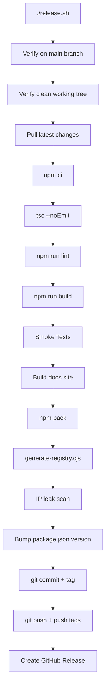
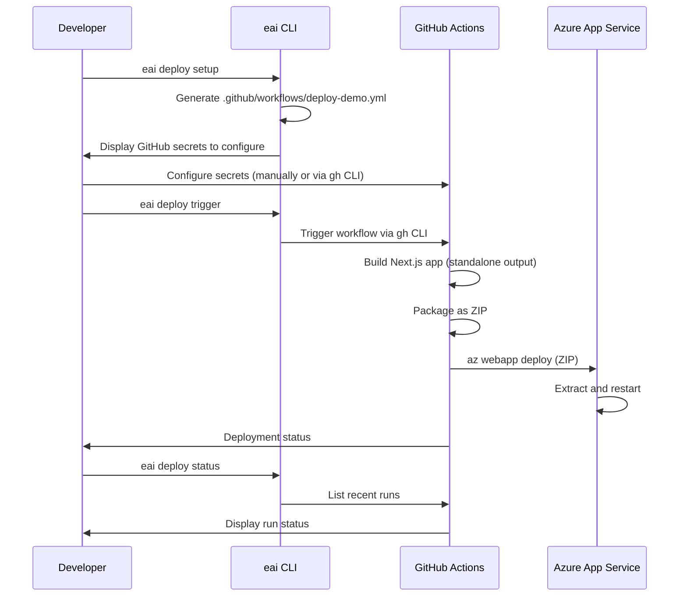

# EAI CLI — Deployment

## Overview

The EAI CLI has two deployment contexts:

1. **CLI Distribution** — How the `eai` CLI tool itself is published and installed
2. **Vertical Application Deployment** — How the CLI helps deploy vertical apps to Azure

---

## CLI Distribution

### Publishing Model

The EAI CLI uses a **static npm registry hosted on GitHub Pages**, eliminating the need for npm.js publishing.

**Registry URL**: `https://eai-tools.github.io/eai-cli/registry`

**Package Name**: `@eai-tools/cli`

### Release Process

Releases are managed by `release.sh` script, which runs a comprehensive validation pipeline.

**Command**:
```bash
./release.sh <patch|minor|major> "Release message"
```

**Examples**:
```bash
./release.sh patch "Fix auth token refresh bug"
./release.sh minor "Add bulk resource import command"
./release.sh major "New config format, breaking changes to types CLI"
```

**Release Pipeline**:


### Validation Checks

| Check | Tool | Purpose |
|-------|------|---------|
| **Branch** | `git rev-parse --abbrev-ref HEAD` | Must be on `main` |
| **Working Tree** | `git status --porcelain` | Must be clean (no uncommitted changes) |
| **Dependencies** | `npm ci` | Clean install from lockfile |
| **Type Check** | `tsc --noEmit` | TypeScript type errors |
| **Lint** | `npm run lint` | ESLint violations |
| **Build** | `npm run build` | Compilation errors |
| **Smoke Tests** | `node dist/index.js --version/--help` | CLI executable and commands present |
| **Docs Build** | Build documentation site | Docs generation succeeds |
| **Registry** | `npm pack` + `generate-registry.cjs` | Registry metadata valid |
| **IP Leak** | Scan source for internal terms | No sensitive info leaked |

### GitHub Actions Workflow (`.github/workflows/release.yml`)

**Trigger**: Git tag push (`v*`)

**Steps**:

1. **Checkout** — Fetch repository with full history
2. **Setup Node.js** — Install Node 20
3. **Validate Version** — Ensure tag matches `package.json` version
4. **Install** — `npm ci`
5. **Build** — `npm run build`
6. **Lint** — `npm run lint`
7. **Create Tarball** — `npm pack`
8. **Generate Registry** — `node scripts/generate-registry.cjs`
9. **Publish to Registry** — Commit registry files to `docs/public/registry/`
10. **Generate Changelog** — Extract commit messages since last tag
11. **Create GitHub Release** — Publish release with tarball and changelog

**Permissions**:
```yaml
permissions:
  contents: write
  packages: write
```

### Installation

**User Setup**:
```bash
# 1. Configure npm to use EAI registry
echo "@eai-tools:registry=https://eai-tools.github.io/eai-cli/registry" >> ~/.npmrc

# 2. Install globally
npm install -g @eai-tools/cli
```

**Verification**:
```bash
eai --version
eai --help
```

### Update Management

**Update Check**:
- Runs in background on every CLI invocation
- Checks GitHub Pages registry for latest version
- Caches result for 24 hours
- Displays banner after command execution if update available

**Update Command**:
```bash
eai update
```

**Equivalent to**:
```bash
npm install -g @eai-tools/cli@latest
```

---

## Vertical Application Deployment

### Azure App Service Deployment

The CLI helps deploy vertical applications (Next.js apps) to Azure App Service via GitHub Actions.

### Deployment Workflow



### Deployment Commands

#### 1. Setup Deployment
```bash
eai deploy setup --repo org/my-vertical
```

**Actions**:
- Generates `.github/workflows/deploy-demo.yml`
- Lists required GitHub secrets:
  - `AZUREAPPSERVICE_CLIENTID`
  - `AZUREAPPSERVICE_TENANTID`
  - `AZUREAPPSERVICE_SUBSCRIPTIONID`
  - `AZURE_RESOURCE_GROUP`
  - `AZURE_WEBAPP_NAME`

**Generated Workflow** (simplified):
```yaml
name: Deploy my-vertical

on:
  push:
    branches: [main]
  workflow_dispatch:

jobs:
  build-and-deploy:
    runs-on: ubuntu-latest
    environment: demo
    permissions:
      id-token: write
      contents: read

    steps:
      - uses: actions/checkout@v4
      - name: Setup Node.js
        uses: actions/setup-node@v4
      - name: Install dependencies
        run: npm ci
      - name: Build
        run: npm run build
      - name: Package standalone output
        run: |
          mkdir -p deploy/$APP_NAME
          cp -r .next/standalone/. deploy/$APP_NAME/
          zip -r app-content.zip deploy/$APP_NAME
      - name: Azure Login
        uses: azure/login@v2
        with:
          client-id: ${{ secrets.AZUREAPPSERVICE_CLIENTID }}
          tenant-id: ${{ secrets.AZUREAPPSERVICE_TENANTID }}
          subscription-id: ${{ secrets.AZUREAPPSERVICE_SUBSCRIPTIONID }}
      - name: Deploy to Azure
        run: az webapp deploy --resource-group ${{ secrets.AZURE_RESOURCE_GROUP }} --name ${{ secrets.AZURE_WEBAPP_NAME }} --src-path app-content.zip
      - name: Restart App Service
        run: az webapp restart --resource-group ${{ secrets.AZURE_RESOURCE_GROUP }} --name ${{ secrets.AZURE_WEBAPP_NAME }}
```

#### 2. Trigger Deployment
```bash
eai deploy trigger --repo org/my-vertical --branch main
```

**Actions**:
- Detects GitHub repo from `git remote` (if `--repo` not provided)
- Triggers `deploy-demo.yml` workflow via `gh workflow run`

**Requirements**:
- `gh` CLI installed and authenticated
- Workflow file exists in repo
- GitHub Actions enabled

#### 3. Check Deployment Status
```bash
eai deploy status --repo org/my-vertical
```

**Actions**:
- Lists last 5 workflow runs via `gh run list`
- Displays status (success, failure, in_progress)
- Shows branch and timestamp

**Output**:
```
✓ Recent deployments for org/my-vertical
  ✓ Deploy my-vertical (main) — 2026-03-11, 12:30:00
  ⟳ Deploy my-vertical (main) — 2026-03-11, 11:00:00
  ✗ Deploy my-vertical (feature-branch) — 2026-03-11, 09:15:00
```

---

## Azure Resources

### Required Azure Services

| Service | Purpose | Configuration |
|---------|---------|---------------|
| **Azure App Service** | Hosting for Next.js vertical apps | Configured via Azure Portal or Terraform |
| **Azure App Config** | Centralized environment variables | Connection string in `.env.local` |
| **Azure Key Vault** | Secrets management | Key Vault name in `.env.local` |
| **Azure AD (Entra)** | CI/CD authentication | Service principal for GitHub Actions |

### Azure AD Setup for Deployment

**Create Service Principal**:
```bash
az ad sp create-for-rbac --name "GitHub-Actions-EAI" \
  --role contributor \
  --scopes /subscriptions/{subscription-id}/resourceGroups/{resource-group} \
  --sdk-auth
```

**Set GitHub Secrets**:
```bash
gh secret set AZUREAPPSERVICE_CLIENTID --repo org/my-vertical
gh secret set AZUREAPPSERVICE_TENANTID --repo org/my-vertical
gh secret set AZUREAPPSERVICE_SUBSCRIPTIONID --repo org/my-vertical
gh secret set AZURE_RESOURCE_GROUP --repo org/my-vertical
gh secret set AZURE_WEBAPP_NAME --repo org/my-vertical
```

### App Service Configuration

**Runtime**: Node.js 20.x

**Deployment Method**: ZIP deploy (via `az webapp deploy`)

**App Settings** (configured via Azure Portal or CLI):
- `NEXT_PUBLIC_APP_NAME`
- `BASE_URL_PUBLIC_API`
- `TENANT_DEFAULT_ID`
- `ENTRA_TENANT_NAME`
- `ENTRA_TENANT_ID`
- `ENTRA_CLIENT_ID`

**Health Check Endpoint**: `/api/health` (if implemented by vertical app)

---

## CI/CD Pipeline

### GitHub Actions Workflow Events

| Event | Trigger | Purpose |
|-------|---------|---------|
| `push (main)` | Commit to main branch | Automatic deployment to demo/staging |
| `workflow_dispatch` | Manual trigger | On-demand deployment |

### Build Steps

1. **Checkout** — Clone repository
2. **Setup Node.js** — Install Node 20
3. **Install Dependencies** — `npm ci`
4. **Build Object Types** — `npm run build:object-types` (generate JSON from TypeScript)
5. **Build Next.js** — `npm run build` (standalone output)
6. **Package** — Create ZIP with standalone output
7. **Deploy** — Upload to Azure App Service
8. **Restart** — Restart App Service to apply changes

### Environment-Specific Deployments

**Demo Environment**:
- Branch: `main`
- Environment: `demo`
- App Service: `my-vertical-demo`

**Production Environment** (manual):
- Branch: `production` or tag-based
- Environment: `production`
- App Service: `my-vertical-prod`
- Requires manual approval

---

## Deployment Health Checks

### Pre-Deployment Validation

Not enforced by CLI, but recommended:

1. **Type Check**: `npm run typecheck`
2. **Lint**: `npm run lint`
3. **Object Type Validation**: `eai types validate`
4. **Unit Tests**: `npm test` (if configured)

### Post-Deployment Verification

**CLI Verification**:
```bash
eai verify
```

**Manual Verification**:
- Visit deployed URL
- Check logs: `az webapp log tail --resource-group {rg} --name {app}`
- Monitor App Service metrics in Azure Portal

---

## Rollback Strategy

### Rollback via GitHub Actions

**Option 1: Revert Commit**
```bash
git revert <bad-commit-sha>
git push origin main
# GitHub Actions auto-deploys reverted code
```

**Option 2: Re-deploy Previous Release**
```bash
git checkout <previous-tag>
eai deploy trigger
```

### Rollback via Azure Portal

1. Navigate to App Service
2. Go to **Deployment Center** → **Deployment History**
3. Select previous successful deployment
4. Click **Redeploy**

### Rollback via Azure CLI

```bash
az webapp deployment source config-zip \
  --resource-group {rg} \
  --name {app} \
  --src previous-version.zip
az webapp restart --resource-group {rg} --name {app}
```

---

## Monitoring & Diagnostics

### Application Insights

Not configured by CLI. Recommended to add manually:

```bash
az monitor app-insights component create \
  --app my-vertical-insights \
  --location eastus \
  --resource-group {rg}
```

Add to App Service settings:
- `APPLICATIONINSIGHTS_CONNECTION_STRING`

### Log Streaming

**Azure CLI**:
```bash
az webapp log tail --resource-group {rg} --name {app}
```

**Azure Portal**: App Service → Monitoring → Log Stream

### Alerts

Configure via Azure Portal:
- Response time > 5s
- HTTP 5xx errors > 10/min
- App Service down

---

## Infrastructure as Code

### Terraform Example (Not Included in CLI)

```hcl
resource "azurerm_app_service" "vertical" {
  name                = "my-vertical-demo"
  location            = azurerm_resource_group.rg.location
  resource_group_name = azurerm_resource_group.rg.name
  app_service_plan_id = azurerm_app_service_plan.plan.id

  site_config {
    node_version = "20-lts"
    always_on    = true
  }

  app_settings = {
    "NEXT_PUBLIC_APP_NAME"    = "my-vertical"
    "BASE_URL_PUBLIC_API"     = "https://api.eai.example.com"
    "TENANT_DEFAULT_ID"       = "tenant-123"
    "ENTRA_TENANT_NAME"       = "eaiplatform"
    "ENTRA_TENANT_ID"         = "entra-tenant-id"
    "ENTRA_CLIENT_ID"         = "entra-client-id"
  }
}
```

---

## Security Considerations

### Secrets Management

1. **Never commit secrets** to `.env.local` or Git
2. Use **Azure Key Vault** for production secrets
3. Use **GitHub Secrets** for CI/CD credentials
4. Rotate secrets regularly

### Authentication

- CLI uses **device code flow** (no client secrets)
- GitHub Actions uses **Azure AD service principal**
- App Service uses **managed identity** (recommended for production)

### Network Security

- App Service should use **VNet integration** (production)
- API calls should go through **private endpoints** (production)
- Use **Azure Front Door** or **Application Gateway** for public access

---

## Troubleshooting

### "gh command not found"

**Fix**: Install GitHub CLI
```bash
# macOS
brew install gh

# Linux
curl -fsSL https://cli.github.com/packages/githubcli-archive-keyring.gpg | sudo dd of=/usr/share/keyrings/githubcli-archive-keyring.gpg
echo "deb [arch=$(dpkg --print-architecture) signed-by=/usr/share/keyrings/githubcli-archive-keyring.gpg] https://cli.github.com/packages stable main" | sudo tee /etc/apt/sources.list.d/github-cli.list > /dev/null
sudo apt update
sudo apt install gh

# Authenticate
gh auth login
```

### "Could not detect GitHub repo"

**Fix**: Add remote or specify explicitly
```bash
git remote add origin https://github.com/org/my-vertical.git
# Or
eai deploy trigger --repo org/my-vertical
```

### "Deployment failed: Authentication failed"

**Fix**: Check GitHub secrets
```bash
gh secret list --repo org/my-vertical
# Ensure all 5 secrets are set
```

### "Azure CLI not found in workflow"

**Fix**: Ensure `azure/login@v2` action is present in workflow before `az` commands

---

## Performance Optimization

### Build Optimization

- Use **Next.js standalone output** (reduces deployment size)
- Enable **SWC minification** (faster builds)
- Use **incremental static regeneration** (ISR) for pages

### Deployment Optimization

- **ZIP deploy** is faster than Git deploy
- Enable **Run From Package** for faster cold starts
- Use **deployment slots** for zero-downtime swaps (production)

---

## Future Enhancements

Planned features (per README roadmap):

- `eai dev --offline` — Local mock gateway for offline development
- `eai tunnel` — Cloudflare tunnel for webhook testing
- `eai deploy rollback` — Automated rollback command
- `eai deploy logs` — Tail logs directly from CLI
