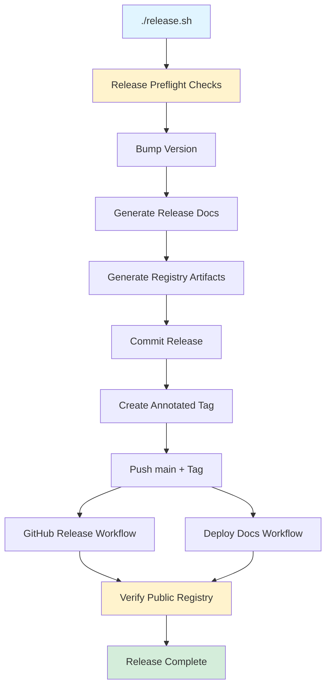
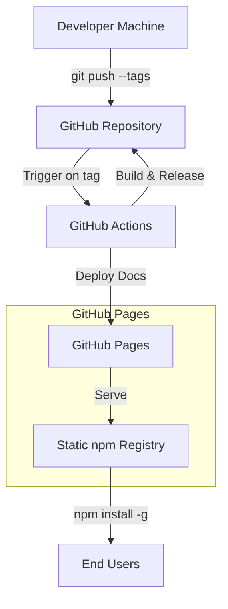
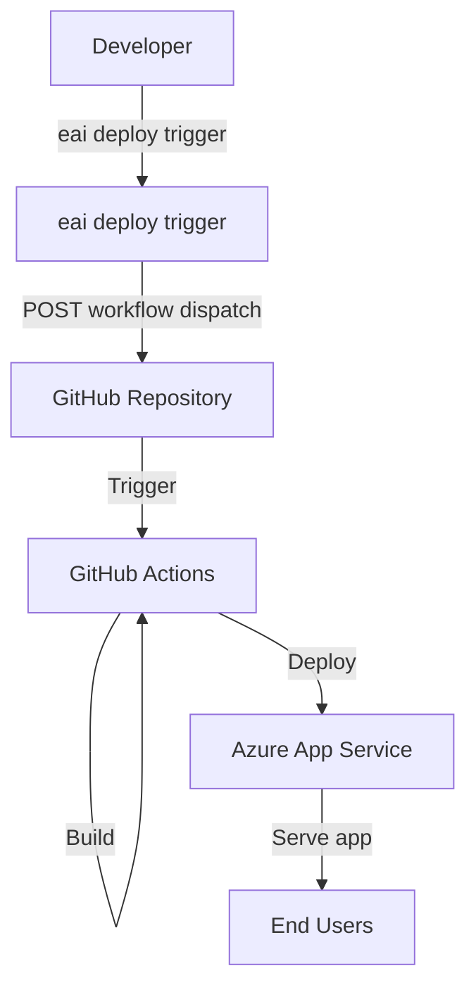

# EAI CLI — Deployment

## Overview

The EAI CLI has two distinct deployment contexts:

1. **CLI Distribution** — How the `eai` CLI tool itself is published and installed by developers
2. **Application Deployment** — How the CLI orchestrates deployment of apps to Azure App Service

---

## CLI Distribution

### Publishing Model

The EAI CLI uses a **static npm registry hosted on GitHub Pages**, eliminating the need for npmjs publishing.

**Registry URL**: [https://eai-tools.github.io/eai/registry](https://eai-tools.github.io/eai/registry)  
**Package Name**: `@eai-tools/cli`  
**Current Version**: 2.9.5
**Package Metadata**: [https://eai-tools.github.io/eai/registry/@eai-tools/cli](https://eai-tools.github.io/eai/registry/@eai-tools/cli)

### Installation

Users configure npm to use the EAI registry, then install globally:

```bash
# Configure the scoped EAI registry (one-time setup)
npm config set @eai-tools:registry https://eai-tools.github.io/eai/registry/ --location=user

# Install globally
npm install -g @eai-tools/cli

# Verify installation
eai --version
```

### Update Channel

Users update the CLI via:

```bash
# Check for updates
eai update --check

# Install latest version
eai update  # Reinstalls the latest CLI from the scoped EAI registry

# Or manually
npm install -g @eai-tools/cli@latest
```

The CLI checks the scoped static registry once per 24 hours and notifies users if a newer version is available.

---

## Release Process

### Release Script

Releases are managed by `./release.sh`, which runs a comprehensive validation pipeline before publishing.

**Usage**:
```bash
./release.sh <patch|minor|major> "Release message"
```

**Examples**:
```bash
./release.sh patch "Fix auth token refresh bug"
./release.sh minor "Add bulk resource import command"
./release.sh major "New config format, breaking changes to types CLI"
```

### Release Pipeline Stages



### Preflight Checks (`npm run release:check`)

Before tagging, `release.sh` validates:

1. **Clean working tree** — No uncommitted changes
2. **On main branch** — Must release from `main`
3. **Latest code** — `git pull` to ensure up-to-date
4. **Dependencies installed** — `npm ci`
5. **Type checking** — `tsc --noEmit`
6. **Linting** — `eslint src/`
7. **Build** — `tsc` (compile to `dist/`)
8. **Tests** — `vitest run`
9. **Smoke tests** — `eai --version`, `eai --help`, command groups
10. **Docs site build** — `cd docs-site && npm run build`
11. **Release docs generated** — `llms.txt`, `llms-full.txt`, `cli-help.txt`
12. **Registry artifacts validated** — `npm pack` + `generate-registry.cjs`

If any check fails, the release is aborted.

### Release Execution

After passing preflight checks:

1. **Bump version** — Updates `package.json` with new semver version
2. **Generate release docs** — Refreshes `docs-site/static/llms.txt`, `llms-full.txt`, `cli-help.txt`
3. **Generate registry** — Creates `docs-site/static/registry/` packument and tarball
4. **Update `.tech-docs/`** — Updates release metadata in `.tech-docs/overview.md` and `.tech-docs/changelog.md`
5. **Commit** — `git commit -m "chore: release vX.Y.Z"`
6. **Tag** — `git tag -a vX.Y.Z -m "Release message"`
7. **Push** — `git push origin main --follow-tags`

### GitHub Actions Workflows

#### Release Workflow (`.github/workflows/release.yml`)

**Trigger**: Tag push (`v*`)

**Steps**:
1. Checkout repository
2. Setup Node.js 24
3. Validate version matches tag
4. Install dependencies (`npm ci`)
5. Type check (`npm run typecheck`)
6. Lint (`npm run lint`)
7. Build (`npm run build`)
8. Test (`npm run test`)
9. Verify committed release docs (`npm run docs:release-assets:check`)
10. Verify committed registry points at tag version
11. Create GitHub Release
12. Attach tarball to release

**Outputs**: GitHub Release with tarball attachment

---

#### Deploy Docs Workflow (`.github/workflows/docs.yml`)

**Trigger**: Push to `main` with changes to:
- `.tech-docs/**`
- `docs-site/**`
- `scripts/generate-release-docs.cjs`
- `scripts/generate-registry.cjs`
- `scripts/generate-llms-full.cjs`

Or manual workflow dispatch.

**Steps**:
1. Checkout repository
2. Setup Node.js 24
3. Install docs-site dependencies (`cd docs-site && npm ci`)
4. Build Docusaurus site (`npm run build`)
5. Verify generated site (index.html, registry files, llms.txt files)
6. Upload to GitHub Pages
7. Deploy to `https://eai-tools.github.io/eai`

**Outputs**: Documentation site and static registry at GitHub Pages

**Post-Deployment**: `release.sh` waits for deployment and verifies public registry shows new version

---

## Deployment Topology

### CLI Distribution



### App Deployment (via `eai deploy`)



---

## Application Deployment

The CLI provides commands to orchestrate deployment of apps to Azure App Service via GitHub Actions.

### Setup Deployment

```bash
eai deploy setup --repo org/my-app
```

**What it does**:
1. Generates `.github/workflows/deploy-demo.yml`
2. Lists required GitHub secrets
3. Provides setup instructions

**Required GitHub Secrets**:
- `AZURE_WEBAPP_PUBLISH_PROFILE` — Azure App Service publish profile
- `AZURE_WEBAPP_NAME` — Azure App Service name

### Trigger Deployment

```bash
eai deploy trigger
```

**What it does**:
1. Reads `GITHUB_TOKEN` from `.env.local`
2. Reads `GITHUB_REPOSITORY` from `.env.local`
3. Calls GitHub Actions API to dispatch `deploy-demo.yml` workflow
4. Returns workflow run ID

**Options**:
- `--workflow <name>` — Workflow file name (default: `deploy-demo.yml`)
- `--ref <ref>` — Git ref to deploy (default: `main`)

### Check Deployment Status

```bash
eai deploy status
```

**What it does**:
1. Fetches latest workflow runs
2. Displays status, conclusion, and logs URL
3. Supports `--run-id` to check specific run

---

## Infrastructure

### GitHub Pages

**URL**: [https://eai-tools.github.io/eai](https://eai-tools.github.io/eai)

**Purpose**:
- Documentation site (Docusaurus)
- Static npm registry
- Release artifacts (llms.txt, cli-help.txt)

**Deployment**:
- Automated via `.github/workflows/docs.yml`
- Triggered on push to `main` affecting docs or registry
- Manual dispatch available

**Resources**:
- HTML/CSS/JS assets (Docusaurus build)
- npm registry packument (`registry/@eai-tools/cli`)
- Tarball releases (`registry/-/@eai-tools/cli-*.tgz`)
- AI-readable docs (`llms.txt`, `llms-full.txt`)
- CLI help output (`cli-help.txt`)

---

### GitHub Repository

**URL**: [https://github.com/eai-tools/eai](https://github.com/eai-tools/eai)

**Branch Protection**:
- `main` branch protected
- Require pull request reviews (recommended)
- Require status checks to pass (recommended)

**GitHub Actions Secrets** (for releases):
- `GITHUB_TOKEN` — Auto-generated, used for creating releases
- No additional secrets required (public repository)

---

### Azure App Service (for apps)

Applications deployed via `eai deploy` typically use:

**Resource**: Azure App Service (Linux)  
**Runtime**: Node.js 20.x or later  
**Deployment Method**: GitHub Actions with publish profile  
**Configuration**: Environment variables from Azure App Configuration  
**Secrets**: Stored in Azure Key Vault

**Deployment Flow**:
1. `eai deploy trigger` calls GitHub Actions API
2. GitHub Actions builds Next.js app
3. Deploys to Azure App Service using publish profile
4. App Service pulls environment from Azure App Config
5. App Service pulls secrets from Azure Key Vault (if configured)

---

## Health Checks

### CLI Installation Health

Verify CLI is correctly installed:

```bash
# Check version
eai --version

# Check help
eai --help

# Run platform connectivity checks
eai verify
```

### Registry Health

Verify static registry is serving correctly:

```bash
# Check packument file
curl https://eai-tools.github.io/eai/registry/@eai-tools/cli

# Check latest tarball exists
curl -I https://eai-tools.github.io/eai/registry/-/@eai-tools/cli-latest.tgz
```

Expected packument format:
```json
{
  "name": "@eai-tools/cli",
  "versions": {
    "2.8.13": {
      "name": "@eai-tools/cli",
      "version": "2.8.13",
      "dist": {
        "tarball": "https://eai-tools.github.io/eai/registry/-/@eai-tools/cli-2.8.13.tgz"
      }
    }
  },
  "dist-tags": {
    "latest": "2.8.13"
  }
}
```

### App Health

Apps deployed to Azure should expose health endpoints:

```bash
# Check app health
curl https://my-app.azurewebsites.net/api/health

# Check via CLI
eai verify
```

---

## Deployment Checklist

### For CLI Releases

- [ ] All tests passing (`npm test`)
- [ ] Linting clean (`npm run lint`)
- [ ] Type checking clean (`npm run typecheck`)
- [ ] Build succeeds (`npm run build`)
- [ ] Smoke tests pass (`eai --version`, `eai --help`)
- [ ] Docs site builds (`cd docs-site && npm run build`)
- [ ] Release docs generated (`npm run docs:release-assets`)
- [ ] Registry artifacts valid (`npm pack` + verify packument)
- [ ] On `main` branch with clean working tree
- [ ] Changelog updated in `.tech-docs/changelog.md`
- [ ] Run `./release.sh <semver> "Message"`
- [ ] Wait for GitHub Actions to complete
- [ ] Verify public registry shows new version
- [ ] Test installation: `npm install -g @eai-tools/cli@latest`

### For App Deployments

- [ ] Environment variables configured in `.env.local`
- [ ] GitHub secrets configured (`AZURE_WEBAPP_PUBLISH_PROFILE`, `AZURE_WEBAPP_NAME`)
- [ ] Deployment workflow tested locally
- [ ] Run `eai deploy setup --repo org/name` (if first time)
- [ ] Run `eai deploy trigger`
- [ ] Check deployment status with `eai deploy status`
- [ ] Verify app is running in Azure Portal
- [ ] Test app endpoints
- [ ] Monitor Application Insights for errors

---

## Rollback Procedures

### CLI Rollback

If a release has issues:

1. **Install previous version**:
   ```bash
   npm install -g @eai-tools/cli@2.8.12
   ```

2. **Revert git tag** (if needed):
   ```bash
   git tag -d vX.Y.Z
   git push origin :refs/tags/vX.Y.Z
   ```

3. **Delete GitHub Release** (via GitHub UI or API)

4. **Fix issue and re-release**

### App Rollback

If an app deployment fails:

1. **Check deployment logs** in GitHub Actions

2. **Roll back in Azure Portal**:
   - Go to Azure App Service
   - Deployment Center → Deployment slots or Previous deployments
   - Select previous working deployment
   - Click "Redeploy"

3. **Or re-deploy previous git ref**:
   ```bash
   eai deploy trigger --ref previous-working-commit-sha
   ```

---

## Monitoring

### CLI Distribution Monitoring

- **GitHub Pages uptime**: Monitor [https://eai-tools.github.io/eai](https://eai-tools.github.io/eai)
- **Registry availability**: Monitor packument endpoint
- **Release workflow status**: Check GitHub Actions runs
- **User feedback**: Monitor GitHub Issues

### App Monitoring

Applications deployed via `eai deploy` should use:

- **Azure Application Insights**: Request telemetry, exceptions, traces
- **Azure Monitor**: Resource metrics (CPU, memory, requests)
- **Log Analytics**: Centralized logging
- **Azure App Service Logs**: Deployment logs, runtime logs

---

## CI/CD Workflows Summary

| Workflow | Trigger | Purpose | Outputs |
|----------|---------|---------|---------|
| `release.yml` | Tag push (`v*`) | Create GitHub Release | GitHub Release + tarball |
| `docs.yml` | Push to `main` (docs changes) | Deploy documentation and registry | GitHub Pages site + registry |
| `ci.yml` | Push, pull request | Run tests and linting | Test results |
| `sync-linked-sources.yml` | Schedule (nightly) | Sync linked source files | Updated files |

---

## Future Deployment Enhancements

- [ ] Automated semantic versioning based on commit messages
- [ ] Blue-green deployments for apps
- [ ] Canary releases for CLI distribution
- [ ] Automated rollback on health check failures
- [ ] Multi-region registry distribution (CDN)
- [ ] Signed releases with GPG verification
