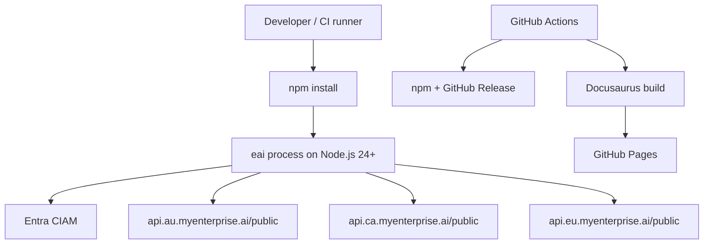

# Deployment and Operations

## Runtime Topology



This repository does not deploy a resident API server, container, App Service,
Function, or database. The CLI runs on the caller's workstation or CI runner.
Azure resources used directly by the CLI are Entra CIAM and the remote EAI
platform contract; concrete platform resource inventory is not exposed by this
public repository.

## CI/CD

| Workflow | Trigger | Key actions |
|---|---|---|
| `.github/workflows/ci.yml` | Push and pull request to `main` | npm install, build, lint, public hygiene, typecheck, full tests, API-reference verification |
| `.github/workflows/docs.yml` | Changes to `.tech-docs/`, `docs-site/`, release-doc generators, or manual dispatch | Build Docusaurus, verify generated assets, deploy GitHub Pages, optionally open a website sync PR |
| `.github/workflows/release.yml` | `v*` tag | Validate version, test/build, verify release docs and registry, publish npm packages with provenance, create GitHub Release, optionally dispatch cross-service tests |

The release workflow creates both canonical and alias npm packages and uses
the checked-in static registry as a fallback. The docs workflow uses
`docs-site/package-lock.json` and Node.js 24.

## Configuration for Deployment

The CLI itself is distributed, not hosted. Consumer deployments commonly use:

```bash
eai runtime validate
eai deploy env --provider generic
eai deploy setup --repo org/name
eai deploy trigger
eai deploy status
eai deploy doctor --url https://deployed.example
```

These commands generate or inspect host-neutral runtime and GitHub Actions
contracts for an application; they do not turn this repository into a hosted
service.

## Health and Diagnostics

There is no HTTP health endpoint for the CLI process. Operational checks are:

- `eai verify` — login, tenant, and API connectivity checks.
- `eai doctor` — broader local/project readiness diagnostics.
- `eai runtime validate` — validates the app runtime contract before deployment.
- `eai deploy doctor --url <url>` — checks a deployed app supplied by the user.

## Failure Boundaries

A missing/expired token, invalid tenant membership, unavailable regional
PublicAPI, invalid project contract, or failed local file operation is surfaced
as a command error. The CLI does not silently substitute a successful result.
