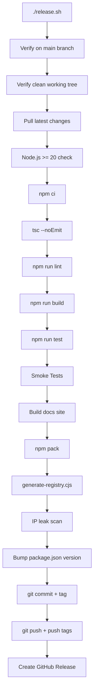
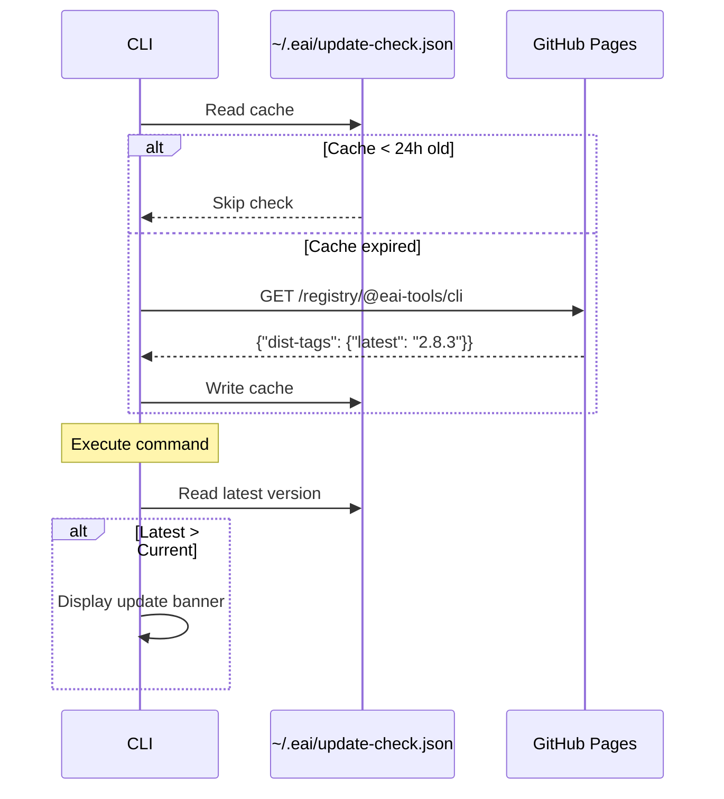
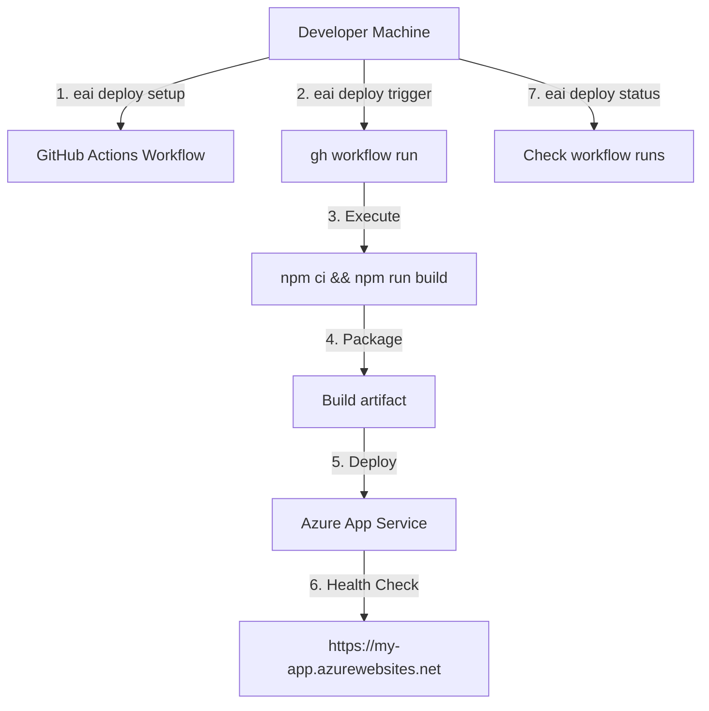

# EAI CLI — Deployment

## Overview

The EAI CLI has two deployment contexts:

1. **CLI Distribution** — How the `eai` CLI tool itself is published and installed
2. **Vertical Application Deployment** — How the CLI helps deploy vertical apps to Azure

---

## CLI Distribution

### Publishing Model

The EAI CLI uses a **static npm registry hosted on GitHub Pages**, eliminating the need for npm.js publishing.

**Registry URL**: `https://eai-tools.github.io/eai-cli/registry`

**Package Name**: `@eai-tools/cli`

**Current Version**: 2.8.3

### Installation

Users configure npm to use the EAI registry, then install globally:

```bash
# Configure npm registry
echo "@eai-tools:registry=https://eai-tools.github.io/eai-cli/registry" >> ~/.npmrc

# Install globally
npm install -g @eai-tools/cli

# Verify installation
eai --version
```

### Release Process

Releases are managed by `release.sh` script, which runs a comprehensive validation pipeline.

**Command**:
```bash
./release.sh <patch|minor|major> "Release message"
```

**Examples**:
```bash
./release.sh patch "Fix auth token refresh bug"
./release.sh minor "Add bulk resource import command"
./release.sh major "New config format, breaking changes to types CLI"
```

**Release Pipeline**:


### Validation Checks

| Check | Tool | Purpose |
|-------|------|---------|
| **Branch** | `git branch --show-current` | Must be on `main` |
| **Working Tree** | `git status --porcelain` | Must be clean (no uncommitted changes) |
| **Node Version** | `node -v` | Must be >= 20.0.0 |
| **Dependencies** | `npm ci` | Clean install from lockfile |
| **Type Check** | `tsc --noEmit` | TypeScript type errors |
| **Lint** | `npm run lint` | ESLint violations |
| **Build** | `npm run build` | Compilation errors |
| **Tests** | `npm run test` | Vitest unit tests pass |
| **Smoke Tests** | `node dist/index.js --version/--help` | CLI executable and commands present (init, login, dev, types, resources, deploy, env, verify, chat, docs, whoami, doctor, tenant, user, provision, update) |
| **Docs Build** | Build documentation site | Astro/Starlight docs generation succeeds |
| **Registry** | `npm pack` + `generate-registry.cjs` | Registry metadata valid |
| **IP Leak** | Scan source for internal terms | No sensitive info leaked |

### Smoke Test Details

The release script verifies these commands are registered:
- `init`, `login`, `dev`, `types`, `resources`, `deploy`, `env`
- `verify`, `chat`, `docs`, `whoami`, `doctor`, `tenant`, `user`, `provision`, `update`

### Registry Generation

**Script**: `scripts/generate-registry.cjs`

**Inputs**:
- `package.json` — Version, description, keywords
- `docs/public/registry/-/@eai-tools/cli-latest.tgz` — Latest tarball

**Outputs**:
- `docs/public/registry/@eai-tools/cli` — npm packument (package metadata)
- `docs/public/registry/-/@eai-tools/cli-{version}.tgz` — Versioned tarball

**Packument Structure**:
```json
{
  "name": "@eai-tools/cli",
  "dist-tags": {
    "latest": "2.8.3"
  },
  "versions": {
    "2.8.3": {
      "name": "@eai-tools/cli",
      "version": "2.8.3",
      "description": "EAI Platform CLI — scaffold, seed, deploy, and manage vertical applications",
      "dist": {
        "tarball": "https://eai-tools.github.io/eai-cli/registry/-/@eai-tools/cli-2.8.3.tgz",
        "shasum": "..."
      }
    }
  }
}
```

### GitHub Actions Workflow

**File**: `.github/workflows/release.yml` (if present)

**Trigger**: Git tag push (`v*`)

**Steps**:

1. **Checkout** — Fetch repository with full history
2. **Setup Node.js** — Install Node 20
3. **Validate Version** — Ensure tag matches `package.json` version
4. **Install** — `npm ci`
5. **Build** — `npm run build`
6. **Test** — `npm run test`
7. **Lint** — `npm run lint`
8. **Create Tarball** — `npm pack`
9. **Generate Registry** — `node scripts/generate-registry.cjs`
10. **Publish to Registry** — Commit registry files to `docs/public/registry/`
11. **Generate Changelog** — Extract commit messages since last tag
12. **Create GitHub Release** — Publish release with tarball and changelog

**Permissions**:
```yaml
permissions:
  contents: write  # For creating releases and pushing to gh-pages
```

### Version Bumping

**Semantic Versioning**: `MAJOR.MINOR.PATCH`

| Bump | Increment | Use Case |
|------|-----------|----------|
| `patch` | `2.5.2` → `2.5.3` | Bug fixes, dependency updates |
| `minor` | `2.7.2` → `2.8.0` | New features, backward-compatible |
| `major` | `2.8.3` → `3.0.0` | Breaking changes |

**Manual Bump**:
```bash
npm version patch -m "chore: release v%s"   # Creates commit + tag
git push origin main --follow-tags
```

### Update Mechanism

Users are notified of updates via background check (24h cache):

**Update Check Flow**:


**Update Command**:
```bash
eai update  # Runs: npm install -g @eai-tools/cli@latest
```

---

## Vertical Application Deployment

The CLI helps deploy vertical applications (built with the Platform SDK) to Azure App Service.

### Deployment Architecture



### Setup Deployment

**Command**: `eai deploy setup`

**Purpose**: Generates GitHub Actions workflow file and documents required secrets.

**Generated File**: `.github/workflows/deploy-demo.yml`

**Workflow Contents**:
```yaml
name: Deploy to Azure

on:
  workflow_dispatch:
  push:
    branches: [main]

jobs:
  deploy:
    runs-on: ubuntu-latest
    steps:
      - uses: actions/checkout@v3
      - uses: actions/setup-node@v3
        with:
          node-version: 20
      - run: npm ci
      - run: npm run build
      - uses: azure/webapps-deploy@v2
        with:
          app-name: ${{ secrets.AZURE_APP_NAME }}
          publish-profile: ${{ secrets.AZURE_PUBLISH_PROFILE }}
```

**Required GitHub Secrets**:
- `AZURE_APP_NAME` — Azure App Service name
- `AZURE_PUBLISH_PROFILE` — Publish profile (downloaded from Azure Portal)

**Setup Output**:
```bash
eai deploy setup --repo myorg/my-vertical

✓ Created .github/workflows/deploy-demo.yml

Next steps:
1. Add GitHub secrets:
   - AZURE_APP_NAME
   - AZURE_PUBLISH_PROFILE
2. Push workflow to GitHub:
   git add .github/workflows/deploy-demo.yml
   git commit -m "Add deployment workflow"
   git push
3. Trigger deployment:
   eai deploy trigger
```

### Trigger Deployment

**Command**: `eai deploy trigger`

**Purpose**: Manually trigger GitHub Actions workflow via `gh` CLI.

**Requirements**:
- `gh` CLI installed and authenticated
- Workflow file exists (`.github/workflows/deploy-demo.yml`)
- User has repo admin permissions

**Execution**:
```bash
eai deploy trigger

▸ Triggering deployment workflow...
✓ Workflow triggered successfully
  Run ID: 123456789
  URL: https://github.com/myorg/my-vertical/actions/runs/123456789
```

**Underlying Command**:
```bash
gh workflow run deploy-demo.yml --ref main
```

### Check Deployment Status

**Command**: `eai deploy status`

**Purpose**: List recent GitHub Actions workflow runs.

**Output**:
```bash
eai deploy status

Recent deployments:
  ✓ Run #42  main  2 hours ago   success   (Deploy to Azure)
  ✗ Run #41  main  1 day ago     failure   (Deploy to Azure)
  ✓ Run #40  main  3 days ago    success   (Deploy to Azure)
```

**Underlying Command**:
```bash
gh run list --workflow=deploy-demo.yml --limit=10
```

### Azure Resources

The CLI does not create Azure resources (App Service, Key Vault, App Config). These must be provisioned manually or via Infrastructure-as-Code (Terraform, Bicep, ARM templates).

**Typical Azure Setup**:

| Resource | Purpose |
|----------|---------|
| **Azure App Service** | Hosts the vertical application (Node.js runtime) |
| **Azure App Config** | Stores environment configuration |
| **Azure Key Vault** | Stores secrets (API keys, connection strings) |
| **Application Insights** | Monitoring and telemetry (optional) |

### Environment Configuration Sync

**Command**: `eai env pull`

**Purpose**: Syncs environment config from Azure App Config + Key Vault to `.env.local`.

**Pre-Deployment Checklist**:
1. ✅ Azure App Service created
2. ✅ Azure App Config populated
3. ✅ GitHub secrets configured
4. ✅ Workflow file committed
5. ✅ `eai deploy trigger` executed
6. ✅ Deployment succeeded (check `eai deploy status`)
7. ✅ Health check passes (`curl https://my-app.azurewebsites.net/health`)

---

## Deployment Health Checks

### CLI Health Check

**Command**: `eai verify`

**Checks**:
- Platform API reachable
- Authentication valid
- Tenant accessible

**Output**:
```bash
eai verify

✓ Platform API reachable (https://api.eai.example.com)
✓ Authentication valid (token expires in 42 minutes)
✓ Tenant accessible (Team A - tenant-123)
```

### Vertical App Health Check

Most vertical apps expose a `/health` endpoint:

```bash
curl https://my-app.azurewebsites.net/health
```

**Expected Response**:
```json
{
  "status": "healthy",
  "platform": "connected",
  "database": "connected"
}
```

---

## CI/CD Integration

### GitHub Actions Example

```yaml
name: CI

on: [push, pull_request]

jobs:
  validate:
    runs-on: ubuntu-latest
    steps:
      - uses: actions/checkout@v3
      - uses: actions/setup-node@v3
        with:
          node-version: 20
      
      # Install CLI
      - run: |
          echo "@eai-tools:registry=https://eai-tools.github.io/eai-cli/registry" >> ~/.npmrc
          npm install -g @eai-tools/cli
      
      # Authenticate (headless)
      - env:
          EAI_ACCESS_TOKEN: ${{ secrets.EAI_ACCESS_TOKEN }}
          NO_UPDATE_NOTIFIER: 1
        run: |
          eai types validate
          eai types seed --dry-run
          eai verify
```

### Environment Variables for CI

| Variable | Purpose |
|----------|---------|
| `EAI_ACCESS_TOKEN` | Bypass token storage, use provided token |
| `NO_UPDATE_NOTIFIER` | Disable update checks |
| `CI` | Auto-detected by CLI; disables interactive prompts |

---

## Rollback Strategy

### CLI Rollback

**Downgrade to Previous Version**:
```bash
npm install -g @eai-tools/cli@2.5.2
eai --version  # Verify downgrade
```

### Vertical App Rollback

**Via GitHub Actions**:
1. Navigate to failed deployment run
2. Find previous successful run
3. Click "Re-run jobs"

**Via Azure Portal**:
1. Navigate to App Service
2. Deployment Center → Deployment History
3. Select previous deployment
4. Click "Redeploy"

**Via `gh` CLI**:
```bash
# List recent runs
gh run list --workflow=deploy-demo.yml

# Re-run previous successful run
gh run rerun 123456789
```

---

## Security Considerations

### CLI Distribution

- **Tarball Integrity**: SHA checksums verified by npm on install
- **HTTPS Only**: Registry served over HTTPS (GitHub Pages)
- **No Secrets in Source**: IP leak scan prevents accidental secret commits
- **Supply Chain**: No npm.js dependency; full control over distribution

### Vertical App Deployment

- **Secrets in GitHub Secrets**: Never commit Azure publish profiles or tokens
- **Least Privilege**: Deploy keys have App Service write-only permissions
- **Signed Commits**: Release commits are signed by maintainer
- **Audit Trail**: GitHub Actions logs retained for 90 days

---

## Monitoring and Observability

### CLI Update Metrics

**Not currently tracked**. Possible future additions:
- Update check success rate
- Version distribution (% on latest, lagging versions)
- Update adoption rate

### Deployment Metrics

**Via GitHub Actions**:
- Workflow success rate
- Deployment duration
- Failure reasons (build, test, deploy)

**Via Azure App Service**:
- Application Insights (telemetry, logs, exceptions)
- Health check endpoint uptime
- Request/response metrics

---

## Troubleshooting

### "gh: command not found"

**Cause**: GitHub CLI not installed

**Fix**:
```bash
# macOS
brew install gh

# Linux (Debian/Ubuntu)
curl -fsSL https://cli.github.com/packages/githubcli-archive-keyring.gpg | sudo gpg --dearmor -o /usr/share/keyrings/githubcli-archive-keyring.gpg
echo "deb [signed-by=/usr/share/keyrings/githubcli-archive-keyring.gpg] https://cli.github.com/packages stable main" | sudo tee /etc/apt/sources.list.d/github-cli.list > /dev/null
sudo apt update && sudo apt install gh

# Authenticate
gh auth login
```

### "Workflow not found"

**Cause**: Workflow file doesn't exist or is in wrong location

**Fix**:
```bash
eai deploy setup --repo myorg/my-vertical
git add .github/workflows/deploy-demo.yml
git commit -m "Add deployment workflow"
git push
```

### "Deployment failed: Publish profile invalid"

**Cause**: Expired or incorrect Azure publish profile

**Fix**:
1. Go to Azure Portal → App Service → Deployment Center
2. Download new publish profile
3. Update GitHub secret `AZURE_PUBLISH_PROFILE`
4. Re-trigger deployment: `eai deploy trigger`

---

## Future Enhancements

- [ ] Automated blue-green deployments
- [ ] Deployment preview environments (PR-based)
- [ ] CLI telemetry (opt-in, privacy-preserving)
- [ ] Registry CDN for faster installs
- [ ] Signed tarballs with GPG
